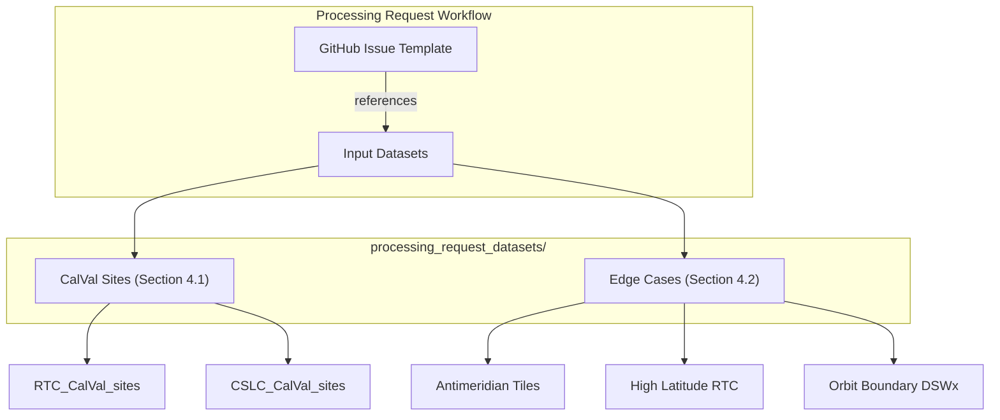
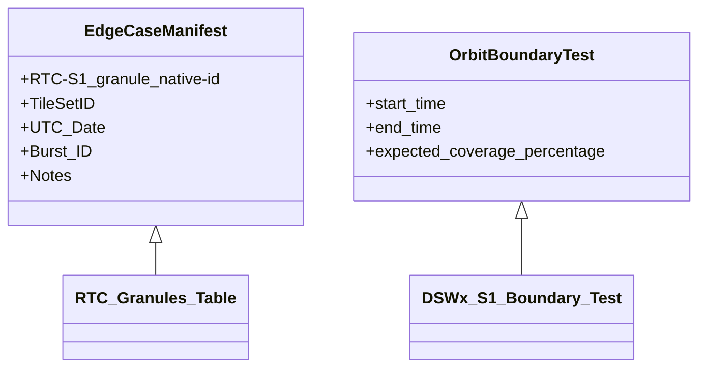

# Page: Validation & Edge Case Datasets

# Validation & Edge Case Datasets

Relevant source files

The following files were used as context for generating this wiki page:

- [processing_request_datasets/edge_cases/README.md](processing_request_datasets/edge_cases/README.md)
- [processing_request_datasets/edge_cases/RTC-S1_granules_for_edge_cases.md](processing_request_datasets/edge_cases/RTC-S1_granules_for_edge_cases.md)
- [processing_request_datasets/edge_cases/dswx-s1_orbit_boundary_test.txt](processing_request_datasets/edge_cases/dswx-s1_orbit_boundary_test.txt)
- [processing_request_datasets/edge_cases/rtc_antimeridian_complete_20231004_thru_20240311.txt](processing_request_datasets/edge_cases/rtc_antimeridian_complete_20231004_thru_20240311.txt)
- [processing_request_datasets/edge_cases/rtc_high_latitude_complete_20231004_thru_20240311.txt](processing_request_datasets/edge_cases/rtc_high_latitude_complete_20231004_thru_20240311.txt)

The OPERA SDS utilizes a collection of curated datasets to validate processing pipelines and ensure robust performance under challenging conditions. These datasets, located within `processing_request_datasets/`, serve as standardized inputs for Calibration/Validation (CalVal) activities and edge case testing for products including RTC-S1, CSLC-S1, and DSWx-S1.

### Dataset Organization and Purpose

The validation infrastructure is divided into two primary categories:
1.  **CalVal Sites**: Targeted geographic locations used to verify the scientific accuracy of the algorithms (SAS) against known ground truth or reference data.
2.  **Geographic Edge Cases**: Manifests designed to stress-test the SDS handling of complex orbital and coordinate scenarios, such as the antimeridian and high-latitude regions.

The following diagram illustrates how these datasets integrate with the processing request workflow:

**Processing Request Dataset Integration**

Sources: [processing_request_datasets/edge_cases/README.md:1-37]()

---

### 4.1 R2 Calibration & Validation Sites

The R2 (Release 2) CalVal datasets are the primary mechanism for validating the production of RTC-S1 and CSLC-S1 granules. These sites are documented through versioned manifests that define specific bursts and orbits required for scientific validation.

*   **RTC-S1 CalVal**: Utilizes the `RTC_CalVal_sites_v0.4.0` manifests. These include 13 numbered site files and are further categorized into static and non-static splits to validate the integration of static layers.
*   **CSLC-S1 CalVal**: Utilizes the `CSLC_CalVal_sites_v0.3.1` manifests, covering 27 named geographic sites. These manifests account for both ascending and descending passes.
*   **Naming Convention**: Sites follow a strict `[orbit-pass]-[location]-[static-suffix]` convention, which allows the SDS to automatically trigger the appropriate CalVal processing jobs when these identifiers are provided in a processing request.

For details on site manifests and triggering logic, see [R2 Calibration & Validation Sites](#4.1).

---

### 4.2 Geographic Edge Case Datasets

Edge case datasets target specific scenarios where standard processing logic might fail due to coordinate wrapping, extreme latitudes, or data availability issues at orbit boundaries.

**Edge Case Categories:**
*   **Antimeridian & Near-Antimeridian**: Lists of MGRS tile IDs (for HLS) and RTC-S1 granules that intersect or are within 200km of the 180° longitude line [processing_request_datasets/edge_cases/README.md:5-10]().
*   **High Latitude**: Curated lists of RTC-S1 granules located at 80° latitude or higher (e.g., Northern Greenland), designed to test polar stereographic projections and high-latitude distortions [processing_request_datasets/edge_cases/README.md:30-34]().
*   **Orbit Boundary**: A specific test case for DSWx-S1 (`dswx-s1_orbit_boundary_test.txt`) that defines a datetime range and expected coverage percentages for TileSets to verify the pipeline's spatial join logic [processing_request_datasets/edge_cases/dswx-s1_orbit_boundary_test.txt:1-17]().
*   **Anomalous Granules**: A table of specific RTC-S1 granules known to have unique properties, such as multiple polarizations (VV/VH/HH/HV) or "water-only" coverage that might trigger specific exclusions in the TileSet database [processing_request_datasets/edge_cases/RTC-S1_granules_for_edge_cases.md:1-14]().

**Data Manifest Structure**

Sources: [processing_request_datasets/edge_cases/RTC-S1_granules_for_edge_cases.md:1-14](), [processing_request_datasets/edge_cases/dswx-s1_orbit_boundary_test.txt:1-17]()

For details on manifest schemas and specific test scenarios, see [Geographic Edge Case Datasets](#4.2).

---
Sources:
- [processing_request_datasets/edge_cases/README.md:1-37]()
- [processing_request_datasets/edge_cases/RTC-S1_granules_for_edge_cases.md:1-15]()
- [processing_request_datasets/edge_cases/dswx-s1_orbit_boundary_test.txt:1-19]()
- [processing_request_datasets/edge_cases/rtc_high_latitude_complete_20231004_thru_20240311.txt:1-97]()
- [processing_request_datasets/edge_cases/rtc_antimeridian_complete_20231004_thru_20240311.txt:1-97]()
