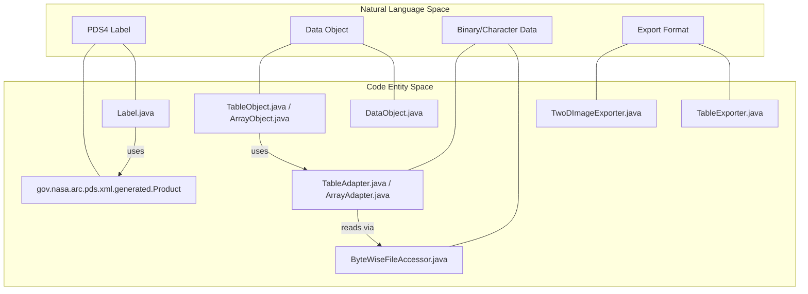
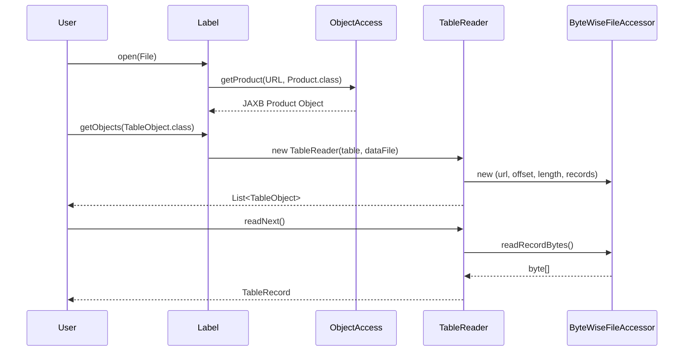

# Page: Architecture Overview

# Architecture Overview

Relevant source files

The following files were used as context for generating this wiki page:

- [CLAUDE.md](CLAUDE.md)
- [README.md](README.md)
- [build/pre-build.sh](build/pre-build.sh)
- [src/build/resources/bindings.xjb](src/build/resources/bindings.xjb)
- [src/build/resources/build.xml](src/build/resources/build.xml)
- [src/build/resources/schema/1A10/PDS4_DISP_1A10.xsd](src/build/resources/schema/1A10/PDS4_DISP_1A10.xsd)
- [src/build/resources/schema/1A10/PDS4_PDS_1A10.xsd](src/build/resources/schema/1A10/PDS4_PDS_1A10.xsd)
- [src/build/resources/schema/1Q00/PDS4_DISP_1Q00.xsd](src/build/resources/schema/1Q00/PDS4_DISP_1Q00.xsd)
- [src/build/resources/schema/1Q00/PDS4_PDS_1Q00.xsd](src/build/resources/schema/1Q00/PDS4_PDS_1Q00.xsd)
- [src/main/java/gov/nasa/pds/label/Label.java](src/main/java/gov/nasa/pds/label/Label.java)
- [src/main/java/gov/nasa/pds/label/ProductType.java](src/main/java/gov/nasa/pds/label/ProductType.java)
- [src/main/java/gov/nasa/pds/objectAccess/ByteWiseFileAccessor.java](src/main/java/gov/nasa/pds/objectAccess/ByteWiseFileAccessor.java)
- [src/main/java/gov/nasa/pds/objectAccess/ObjectAccess.java](src/main/java/gov/nasa/pds/objectAccess/ObjectAccess.java)
- [src/main/java/gov/nasa/pds/objectAccess/ObjectProvider.java](src/main/java/gov/nasa/pds/objectAccess/ObjectProvider.java)
- [src/main/java/gov/nasa/pds/objectAccess/RawTableReader.java](src/main/java/gov/nasa/pds/objectAccess/RawTableReader.java)
- [src/main/java/gov/nasa/pds/objectAccess/TableReader.java](src/main/java/gov/nasa/pds/objectAccess/TableReader.java)
- [src/main/java/gov/nasa/pds/objectAccess/utility/Utility.java](src/main/java/gov/nasa/pds/objectAccess/utility/Utility.java)
- [src/site/xdoc/develop/index.xml.vm](src/site/xdoc/develop/index.xml.vm)

The `pds4-jparser` library is designed to provide a high-level Java API for interacting with PDS4 data products. It abstracts the complexities of XML parsing and binary/character data access, allowing developers to treat PDS4 objects (tables, arrays, images) as native Java objects.

The system is built on a two-layer architecture: a low-level Label API for metadata traversal and a high-level Object Access API for data manipulation.

## Two-Layer API Design

The library separates the concerns of "what is in the label" from "how do I read the data."

1.  **Label API (`gov.nasa.pds.label`)**: This layer handles the initial opening of a PDS4 XML label. It identifies the product type and traverses the various `File_Area` sections to locate data objects. It uses JAXB-generated classes to map XML elements to Java fields.
2.  **Object Access API (`gov.nasa.pds.objectAccess`)**: This layer provides the `ObjectProvider` interface, implemented by `ObjectAccess`. It uses the metadata from the Label API to instantiate readers, writers, and exporters that handle the actual bytes on disk.

### System Architecture Bridge

The following diagram illustrates how natural language concepts map to specific code entities within the architecture.

**Concept to Code Mapping**

Sources: [src/main/java/gov/nasa/pds/label/Label.java:124-129](), [src/main/java/gov/nasa/pds/objectAccess/ObjectAccess.java:114-121](), [CLAUDE.md:157-198]()

---

## Data Flow: From XML to Exported Data

The lifecycle of data processing in `pds4-jparser` follows a strict pipeline from unmarshalling to adaptation.

1.  **Unmarshalling**: `Label.open()` uses `ObjectAccess` to unmarshal the XML file into a JAXB `Product` tree [src/main/java/gov/nasa/pds/label/Label.java:131-149]().
2.  **Discovery**: The `Label` object iterates through `FileArea` elements to identify specific data objects like `Table_Binary` or `Array_2D_Image` [src/main/java/gov/nasa/pds/label/Label.java:100-117]().
3.  **Access**: `ObjectAccess` creates a `TableReader` or `ArrayObject` which uses `ByteWiseFileAccessor` for memory-mapped or random access to the data file [src/main/java/gov/nasa/pds/objectAccess/TableReader.java:158-160]().
4.  **Adaptation**: An `AdapterFactory` selects the correct `TableAdapter` to convert raw bytes into typed `TableRecord` fields [src/main/java/gov/nasa/pds/objectAccess/TableReader.java:132-133]().

**Component Interaction Diagram**

Sources: [src/main/java/gov/nasa/pds/label/Label.java:104-117](), [src/main/java/gov/nasa/pds/objectAccess/TableReader.java:83-113](), [src/main/java/gov/nasa/pds/objectAccess/ByteWiseFileAccessor.java:149-166]()

---

## Key Design Patterns

| Pattern | Implementation | Purpose |
| :--- | :--- | :--- |
| **Provider** | `ObjectProvider` / `ObjectAccess` | Abstracts the source of data objects (local files vs. remote URLs) [src/main/java/gov/nasa/pds/objectAccess/ObjectProvider.java:60-75](). |
| **Factory** | `AdapterFactory`, `ExporterFactory` | Decouples the creation of format-specific logic from the caller [src/main/java/gov/nasa/pds/objectAccess/TableReader.java:132](). |
| **Adapter** | `TableAdapter`, `ArrayAdapter` | Bridges the gap between PDS4 metadata definitions and Java data types [CLAUDE.md:189-190](). |
| **Record** | `TableRecord`, `FixedTableRecord` | Provides a consistent interface for accessing fields regardless of underlying storage (Delimited vs. Fixed) [src/main/java/gov/nasa/pds/objectAccess/RawTableReader.java:203-208](). |

---

## Subsystem Details

For deeper technical information on the components mentioned above, see the following child pages:

### [Label Parsing and the Label API](#2.1)
Details the `Label` class, the `ProductType` enum, and how the library coordinates unmarshalling with `DataObjectLocation` assignment.

### [JAXB Code Generation and PDS4 Schema Management](#2.2)
Explains the build-time pipeline that transforms PDS4 `.xsd` schemas into Java classes using `Ant`, `bindings.xjb`, and the `pre-build.sh` script.

### [ObjectAccess and the ObjectProvider Interface](#2.3)
Covers the entry point for data access, including `ObjectAccess` implementation details, lenient unmarshalling, and network utility management.

Sources: [README.md:38-116](), [CLAUDE.md:157-198](), [src/build/resources/build.xml:80-85]()
