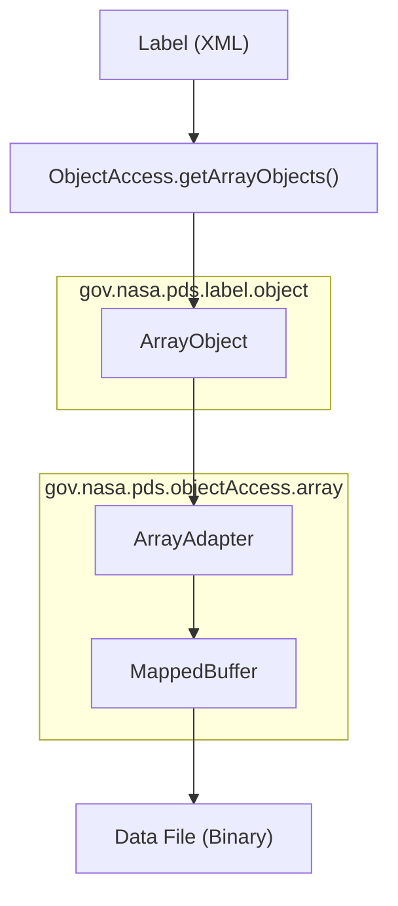
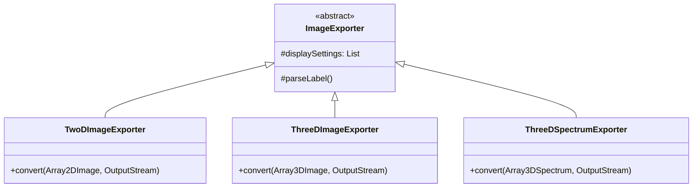

# Page: Array and Image Subsystem

# Array and Image Subsystem

Relevant source files

The following files were used as context for generating this wiki page:

- [src/main/java/gov/nasa/pds/label/object/ArrayObject.java](src/main/java/gov/nasa/pds/label/object/ArrayObject.java)
- [src/main/java/gov/nasa/pds/label/object/DataObject.java](src/main/java/gov/nasa/pds/label/object/DataObject.java)
- [src/main/java/gov/nasa/pds/objectAccess/ImageExporter.java](src/main/java/gov/nasa/pds/objectAccess/ImageExporter.java)
- [src/main/java/gov/nasa/pds/objectAccess/ThreeDImageExporter.java](src/main/java/gov/nasa/pds/objectAccess/ThreeDImageExporter.java)
- [src/main/java/gov/nasa/pds/objectAccess/ThreeDSpectrumExporter.java](src/main/java/gov/nasa/pds/objectAccess/ThreeDSpectrumExporter.java)
- [src/main/java/gov/nasa/pds/objectAccess/TwoDImageExporter.java](src/main/java/gov/nasa/pds/objectAccess/TwoDImageExporter.java)
- [src/main/java/gov/nasa/pds/objectAccess/array/ArrayAdapter.java](src/main/java/gov/nasa/pds/objectAccess/array/ArrayAdapter.java)
- [src/test/java/gov/nasa/pds/label/object/ArrayObjectTest.java](src/test/java/gov/nasa/pds/label/object/ArrayObjectTest.java)
- [src/test/java/gov/nasa/pds/label/object/GenericObjectTest.java](src/test/java/gov/nasa/pds/label/object/GenericObjectTest.java)
- [src/test/java/gov/nasa/pds/objectAccess/DelimitedTableReaderTest.java](src/test/java/gov/nasa/pds/objectAccess/DelimitedTableReaderTest.java)
- [src/test/java/gov/nasa/pds/objectAccess/table/TableBinaryAdapterTest.java](src/test/java/gov/nasa/pds/objectAccess/table/TableBinaryAdapterTest.java)

The Array and Image Subsystem provides the core functionality for reading, navigating, and exporting N-dimensional data structures defined in PDS4 labels. This includes support for `Array_2D_Image`, `Array_3D_Image`, and `Array_3D_Spectrum` objects. The system is designed to handle very large datasets through memory-mapped file access and provides a robust export pipeline for converting scientific data into common image formats (PNG, JPEG, TIFF, FITS, etc.).

### System Architecture Overview

The subsystem is divided into two primary concerns: **Data Access** (reading raw values from the data file) and **Image Export** (transforming those values into viewable or standard archival formats).

#### Natural Language to Code Entity Mapping: Data Access
The following diagram maps high-level data access concepts to the specific classes in the `pds4-jparser` codebase.

| Concept | Code Entity | Role |
| :--- | :--- | :--- |
| **Data Object** | `DataObject` | Base class managing file offsets and byte channels. |
| **Array Container** | `ArrayObject` | Represents a PDS4 Array; manages dimensions and element types. |
| **Coordinate Mapper** | `ArrayAdapter` | Maps N-dimensional coordinates to linear file offsets. |
| **Paging Strategy** | `MappedBuffer` | Handles memory-mapping for large file access. |

#### Data Access Flow

**Sources:** [src/main/java/gov/nasa/pds/label/object/ArrayObject.java:49-54](), [src/main/java/gov/nasa/pds/objectAccess/array/ArrayAdapter.java:41-45]()

---

### Array Data Access

The foundational class for all data objects is `DataObject`, which provides a `CappedSeekable` byte channel to ensure that data access is restricted to the specific byte range defined in the PDS4 label [src/main/java/gov/nasa/pds/label/object/DataObject.java:61-65](). 

`ArrayObject` extends this to provide typed access to N-dimensional data. It utilizes an `ArrayAdapter` to translate multi-dimensional indices (e.g., `row`, `column`, `band`) into the correct byte offset based on the array's dimensions and `ElementType` [src/main/java/gov/nasa/pds/label/object/ArrayObject.java:87-94]().

**Key Capabilities:**
* **Random Access:** Retrieve individual elements as `int`, `long`, or `double` [src/main/java/gov/nasa/pds/label/object/ArrayObject.java:171-197]().
* **Bulk Retrieval:** Fetch entire 2D, 3D, or 4D slices into Java primitive arrays [src/main/java/gov/nasa/pds/label/object/ArrayObject.java:237-259]().
* **Large File Support:** Uses a paging strategy via `MappedBuffer` to handle files exceeding 2 GB.

For details, see [Array Data Access — DataObject, ArrayObject, and ArrayAdapter](#4.1).

**Sources:** [src/main/java/gov/nasa/pds/label/object/DataObject.java:192-201](), [src/main/java/gov/nasa/pds/label/object/ArrayObject.java:49-54]()

---

### Image Export

The export subsystem allows users to convert PDS4 arrays into viewable formats. This process involves handling axis sequences, display orientations, and dynamic range scaling.

#### Natural Language to Code Entity Mapping: Exporters
The following diagram shows the hierarchy of exporter classes and their associated PDS4 object types.

**Sources:** [src/main/java/gov/nasa/pds/objectAccess/ImageExporter.java:52-53](), [src/main/java/gov/nasa/pds/objectAccess/TwoDImageExporter.java:83](), [src/main/java/gov/nasa/pds/objectAccess/ThreeDImageExporter.java:81](), [src/main/java/gov/nasa/pds/objectAccess/ThreeDSpectrumExporter.java:85]()

**Export Features:**
* **Multi-Format Support:** Export to PNG, JPEG, TIFF, FITS, VICAR, and PDS3 [src/main/java/gov/nasa/pds/objectAccess/TwoDImageExporter.java:98]().
* **Display Settings:** Respects `Display_Settings` from the label discipline area to determine `line_direction` and `sample_direction` [src/main/java/gov/nasa/pds/objectAccess/ImageExporter.java:187-191]().
* **Dynamic Range:** Includes functionality to maximize dynamic range during conversion (e.g., scaling 16-bit data to 8-bit for PNG) [src/main/java/gov/nasa/pds/objectAccess/TwoDImageExporter.java:97]().
* **Band Selection:** `ThreeDSpectrumExporter` allows selecting specific bands for RGB or grayscale output [src/main/java/gov/nasa/pds/objectAccess/ThreeDSpectrumExporter.java:107]().

For details, see [Image Export — TwoDImageExporter, ThreeDImageExporter, and ThreeDSpectrumExporter](#4.2).

**Sources:** [src/main/java/gov/nasa/pds/objectAccess/TwoDImageExporter.java:149-162](), [src/main/java/gov/nasa/pds/objectAccess/ThreeDSpectrumExporter.java:156-173]()
