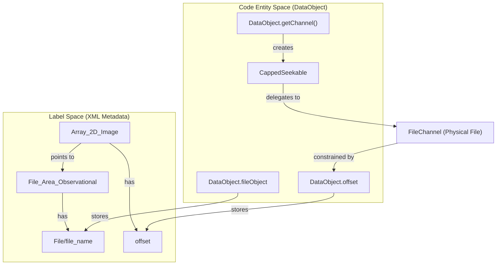
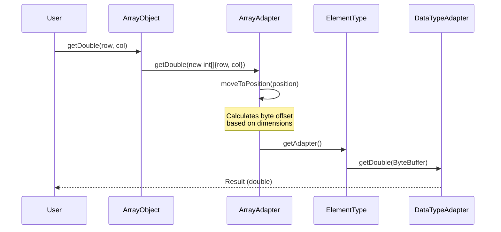

# Page: Array Data Access — DataObject, ArrayObject, and ArrayAdapter

# Array Data Access — DataObject, ArrayObject, and ArrayAdapter

Relevant source files

The following files were used as context for generating this wiki page:

- [src/main/java/gov/nasa/pds/label/NameNotKnownException.java](src/main/java/gov/nasa/pds/label/NameNotKnownException.java)
- [src/main/java/gov/nasa/pds/label/object/ArrayObject.java](src/main/java/gov/nasa/pds/label/object/ArrayObject.java)
- [src/main/java/gov/nasa/pds/label/object/DataObject.java](src/main/java/gov/nasa/pds/label/object/DataObject.java)
- [src/main/java/gov/nasa/pds/objectAccess/array/ArrayAdapter.java](src/main/java/gov/nasa/pds/objectAccess/array/ArrayAdapter.java)
- [src/main/java/gov/nasa/pds/objectAccess/array/ComplexDataTypeAdapter.java](src/main/java/gov/nasa/pds/objectAccess/array/ComplexDataTypeAdapter.java)
- [src/main/java/gov/nasa/pds/objectAccess/array/ComplexDoubleAdapter.java](src/main/java/gov/nasa/pds/objectAccess/array/ComplexDoubleAdapter.java)
- [src/main/java/gov/nasa/pds/objectAccess/array/ComplexFloatAdapter.java](src/main/java/gov/nasa/pds/objectAccess/array/ComplexFloatAdapter.java)
- [src/main/java/gov/nasa/pds/objectAccess/array/DoubleAdapter.java](src/main/java/gov/nasa/pds/objectAccess/array/DoubleAdapter.java)
- [src/main/java/gov/nasa/pds/objectAccess/array/ElementType.java](src/main/java/gov/nasa/pds/objectAccess/array/ElementType.java)
- [src/main/java/gov/nasa/pds/objectAccess/array/FloatAdapter.java](src/main/java/gov/nasa/pds/objectAccess/array/FloatAdapter.java)
- [src/test/java/gov/nasa/pds/label/object/ArrayObjectTest.java](src/test/java/gov/nasa/pds/label/object/ArrayObjectTest.java)
- [src/test/java/gov/nasa/pds/label/object/GenericObjectTest.java](src/test/java/gov/nasa/pds/label/object/GenericObjectTest.java)
- [src/test/java/gov/nasa/pds/objectAccess/table/TableBinaryAdapterTest.java](src/test/java/gov/nasa/pds/objectAccess/table/TableBinaryAdapterTest.java)

This page describes the technical implementation of N-dimensional array access in the PDS4 JParser. It covers the hierarchy from the base `DataObject` to specialized array handling via `ArrayObject` and the coordinate-mapping logic in `ArrayAdapter`.

## DataObject: The Base Foundation

All data structures in a PDS4 product (Tables, Arrays, Parsable Byte Streams) inherit from the `DataObject` abstract class [src/main/java/gov/nasa/pds/label/object/DataObject.java:61-61](). It provides the core mechanism for locating data within a file and managing I/O resources.

### CappedSeekable and Resource Management
To ensure that a `DataObject` only accesses its designated portion of a file, it utilizes an internal `CappedSeekable` class [src/main/java/gov/nasa/pds/label/object/DataObject.java:62-108](). This class wraps a `SeekableByteChannel` and enforces boundaries based on the `offset` and `size` defined in the PDS4 label.

Key capabilities of `DataObject` include:
*   **Remote Caching**: If the data file is located at a remote URL, `DataObject` can download and cache the file locally [src/main/java/gov/nasa/pds/label/object/DataObject.java:237-268]().
*   **Channel Access**: Provides a `SeekableByteChannel` via `getChannel()`, which is restricted to the object's byte range [src/main/java/gov/nasa/pds/label/object/DataObject.java:214-235]().
*   **Input Streams**: Provides a `BoundedInputStream` to prevent reading past the object's defined size [src/main/java/gov/nasa/pds/label/object/DataObject.java:201-212]().

### Data Flow: From Label to Channel
The following diagram illustrates how `DataObject` bridges the XML metadata to the physical byte stream.

**Title: DataObject Resource Mapping**

Sources: [src/main/java/gov/nasa/pds/label/object/DataObject.java:110-117](), [src/main/java/gov/nasa/pds/label/object/DataObject.java:62-71]()

---

## ArrayObject: N-Dimensional Data Access

`ArrayObject` extends `DataObject` to provide typed access to PDS4 arrays (e.g., `Array_2D_Image`, `Array_3D_Spectrum`) [src/main/java/gov/nasa/pds/label/object/ArrayObject.java:49-49]().

### Initialization and Metadata
During construction, `ArrayObject` performs several critical steps:
1.  **Dimension Discovery**: Parses the `Axis_Array` elements to determine the shape of the array [src/main/java/gov/nasa/pds/label/object/ArrayObject.java:118-125]().
2.  **Element Type Selection**: Maps the PDS4 `data_type` (e.g., `IEEE754MSBDouble`) to an `ElementType` and a corresponding `DataTypeAdapter` [src/main/java/gov/nasa/pds/label/object/ArrayObject.java:91-91]().
3.  **Size Calculation**: Calculates total byte size based on dimensions and element size [src/main/java/gov/nasa/pds/label/object/ArrayObject.java:136-143]().

### Data Access Methods
`ArrayObject` provides multiple ways to retrieve data:
*   **Single Element**: `getInt(int[] position)`, `getDouble(int row, int col)`, etc. [src/main/java/gov/nasa/pds/label/object/ArrayObject.java:171-197]().
*   **Bulk Retrieval**: `getElements2D()`, `getElements3D()`, or `getElements4D()` return native Java arrays [src/main/java/gov/nasa/pds/label/object/ArrayObject.java:279-346]().
*   **Image Conversion**: `as2DImage()` converts the array data into a `BufferedImage` for visualization [src/main/java/gov/nasa/pds/label/object/ArrayObject.java:515-534]().

Sources: [src/main/java/gov/nasa/pds/label/object/ArrayObject.java:84-98](), [src/test/java/gov/nasa/pds/label/object/ArrayObjectTest.java:59-101]()

---

## ArrayAdapter and Coordinate Mapping

The `ArrayAdapter` is the engine that translates N-dimensional coordinates into byte offsets within the file [src/main/java/gov/nasa/pds/objectAccess/array/ArrayAdapter.java:41-41]().

### Offset Calculation
For an array with dimensions $d_1, d_2, ..., d_n$, the offset for a position $(p_1, p_2, ..., p_n)$ is calculated using a row-major strategy. The `moveToPosition(int[] position)` method performs this mapping and positions a `ByteBuffer` at the resulting offset [src/main/java/gov/nasa/pds/objectAccess/array/ArrayAdapter.java:313-324]().

### Paging Strategy: MappedBuffer
For large arrays that may exceed available memory or the 2GB limit of a single Java `MappedByteBuffer`, `ArrayAdapter` uses a `MappedBuffer` strategy [src/main/java/gov/nasa/pds/objectAccess/array/ArrayAdapter.java:45-45](). This allows the system to page through the file data efficiently without loading the entire array into the JVM heap.

**Title: ArrayAdapter Coordinate-to-Byte Flow**

Sources: [src/main/java/gov/nasa/pds/objectAccess/array/ArrayAdapter.java:209-213](), [src/main/java/gov/nasa/pds/objectAccess/array/ArrayAdapter.java:313-324]()

---

## ElementType and DataTypeAdapters

The `ElementType` class contains a registry of all supported PDS4 data types and their corresponding adapters [src/main/java/gov/nasa/pds/objectAccess/array/ElementType.java:42-91]().

### Supported Types
| PDS4 Data Type | Adapter Class | Size (Bytes) |
| :--- | :--- | :--- |
| `SignedMSB4` | `IntegerAdapter` | 4 |
| `IEEE754MSBDouble` | `DoubleAdapter` | 8 |
| `ComplexMSB16` | `ComplexDoubleAdapter` | 16 |
| `UnsignedByte` | `IntegerAdapter` | 1 |

### Specialized Adapters
*   **IntegerAdapter**: Handles signed/unsigned integers and endianness [src/main/java/gov/nasa/pds/objectAccess/array/ElementType.java:60-90]().
*   **Float/DoubleAdapter**: Uses `Float.intBitsToFloat()` and `Double.longBitsToDouble()` after reading the raw bits via an underlying `IntegerAdapter` [src/main/java/gov/nasa/pds/objectAccess/array/FloatAdapter.java:68-71](), [src/main/java/gov/nasa/pds/objectAccess/array/DoubleAdapter.java:66-69]().
*   **ComplexAdapters**: Handle `ComplexLSB8/16` and `ComplexMSB8/16`. These return the magnitude ($\sqrt{real^2 + imag^2}$) when calling standard `getDouble()` [src/main/java/gov/nasa/pds/objectAccess/array/ComplexFloatAdapter.java:18-21]().

Sources: [src/main/java/gov/nasa/pds/objectAccess/array/ElementType.java:40-130](), [src/main/java/gov/nasa/pds/objectAccess/array/ComplexFloatAdapter.java:5-46]()
