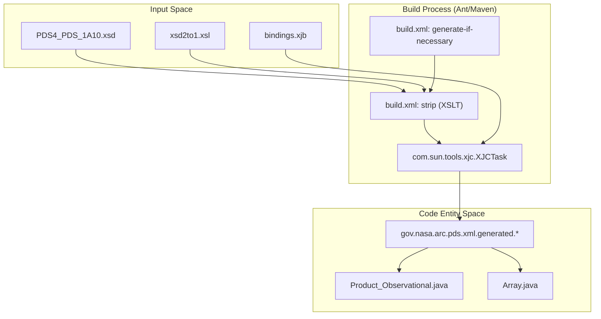
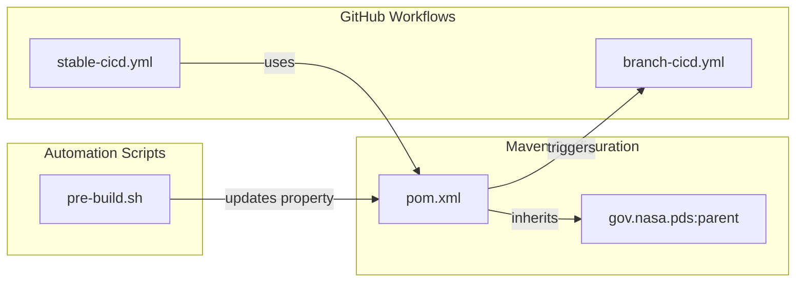

# Page: Build System and Dependencies

# Build System and Dependencies

Relevant source files

The following files were used as context for generating this wiki page:

- [CHANGELOG.md](CHANGELOG.md)
- [build/pre-build.sh](build/pre-build.sh)
- [pom.xml](pom.xml)
- [src/build/resources/bindings.xjb](src/build/resources/bindings.xjb)
- [src/build/resources/build.xml](src/build/resources/build.xml)
- [src/build/resources/schema/1A10/PDS4_DISP_1A10.xsd](src/build/resources/schema/1A10/PDS4_DISP_1A10.xsd)
- [src/build/resources/schema/1A10/PDS4_PDS_1A10.xsd](src/build/resources/schema/1A10/PDS4_PDS_1A10.xsd)
- [src/changes/changes.xml](src/changes/changes.xml)

This page provides a high-level overview of the **pds4-jparser** build infrastructure. The project uses Apache Maven as its primary build tool, incorporating a sophisticated code-generation pipeline to transform PDS4 Information Model (IM) schemas into Java classes. It also manages a set of "vendored" dependencies via a local repository to ensure compatibility with specific PDS4 requirements.

## Maven Build Lifecycle and Configuration

The project inherits from the `gov.nasa.pds:parent` POM, which provides standard NASA PDS release profiles and repository configurations [pom.xml:5-10](). The build is configured for Java 17+ [CHANGELOG.md:14-14]().

### Build Pipeline Overview
The build process involves several distinct phases to handle resource filtering, source generation, and artifact packaging.

| Phase | Plugin | Purpose |
| :--- | :--- | :--- |
| `generate-sources` | `maven-antrun-plugin` | Executes an Ant script to generate JAXB classes from PDS4 XSDs [pom.xml:74-91](). |
| `process-sources` | `build-helper-maven-plugin` | Adds the generated Java files to the project's source path [pom.xml:54-71](). |
| `prepare-package` | `maven-source-plugin` | Packages source and test-source JARs [pom.xml:95-112](). |
| `package` | `maven-shade-plugin` | Bundles specific local dependencies into the final JAR [pom.xml:113-145](). |
| `package` | `maven-assembly-plugin` | Creates binary distributions in `.zip` and `.tar.gz` formats [pom.xml:146-167](). |

**Sources:** [pom.xml:30-177](), [CHANGELOG.md:14-14]()

## JAXB Code-Generation Pipeline

A core component of the build system is the automated generation of Java classes from PDS4 XML Schemas. This ensures that the parser remains synchronized with the PDS4 Information Model.

### Generation Workflow
The pipeline uses an Ant script (`src/build/resources/build.xml`) to coordinate the `xjc` (XML to Java Compiler) task [src/build/resources/build.xml:74-85]().

1.  **Schema Preparation**: The `strip` target applies an XSLT transformation (`xsd2to1.xsl`) to simplify the PDS4 schema for JAXB processing [src/build/resources/build.xml:87-90]().
2.  **Binding Customization**: The `bindings.xjb` file defines how XML types map to Java, including renaming conflicts (e.g., `editionCount` for document editions) and handling special characters in enumerations [src/build/resources/bindings.xjb:71-112]().
3.  **Source Generation**: Java classes are generated into `target/generated-sources/main/java` under the package `gov.nasa.arc.pds.xml.generated` [src/build/resources/build.xml:37-41]().

### Code-to-Entity Mapping: Generation Pipeline
The following diagram illustrates how build-time entities interact to produce the generated API.

**Sources:** [src/build/resources/build.xml:37-90](), [src/build/resources/bindings.xjb:33-134]()

## Dependency Management

The project manages two types of dependencies: standard Maven Central artifacts and specialized "vendored" libraries.

### Third-Party Dependencies
Standard dependencies include JAXB runtimes, Log4j for logging, and various Apache Commons utilities. Note that legacy dependencies like `antlr` have been removed in recent versions to streamline the footprint [CHANGELOG.md:54-54]().

### Local Repository and Shading
Because certain PDS-specific forks (like `opencsv`) or niche libraries (like `vicario`) are required, the project maintains a local repository.
*   **Shading**: The `maven-shade-plugin` is used to bundle `gov.nasa.pds:vicario` and `gov.nasa.pds:opencsv` directly into the `pds4-jparser` JAR [pom.xml:125-130](). This prevents "dependency hell" for downstream tools like the PDS Validate Tool.

For more information, see **[Local Maven Repository and Vendored Dependencies](#5.2)**.

**Sources:** [pom.xml:113-145](), [CHANGELOG.md:54-54]()

## CI/CD and Versioning

The build system is integrated with GitHub Actions for continuous integration and deployment.

### Information Model (IM) Upgrades
The project uses a `pre-build.sh` script to facilitate upgrading to new PDS4 IM versions. This script downloads the requested XSD, updates the `model-version` property in the `pom.xml`, and commits the changes [build/pre-build.sh:23-36]().

### Release Automation
The build uses the `roundup-action` for automated releases to Maven Central [CHANGELOG.md:143-143]().

For details on the automated workflows, see **[CI/CD Pipelines and GitHub Workflows](#5.1)**.

### System Overview: Build and Deployment
This diagram maps the high-level build components to the specific files and scripts that implement them.

**Sources:** [pom.xml:5-10](), [build/pre-build.sh:32-32](), [CHANGELOG.md:143-143]()
