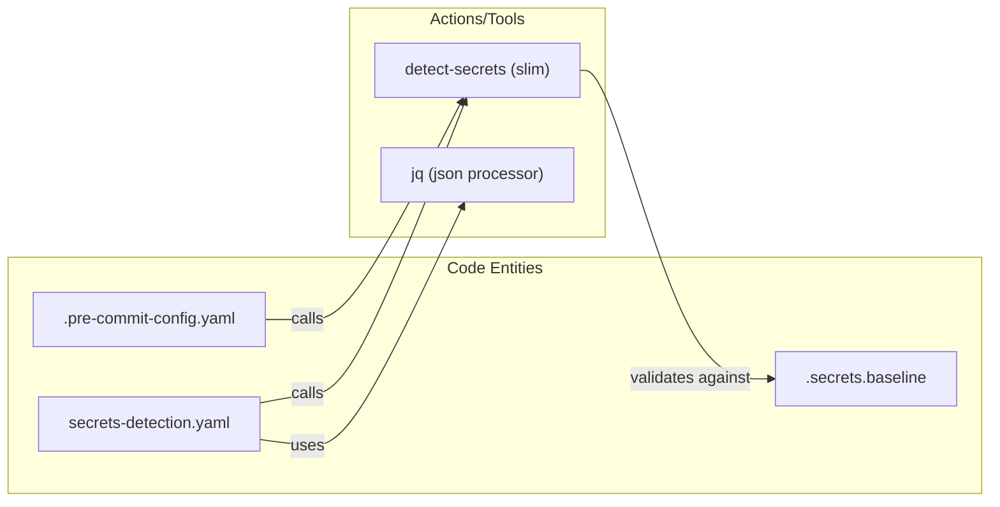

# Page: CI/CD Pipelines and GitHub Workflows

# CI/CD Pipelines and GitHub Workflows

<details>
<summary>Relevant source files</summary>

The following files were used as context for generating this wiki page:

- [.github/dependabot.yml](.github/dependabot.yml)
- [.github/workflows/branch-cicd.yaml](.github/workflows/branch-cicd.yaml)
- [.github/workflows/issue-project-automation.yml](.github/workflows/issue-project-automation.yml)
- [.github/workflows/secrets-detection.yaml](.github/workflows/secrets-detection.yaml)
- [.github/workflows/stable-cicd.yaml](.github/workflows/stable-cicd.yaml)
- [.github/workflows/unstable-cicd.yaml](.github/workflows/unstable-cicd.yaml)
- [.pre-commit-config.yaml](.pre-commit-config.yaml)
- [.secrets.baseline](.secrets.baseline)
- [repo/gov/nasa/pds/opencsv/5.5/opencsv-5.5.jar](repo/gov/nasa/pds/opencsv/5.5/opencsv-5.5.jar)
- [repo/gov/nasa/pds/opencsv/5.5/opencsv-5.5.jar.md5](repo/gov/nasa/pds/opencsv/5.5/opencsv-5.5.jar.md5)
- [repo/gov/nasa/pds/opencsv/5.5/opencsv-5.5.jar.sha1](repo/gov/nasa/pds/opencsv/5.5/opencsv-5.5.jar.sha1)
- [repo/gov/nasa/pds/opencsv/5.5/opencsv-5.5.pom](repo/gov/nasa/pds/opencsv/5.5/opencsv-5.5.pom)
- [repo/gov/nasa/pds/opencsv/5.5/opencsv-5.5.pom.md5](repo/gov/nasa/pds/opencsv/5.5/opencsv-5.5.pom.md5)
- [repo/gov/nasa/pds/opencsv/5.5/opencsv-5.5.pom.sha1](repo/gov/nasa/pds/opencsv/5.5/opencsv-5.5.pom.sha1)
- [repo/gov/nasa/pds/opencsv/maven-metadata.xml](repo/gov/nasa/pds/opencsv/maven-metadata.xml)
- [settings.xml](settings.xml)

</details>


This page documents the automated Continuous Integration and Continuous Delivery (CI/CD) infrastructure for the `pds4-jparser` library. The project utilizes GitHub Actions to manage the lifecycle of the software, from branch-level testing and security scanning to snapshot deployments and official releases to Maven Central.

## Workflow Architecture Overview

The CI/CD strategy is divided into three primary tiers of execution based on the git reference (branch or tag) and the intended artifact stability. All workflows leverage the `NASA-PDS/roundup-action` for standardized PDS build logic.

### CI/CD Data Flow and Execution

The following diagram illustrates how code changes trigger different pipelines and how data flows toward final publication.

**Pipeline Trigger and Artifact Flow**
```mermaid
graph TD
    subgraph "Developer Space"
        PR["Pull Request"]
        Branch["Feature Branch"]
    end

    subgraph "GitHub Actions Space"
        BCICD["branch-cicd.yaml"]
        UCICD["unstable-cicd.yaml"]
        SCICD["stable-cicd.yaml"]
        SD["secrets-detection.yaml"]
    end

    subgraph "External Entities"
        Validate["NASA-PDS/validate"]
        Sonatype["Maven Central (OSSRH)"]
        GitHubPkg["GitHub Packages"]
    end

    Branch -->|push| BCICD
    PR -->|open/sync| BCICD
    PR -->|open/sync| SD
    
    BCICD -->|mvn install| Validate
    
    "main branch" -->|push| UCICD
    UCICD -->|deploy snapshot| GitHubPkg
    
    "release/* tag" -->|push| SCICD
    SCICD -->|deploy release| Sonatype
```
Sources: [.github/workflows/branch-cicd.yaml:15-20](), [.github/workflows/unstable-cicd.yaml:32-35](), [.github/workflows/stable-cicd.yaml:34-37](), [.github/workflows/secrets-detection.yaml:2-8]()

---

## 1. Branch Integration Testing (`branch-cicd`)

The `branch-cicd.yaml` workflow ensures that every commit to a non-main branch is functionally sound across multiple Java environments.

### Implementation Details
- **Multi-JDK Matrix**: The workflow runs a build matrix against JDK 17 and JDK 21 to ensure forward compatibility [[.github/workflows/branch-cicd.yaml:34-36]]().
- **Maven Caching**: Utilizes `actions/cache` with a key based on the OS and `pom.xml` hash to speed up dependency resolution [[.github/workflows/branch-cicd.yaml:47-57]]().
- **Downstream Integration**: A critical step in this pipeline is the integration test with the `NASA-PDS/validate` tool. The workflow clones the `validate` repository and runs its test suite against the locally built `pds4-jparser` artifact to prevent regressions in the PDS validation ecosystem [[.github/workflows/branch-cicd.yaml:69-74]]().

Sources: [.github/workflows/branch-cicd.yaml:1-76]()

---

## 2. Unstable Integration & Delivery (`unstable-cicd`)

Triggered by pushes to the `main` branch, this workflow manages the "Snapshot" lifecycle.

### Key Characteristics
- **Snapshot Deployment**: It uses the `roundup-action` with the `unstable` assembly type to deploy artifacts to the GitHub Packages repository [[.github/workflows/unstable-cicd.yaml:73-80]]().
- **Site Generation**: Executes `maven-doc-phases` including `site` and `site:stage` to update project documentation for the current development state [[.github/workflows/unstable-cicd.yaml:79-80]]().
- **Security Requirements**: Requires `ADMIN_GITHUB_TOKEN` and `CODE_SIGNING_KEY` for signing the unstable artifacts [[.github/workflows/unstable-cicd.yaml:81-85]]().

Sources: [.github/workflows/unstable-cicd.yaml:1-87]()

---

## 3. Stable Integration & Delivery (`stable-cicd`)

This workflow is the final stage of the release process, triggered by tags matching the `release/*` pattern [[.github/workflows/stable-cicd.yaml:34-37]]().

### Release Implementation
- **Roundup Configuration**: Sets `assembly: stable` which instructs the `roundup-action` to perform a full release to Maven Central (OSSRH) [[.github/workflows/stable-cicd.yaml:71-78]]().
- **Documentation Staging**: Explicitly defines the `documentation-dir` as `target/staging/pds4-jparser` for permanent archival of versioned docs [[.github/workflows/stable-cicd.yaml:79]]().
- **Authentication**: Leverages `central_portal_username` and `central_portal_token` (derived from `OSSRH_USERNAME/PASSWORD` secrets) to authenticate with the Sonatype Central Portal [[.github/workflows/stable-cicd.yaml:81-84]]().

Sources: [.github/workflows/stable-cicd.yaml:1-86]()

---

## 4. Security and Maintenance Workflows

The repository employs several automated checks to maintain code quality and security.

### Secret Detection (`secrets-detection`)
This workflow prevents the accidental leakage of credentials or private keys.
- **Tooling**: Uses `slim-detect-secrets` (a NASA-AMMOS fork) and `jq` [[.github/workflows/secrets-detection.yaml:21-22]]().
- **Baseline Mechanism**: It compares current scans against `.secrets.baseline` [[.github/workflows/secrets-detection.yaml:45-59]](). If new, un-indexed secrets are found, the build fails with instructions for the developer to remediate locally [[.github/workflows/secrets-detection.yaml:60-71]]().
- **Pre-commit Integration**: The same `detect-secrets` logic is mirrored in the `.pre-commit-config.yaml` to catch issues before they are pushed to GitHub [[.pre-commit-config.yaml:19-34]]().

### Dependabot Configuration
Managed via `.github/dependabot.yml`, the project automatically checks for updates to:
- **Maven Dependencies**: Scans `pom.xml` monthly [[.github/dependabot.yml:9-12]]().
- **GitHub Actions**: Scans workflow files monthly to ensure the latest versions of actions (like `actions/checkout@v6`) are used [[.github/dependabot.yml:15-18]]().

### Issue Automation
The `issue-project-automation.yml` workflow automatically assigns new issues to the PDS Organization project board (Project #6) using the `ORG_PROJECT_PAT` secret [[.github/workflows/issue-project-automation.yml:1-24]]().

**Security Entity Mapping**

Sources: [.github/workflows/secrets-detection.yaml:21-22](), [.github/workflows/secrets-detection.yaml:45-59](), [.pre-commit-config.yaml:19-34]()

---

## Summary of Required Secrets

To function correctly, the following secrets must be configured in the GitHub repository settings:

| Secret Name | Purpose | Used In |
| :--- | :--- | :--- |
| `ADMIN_GITHUB_TOKEN` | PAT for repository access and package writes | All CICD workflows |
| `CODE_SIGNING_KEY` | GPG Private key for signing Maven artifacts | Stable/Unstable CICD |
| `CENTRAL_REPOSITORY_USERNAME` | OSSRH/Maven Central username | Stable/Unstable CICD |
| `CENTRAL_REPOSITORY_TOKEN` | OSSRH/Maven Central password/token | Stable/Unstable CICD |
| `ORG_PROJECT_PAT` | PAT with `project` scope for org-level automation | Issue Automation |

Sources: [.github/workflows/unstable-cicd.yaml:7-18](), [.github/workflows/issue-project-automation.yml:21-23]()
