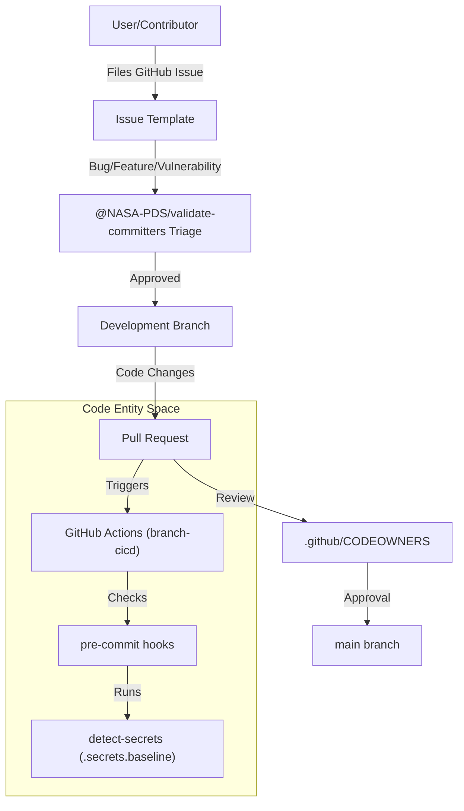
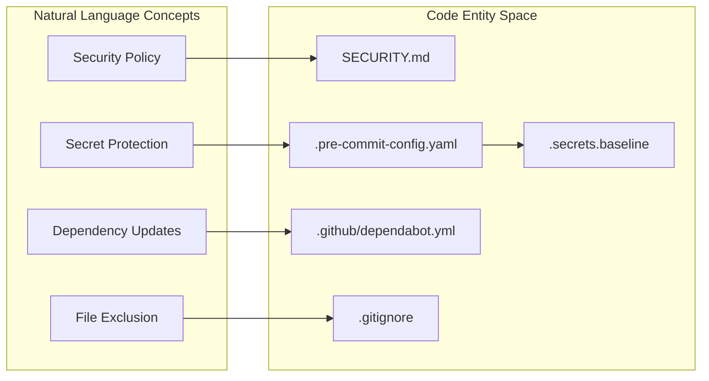

# Page: Contributing and Governance

# Contributing and Governance

Relevant source files

The following files were used as context for generating this wiki page:

- [.github/CODEOWNERS](.github/CODEOWNERS)
- [.github/dependabot.yml](.github/dependabot.yml)
- [.gitignore](.gitignore)
- [.pre-commit-config.yaml](.pre-commit-config.yaml)
- [.secrets.baseline](.secrets.baseline)
- [LICENSE.md](LICENSE.md)
- [NOTICE.txt](NOTICE.txt)
- [SECURITY.md](SECURITY.md)
- [repo/gov/nasa/pds/opencsv/5.5/opencsv-5.5.jar](repo/gov/nasa/pds/opencsv/5.5/opencsv-5.5.jar)
- [repo/gov/nasa/pds/opencsv/5.5/opencsv-5.5.jar.md5](repo/gov/nasa/pds/opencsv/5.5/opencsv-5.5.jar.md5)
- [repo/gov/nasa/pds/opencsv/5.5/opencsv-5.5.jar.sha1](repo/gov/nasa/pds/opencsv/5.5/opencsv-5.5.jar.sha1)
- [repo/gov/nasa/pds/opencsv/5.5/opencsv-5.5.pom](repo/gov/nasa/pds/opencsv/5.5/opencsv-5.5.pom)
- [repo/gov/nasa/pds/opencsv/5.5/opencsv-5.5.pom.md5](repo/gov/nasa/pds/opencsv/5.5/opencsv-5.5.pom.md5)
- [repo/gov/nasa/pds/opencsv/5.5/opencsv-5.5.pom.sha1](repo/gov/nasa/pds/opencsv/5.5/opencsv-5.5.pom.sha1)
- [repo/gov/nasa/pds/opencsv/maven-metadata.xml](repo/gov/nasa/pds/opencsv/maven-metadata.xml)

This page outlines the processes and policies for contributing to the `pds4-jparser` library. As a core component of the NASA Planetary Data System (PDS) ecosystem, the project maintains strict standards for code quality, security, and attribution.

## Overview of Contribution and Governance

The `pds4-jparser` project follows a structured governance model managed by the NASA PDS Engineering Node. Contributions are welcomed from the community and are facilitated through GitHub issues and pull requests. The repository utilizes automated tools to ensure compliance with licensing, security baselines, and coding standards.

### Governance Structure
- **Code Ownership**: The repository is governed by the `@NASA-PDS/validate-committers` team, who serve as the default reviewers for all changes [ .github/CODEOWNERS:43-43 ]().
- **Licensing**: The project is licensed under the Apache License, Version 2.0 [ LICENSE.md:1-5 ](). All contributions are expected to adhere to this license [ LICENSE.md:120-124 ]().
- **Attribution**: Legal notices and government sponsorship acknowledgments are maintained in the `NOTICE.txt` file [ NOTICE.txt:1-6 ]().

## Issue and Pull Request Workflow

The project uses standardized templates to categorize and streamline incoming requests. This ensures that the maintainers have all necessary technical context to triage bugs or evaluate new features.

| Template Type | Purpose |
| :--- | :--- |
| **Bug Report** | Reporting unexpected behavior or software defects. |
| **Feature Request** | Proposing new functionality or enhancements. |
| **PDS4 Standards Change** | Requesting updates to support new Information Model (IM) versions. |
| **Vulnerability Issue** | Securely reporting security-related defects [ SECURITY.md:18-21 ](). |

For a detailed breakdown of the submission requirements and the lifecycle of a contribution, see **[Issue Templates and Pull Request Process](#7.1)**.

### Contribution Lifecycle Diagram
The following diagram illustrates how a natural language request moves into the code entity space through the PDS4 JParser workflow.

**Contribution Flow: From Issue to Merge**

Sources: [ .github/CODEOWNERS:43-43 ](), [ .pre-commit-config.yaml:18-24 ](), [ .secrets.baseline:1-134 ]()

## Repository Hygiene and Security

To maintain a high standard of repository health, `pds4-jparser` employs several automated hygiene mechanisms.

### Security Policy
The project maintains a `SECURITY.md` file that defines the supported versions for security updates and the protocol for reporting vulnerabilities [ SECURITY.md:1-21 ](). Currently, only the 2.0.x branch is actively supported for security patches [ SECURITY.md:10-15 ]().

### Automated Checks
- **Secret Detection**: The repository uses `detect-secrets` via a pre-commit hook to prevent the accidental exposure of credentials [ .pre-commit-config.yaml:20-24 ](). It references a `.secrets.baseline` file to manage known false positives [ .secrets.baseline:1-134 ]().
- **Dependency Management**: Dependabot is configured to perform monthly updates for both Maven dependencies and GitHub Actions [ .github/dependabot.yml:6-18 ]().
- **Git Ignore**: A comprehensive `.gitignore` file prevents build artifacts (e.g., `target/`), IDE metadata (`.idea/`, `.settings/`), and OS-specific files from entering the source tree [ .gitignore:43-83 ]().

For detailed information on security reporting and hook configuration, see **[Licensing, Security, and Repository Hygiene](#7.2)**.

### Security and Hygiene Mapping
The following diagram maps security concepts to the specific configuration files and tools used in the codebase.

**Security and Hygiene Mapping**

Sources: [ SECURITY.md:1-21 ](), [ .pre-commit-config.yaml:1-35 ](), [ .github/dependabot.yml:1-19 ](), [ .gitignore:1-92 ]()

## Sub-pages
- [Issue Templates and Pull Request Process](#7.1) — Detailed guide on GitHub issue types and the PR checklist.
- [Licensing, Security, and Repository Hygiene](#7.2) — Deep dive into Apache 2.0 compliance, vulnerability reporting, and automated secret scanning.
