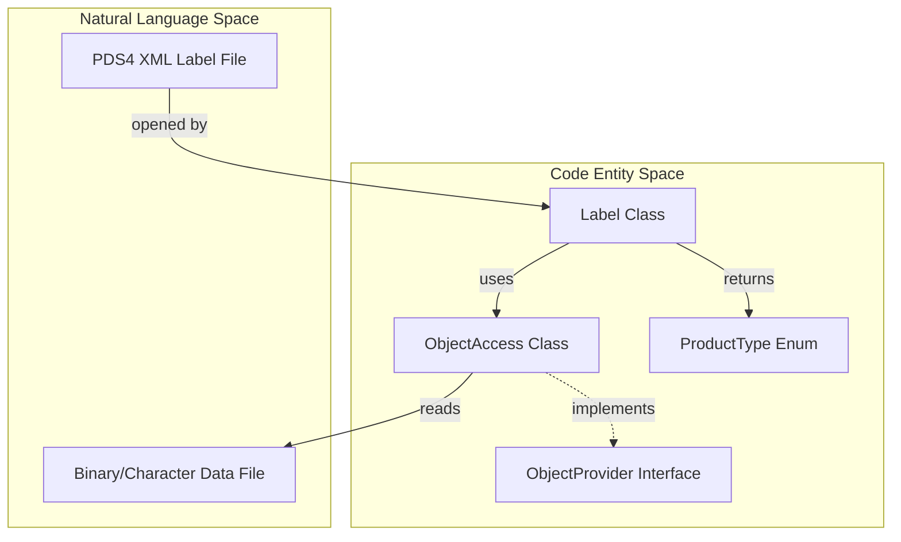
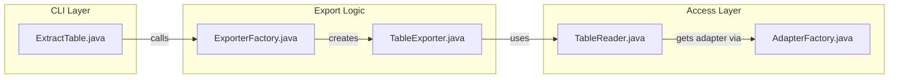

# Page: Getting Started — Installation and Quick-Start

# Getting Started — Installation and Quick-Start

<details>
<summary>Relevant source files</summary>

The following files were used as context for generating this wiki page:

- [README.md](README.md)
- [src/main/assembly/tar-assembly.xml](src/main/assembly/tar-assembly.xml)
- [src/main/assembly/zip-assembly.xml](src/main/assembly/zip-assembly.xml)
- [src/main/java/gov/nasa/pds/objectAccess/TableExporter.java](src/main/java/gov/nasa/pds/objectAccess/TableExporter.java)
- [src/main/java/gov/nasa/pds/objectAccess/example/ExtractTable.java](src/main/java/gov/nasa/pds/objectAccess/example/ExtractTable.java)
- [src/site/resources/images/pds4_logo.png](src/site/resources/images/pds4_logo.png)
- [src/site/site.xml](src/site/site.xml)
- [src/site/xdoc/develop/index.xml.vm](src/site/xdoc/develop/index.xml.vm)
- [src/site/xdoc/index.xml](src/site/xdoc/index.xml)
- [src/site/xdoc/install/index.xml.vm](src/site/xdoc/install/index.xml.vm)
- [src/test/java/gov/nasa/pds/objectAccess/TableWriterTest.java](src/test/java/gov/nasa/pds/objectAccess/TableWriterTest.java)

</details>


This page provides a step-by-step guide for integrating the PDS4 JParser library into your Java projects. It covers system requirements, installation methods (Maven vs. source build), and basic usage of the API and command-line interface.

## System Requirements

The PDS4 JParser is a Java-based library designed to run on any platform with a supported Java Runtime Environment (JRE).

*   **Java:** Version 17 or higher [README.md:16-16](), [src/site/xdoc/install/index.xml.vm:53-53]().
*   **Build Tool:** Maven 3 [README.md:17-17]().

Sources: [README.md:14-17](), [src/site/xdoc/install/index.xml.vm:52-68]()

---

## Installation

### 1. Adding Maven Dependency
To use the library in an existing Maven project, add the following dependency to your `pom.xml`. Note that the library is deployed to the [Sonatype Maven Repository](https://repo.maven.apache.org/maven2/gov/nasa/pds/) [README.md:169-173]().

```xml
<dependency>
  <groupId>gov.nasa.pds</groupId>
  <artifactId>pds4-jparser</artifactId>
  <version>1.1.0</version>
</dependency>
```

### 2. Building from Source
If you wish to modify the library or use the latest development version, clone the repository and build using Maven.

*   **Compile only:** `mvn compile` [README.md:27-27]()
*   **Build JAR:** `mvn compile jar:jar` [README.md:28-28]()
*   **Full Distribution:** To create the complete package (including documentation and site), run:
    ```bash
    mvn site
    mvn package
    ```
    [README.md:30-36]()

### 3. Binary Distribution
Binary packages are available as `.zip` or `.tar.gz` files from the [GitHub Releases](https://github.com/NASA-PDS/pds4-jparser/releases) page [src/site/xdoc/install/index.xml.vm:71-71]().

**Directory Structure after unpacking:**
*   `bin/`: Execution scripts for CLI tools [src/site/xdoc/install/index.xml.vm:95-98]().
*   `doc/`: Javadoc documentation [src/site/xdoc/install/index.xml.vm:99-102]().
*   `examples/`: Example driver programs and data [src/site/xdoc/install/index.xml.vm:103-106]().
*   `lib/`: The library JAR and its dependencies [src/site/xdoc/install/index.xml.vm:107-110]().

Sources: [README.md:25-37](), [src/site/xdoc/install/index.xml.vm:70-112]()

---

## Command-Line Usage: ExtractTable

The `ExtractTable` tool is a provided example application that demonstrates how to read PDS4 tables and export them to formats like CSV [src/main/java/gov/nasa/pds/objectAccess/example/ExtractTable.java:67-117]().

### Configuration
On UNIX-based systems, add the `bin` directory to your path:
```bash
export PATH=${PATH}:/usr/local/pds4-jparser-1.1.0/bin
```
[src/site/xdoc/install/index.xml.vm:126-126]()

### Common Commands
| Flag | Description |
| :--- | :--- |
| `-l`, `--list-tables` | Lists tables present in the product label [src/main/java/gov/nasa/pds/objectAccess/example/ExtractTable.java:137-138](). |
| `-n`, `--index` | Specifies the table index (1..N) to extract [src/main/java/gov/nasa/pds/objectAccess/example/ExtractTable.java:140-141](). |
| `-f`, `--fields` | Comma-separated list of field names or numbers to extract [src/main/java/gov/nasa/pds/objectAccess/example/ExtractTable.java:150-151](). |
| `-c`, `--csv` | Output in CSV format [src/main/java/gov/nasa/pds/objectAccess/example/ExtractTable.java:166-166](). |
| `-o`, `--output-file` | Output file name (defaults to stdout) [src/main/java/gov/nasa/pds/objectAccess/example/ExtractTable.java:156-157](). |

Sources: [src/main/java/gov/nasa/pds/objectAccess/example/ExtractTable.java:132-179](), [src/site/xdoc/install/index.xml.vm:114-127]()

---

## Minimal Code Example

The primary entry point for the API is the `Label` class, which handles opening PDS4 XML labels and accessing the underlying data objects.

### Opening a Label and Accessing Objects
```java
import gov.nasa.pds.label.Label;
import java.io.File;

public class QuickStart {
    public static void main(String[] args) throws Exception {
        // 1. Open the label file
        Label label = Label.open(new File("product_label.xml"));
        
        // 2. Identify the product type (e.g., PRODUCT_OBSERVATIONAL)
        System.out.println("Product Type: " + label.getProductType());
        
        // 3. Get all data objects (Tables, Arrays, etc.)
        int objectCount = label.getObjects().size();
        System.out.println("Found " + objectCount + " data objects.");
    }
}
```

### Data Flow and Code Entities

The following diagram illustrates the relationship between a PDS4 Label file and the core classes used to access its data.

**Label-to-Object Data Flow**


**Extraction Logic Overview**


Sources: [README.md:111-115](), [src/main/java/gov/nasa/pds/objectAccess/example/ExtractTable.java:57-61](), [src/main/java/gov/nasa/pds/objectAccess/TableExporter.java:67-135]()
