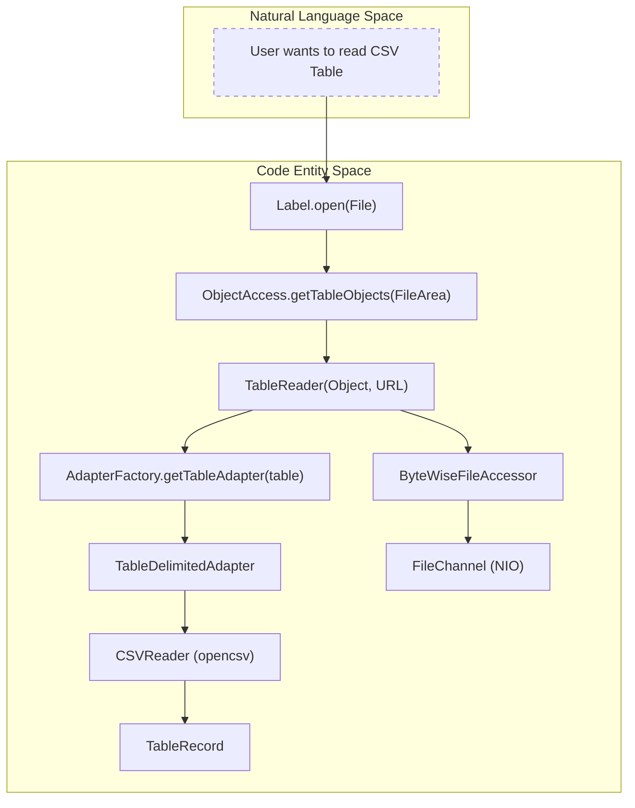
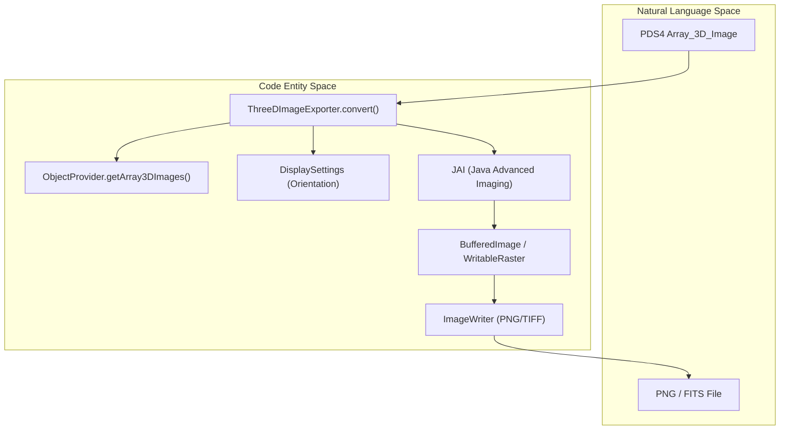

# Page: Glossary

# Glossary

Relevant source files

The following files were used as context for generating this wiki page:

- [CHANGELOG.md](CHANGELOG.md)
- [CLAUDE.md](CLAUDE.md)
- [README.md](README.md)
- [pom.xml](pom.xml)
- [src/build/resources/bindings.xjb](src/build/resources/bindings.xjb)
- [src/build/resources/build.xml](src/build/resources/build.xml)
- [src/build/resources/schema/1A10/PDS4_DISP_1A10.xsd](src/build/resources/schema/1A10/PDS4_DISP_1A10.xsd)
- [src/build/resources/schema/1A10/PDS4_PDS_1A10.xsd](src/build/resources/schema/1A10/PDS4_PDS_1A10.xsd)
- [src/build/resources/schema/1Q00/PDS4_DISP_1Q00.xsd](src/build/resources/schema/1Q00/PDS4_DISP_1Q00.xsd)
- [src/build/resources/schema/1Q00/PDS4_PDS_1Q00.xsd](src/build/resources/schema/1Q00/PDS4_PDS_1Q00.xsd)
- [src/changes/changes.xml](src/changes/changes.xml)
- [src/main/java/gov/nasa/pds/label/Label.java](src/main/java/gov/nasa/pds/label/Label.java)
- [src/main/java/gov/nasa/pds/label/NameNotKnownException.java](src/main/java/gov/nasa/pds/label/NameNotKnownException.java)
- [src/main/java/gov/nasa/pds/label/ProductType.java](src/main/java/gov/nasa/pds/label/ProductType.java)
- [src/main/java/gov/nasa/pds/label/object/ArrayObject.java](src/main/java/gov/nasa/pds/label/object/ArrayObject.java)
- [src/main/java/gov/nasa/pds/label/object/DataObject.java](src/main/java/gov/nasa/pds/label/object/DataObject.java)
- [src/main/java/gov/nasa/pds/label/object/FieldDescription.java](src/main/java/gov/nasa/pds/label/object/FieldDescription.java)
- [src/main/java/gov/nasa/pds/label/object/FieldType.java](src/main/java/gov/nasa/pds/label/object/FieldType.java)
- [src/main/java/gov/nasa/pds/objectAccess/ByteWiseFileAccessor.java](src/main/java/gov/nasa/pds/objectAccess/ByteWiseFileAccessor.java)
- [src/main/java/gov/nasa/pds/objectAccess/ImageExporter.java](src/main/java/gov/nasa/pds/objectAccess/ImageExporter.java)
- [src/main/java/gov/nasa/pds/objectAccess/ObjectAccess.java](src/main/java/gov/nasa/pds/objectAccess/ObjectAccess.java)
- [src/main/java/gov/nasa/pds/objectAccess/ObjectProvider.java](src/main/java/gov/nasa/pds/objectAccess/ObjectProvider.java)
- [src/main/java/gov/nasa/pds/objectAccess/RawTableReader.java](src/main/java/gov/nasa/pds/objectAccess/RawTableReader.java)
- [src/main/java/gov/nasa/pds/objectAccess/TableReader.java](src/main/java/gov/nasa/pds/objectAccess/TableReader.java)
- [src/main/java/gov/nasa/pds/objectAccess/ThreeDImageExporter.java](src/main/java/gov/nasa/pds/objectAccess/ThreeDImageExporter.java)
- [src/main/java/gov/nasa/pds/objectAccess/ThreeDSpectrumExporter.java](src/main/java/gov/nasa/pds/objectAccess/ThreeDSpectrumExporter.java)
- [src/main/java/gov/nasa/pds/objectAccess/TwoDImageExporter.java](src/main/java/gov/nasa/pds/objectAccess/TwoDImageExporter.java)
- [src/main/java/gov/nasa/pds/objectAccess/array/ArrayAdapter.java](src/main/java/gov/nasa/pds/objectAccess/array/ArrayAdapter.java)
- [src/main/java/gov/nasa/pds/objectAccess/array/ComplexDataTypeAdapter.java](src/main/java/gov/nasa/pds/objectAccess/array/ComplexDataTypeAdapter.java)
- [src/main/java/gov/nasa/pds/objectAccess/array/ComplexDoubleAdapter.java](src/main/java/gov/nasa/pds/objectAccess/array/ComplexDoubleAdapter.java)
- [src/main/java/gov/nasa/pds/objectAccess/array/ComplexFloatAdapter.java](src/main/java/gov/nasa/pds/objectAccess/array/ComplexFloatAdapter.java)
- [src/main/java/gov/nasa/pds/objectAccess/array/DoubleAdapter.java](src/main/java/gov/nasa/pds/objectAccess/array/DoubleAdapter.java)
- [src/main/java/gov/nasa/pds/objectAccess/array/ElementType.java](src/main/java/gov/nasa/pds/objectAccess/array/ElementType.java)
- [src/main/java/gov/nasa/pds/objectAccess/array/FloatAdapter.java](src/main/java/gov/nasa/pds/objectAccess/array/FloatAdapter.java)
- [src/main/java/gov/nasa/pds/objectAccess/table/NumericTextFieldAdapter.java](src/main/java/gov/nasa/pds/objectAccess/table/NumericTextFieldAdapter.java)
- [src/main/java/gov/nasa/pds/objectAccess/table/TableBinaryAdapter.java](src/main/java/gov/nasa/pds/objectAccess/table/TableBinaryAdapter.java)
- [src/main/java/gov/nasa/pds/objectAccess/table/TableCharacterAdapter.java](src/main/java/gov/nasa/pds/objectAccess/table/TableCharacterAdapter.java)
- [src/main/java/gov/nasa/pds/objectAccess/table/TableDelimitedAdapter.java](src/main/java/gov/nasa/pds/objectAccess/table/TableDelimitedAdapter.java)
- [src/main/java/gov/nasa/pds/objectAccess/utility/Utility.java](src/main/java/gov/nasa/pds/objectAccess/utility/Utility.java)
- [src/site/xdoc/develop/index.xml.vm](src/site/xdoc/develop/index.xml.vm)
- [src/test/java/gov/nasa/pds/label/object/ArrayObjectTest.java](src/test/java/gov/nasa/pds/label/object/ArrayObjectTest.java)
- [src/test/java/gov/nasa/pds/label/object/GenericObjectTest.java](src/test/java/gov/nasa/pds/label/object/GenericObjectTest.java)
- [src/test/java/gov/nasa/pds/objectAccess/DelimitedTableReaderTest.java](src/test/java/gov/nasa/pds/objectAccess/DelimitedTableReaderTest.java)
- [src/test/java/gov/nasa/pds/objectAccess/TableReaderTest.java](src/test/java/gov/nasa/pds/objectAccess/TableReaderTest.java)
- [src/test/java/gov/nasa/pds/objectAccess/table/FieldTypeTest.java](src/test/java/gov/nasa/pds/objectAccess/table/FieldTypeTest.java)
- [src/test/java/gov/nasa/pds/objectAccess/table/NumericTextFieldAdapterTest.java](src/test/java/gov/nasa/pds/objectAccess/table/NumericTextFieldAdapterTest.java)
- [src/test/java/gov/nasa/pds/objectAccess/table/TableBinaryAdapterTest.java](src/test/java/gov/nasa/pds/objectAccess/table/TableBinaryAdapterTest.java)

This page defines technical terms, domain concepts, and code entities used within the `pds4-jparser` library. It serves as a reference for engineers to map PDS4 Information Model (IM) concepts to their Java implementation.

## Domain Concepts and Terms

| Term | Definition | Code Reference |
| :--- | :--- | :--- |
| **Label** | An XML file describing the structure and content of PDS4 data products. | `gov.nasa.pds.label.Label` |
| **Information Model (IM)** | The PDS4 standard defining data structures. JParser generates classes from IM XSDs. | `src/build/resources/schema/` |
| **File Area** | A section of a label that groups data objects found within a specific physical file. | `gov.nasa.arc.pds.xml.generated.FileAreaObservational` |
| **Object Access** | The high-level API layer for retrieving unmarshalled JAXB objects and data readers. | `gov.nasa.pds.objectAccess.ObjectAccess` |
| **Field Adapter** | Logic that handles the conversion of raw bytes/text into Java types based on PDS4 data types. | `gov.nasa.pds.objectAccess.table.TableAdapter` |

**Sources:** [src/main/java/gov/nasa/pds/label/Label.java:124-130](), [src/main/java/gov/nasa/pds/objectAccess/ObjectAccess.java:109-114](), [README.md:38-40]()

---

## Technical Implementation Glossary

### 1. Core Parsing & Navigation
*   **`Label`**: The primary entry point. It wraps `ObjectAccess` and provides high-level methods to extract specific object types (Tables, Arrays) from a product [src/main/java/gov/nasa/pds/label/Label.java:124-149]().
*   **`ObjectAccess`**: Implements `ObjectProvider`. It manages the JAXB `Unmarshaller` and resolves file paths relative to the `archiveRoot` [src/main/java/gov/nasa/pds/objectAccess/ObjectAccess.java:114-151]().
*   **`ProductType`**: An enumeration mapping PDS4 XML root elements (e.g., `Product_Observational`) to their generated JAXB classes [src/main/java/gov/nasa/pds/label/ProductType.java:1-30]().
*   **`XMLLabelContext`**: Captures metadata about the XML itself, such as namespaces and schema locations used during unmarshalling [src/main/java/gov/nasa/pds/objectAccess/ObjectAccess.java:120-120]().

### 2. Table Subsystem
*   **`TableReader`**: Orchestrates reading records. It uses an `AdapterFactory` to select the correct `TableAdapter` based on whether the table is Binary, Character, or Delimited [src/main/java/gov/nasa/pds/objectAccess/TableReader.java:67-132]().
*   **`ByteWiseFileAccessor`**: Provides random access to data files using `java.nio.channels.FileChannel`. It handles large files (>2GB) by mapping them into multiple `ByteBuffer` "mappings" [src/main/java/gov/nasa/pds/objectAccess/ByteWiseFileAccessor.java:51-68]().
*   **`TableRecord`**: Represents a single row of data. It provides methods to get field values by index or name [src/main/java/gov/nasa/pds/objectAccess/TableReader.java:73-73]().
*   **`FieldDescription`**: Metadata about a table column, including its name, offset, length, and `FieldType` [src/main/java/gov/nasa/pds/label/object/FieldDescription.java:1-40]().

### 3. Array & Image Subsystem
*   **`ArrayObject`**: A specialized `DataObject` for N-dimensional arrays. It provides access to raw elements as primitive arrays (e.g., `getElements2D()`) [src/main/java/gov/nasa/pds/label/object/ArrayObject.java:1-50]().
*   **`ArrayAdapter`**: Maps multi-dimensional coordinates (e.g., `[band, line, sample]`) to a linear byte offset in the data file [src/main/java/gov/nasa/pds/objectAccess/array/ArrayAdapter.java:1-40]().
*   **`ImageExporter`**: Base class for converting PDS4 arrays into standard formats like PNG, TIFF, or FITS [src/main/java/gov/nasa/pds/objectAccess/ImageExporter.java:1-40]().
*   **`DisplaySettings`**: PDS4 metadata used by exporters to determine image orientation (e.g., `line_display_direction`) [src/main/java/gov/nasa/pds/objectAccess/TwoDImageExporter.java:63-65]().

---

## System Data Flow Diagrams

### From XML Label to Table Records
This diagram bridges the "Natural Language" concept of a Table to the internal code entities that facilitate reading.

Title: Table Reading Data Flow

**Sources:** [src/main/java/gov/nasa/pds/label/Label.java:104-117](), [src/main/java/gov/nasa/pds/objectAccess/TableReader.java:132-167](), [src/main/java/gov/nasa/pds/objectAccess/ByteWiseFileAccessor.java:145-147]()

### Image Export Pipeline
This diagram illustrates how a PDS4 `Array_3D_Image` is transformed into a viewable format.

Title: Image Export Logic

**Sources:** [src/main/java/gov/nasa/pds/objectAccess/ThreeDImageExporter.java:81-163](), [src/main/java/gov/nasa/pds/objectAccess/ImageExporter.java:1-30]()

---

## Abbreviations

| Abbreviation | Full Term | Context |
| :--- | :--- | :--- |
| **JAXB** | Java Architecture for XML Binding | Used for unmarshalling PDS4 XML into Java POJOs [pom.xml:34-39](). |
| **NIO** | New I/O (java.nio) | Used in `ByteWiseFileAccessor` for memory-mapped file access [src/main/java/gov/nasa/pds/objectAccess/ByteWiseFileAccessor.java:40-44](). |
| **IM** | Information Model | The versioned PDS4 standard (e.g., 1Q00) [README.md:38-40](). |
| **BWFA** | `ByteWiseFileAccessor` | Internal shorthand for the byte-level I/O controller [src/main/java/gov/nasa/pds/objectAccess/TableReader.java:74-74](). |
| **TDA / TBA** | `TableDelimitedAdapter` / `TableBinaryAdapter` | Specific implementations of the table parsing strategy [src/main/java/gov/nasa/pds/objectAccess/TableReader.java:59-61](). |

**Sources:** [pom.xml:34-39](), [src/main/java/gov/nasa/pds/objectAccess/ByteWiseFileAccessor.java:40-68](), [README.md:38-40](), [src/main/java/gov/nasa/pds/objectAccess/TableReader.java:59-74]()