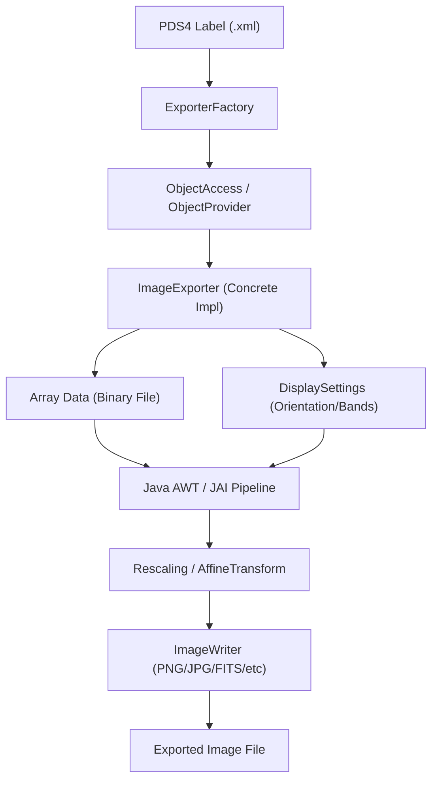
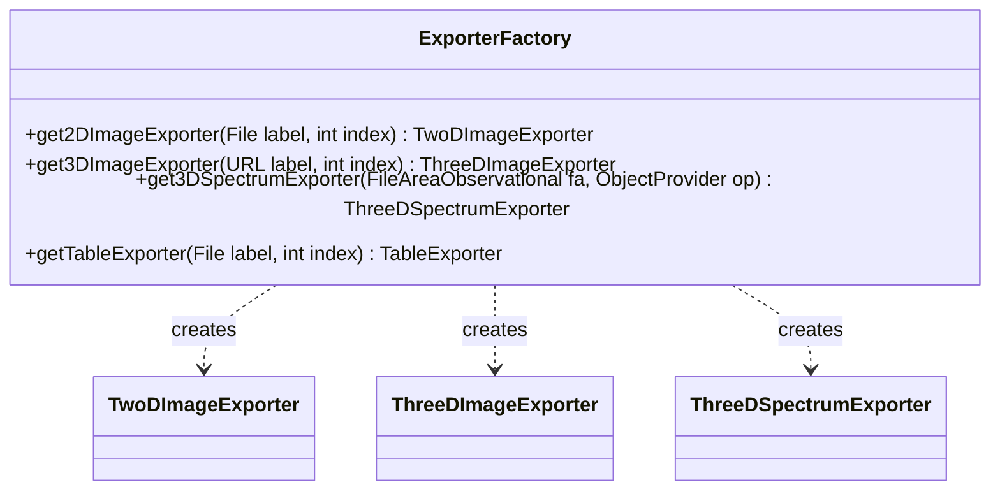

# Page: Image Export — TwoDImageExporter, ThreeDImageExporter, and ThreeDSpectrumExporter

# Image Export — TwoDImageExporter, ThreeDImageExporter, and ThreeDSpectrumExporter

Relevant source files

The following files were used as context for generating this wiki page:

- [src/build/resources/schema/1600/PDS4_DISP_1600.xsd](src/build/resources/schema/1600/PDS4_DISP_1600.xsd)
- [src/build/resources/schema/1600/PDS4_PDS_1600.xsd](src/build/resources/schema/1600/PDS4_PDS_1600.xsd)
- [src/main/java/gov/nasa/pds/label/object/RecordLocation.java](src/main/java/gov/nasa/pds/label/object/RecordLocation.java)
- [src/main/java/gov/nasa/pds/objectAccess/ExporterFactory.java](src/main/java/gov/nasa/pds/objectAccess/ExporterFactory.java)
- [src/main/java/gov/nasa/pds/objectAccess/ImageExporter.java](src/main/java/gov/nasa/pds/objectAccess/ImageExporter.java)
- [src/main/java/gov/nasa/pds/objectAccess/ObjectExporter.java](src/main/java/gov/nasa/pds/objectAccess/ObjectExporter.java)
- [src/main/java/gov/nasa/pds/objectAccess/ThreeDImageExporter.java](src/main/java/gov/nasa/pds/objectAccess/ThreeDImageExporter.java)
- [src/main/java/gov/nasa/pds/objectAccess/ThreeDSpectrumExporter.java](src/main/java/gov/nasa/pds/objectAccess/ThreeDSpectrumExporter.java)
- [src/main/java/gov/nasa/pds/objectAccess/TwoDImageExporter.java](src/main/java/gov/nasa/pds/objectAccess/TwoDImageExporter.java)
- [src/main/java/gov/nasa/pds/objectAccess/table/DelimiterType.java](src/main/java/gov/nasa/pds/objectAccess/table/DelimiterType.java)
- [src/main/java/gov/nasa/pds/objectAccess/table/TableAdapter.java](src/main/java/gov/nasa/pds/objectAccess/table/TableAdapter.java)
- [src/test/java/gov/nasa/pds/objectAccess/ByteWiseFileAccessorTest.java](src/test/java/gov/nasa/pds/objectAccess/ByteWiseFileAccessorTest.java)
- [src/test/java/gov/nasa/pds/objectAccess/DelimitedTableReaderTest.java](src/test/java/gov/nasa/pds/objectAccess/DelimitedTableReaderTest.java)

The Image Export subsystem provides a high-level API for converting PDS4 Array objects (2D images, 3D images, and 3D spectral cubes) into common viewable and scientific image formats. It handles the complexities of PDS4 axis orientations, display settings, and high-bit-depth rescaling to ensure data is represented accurately in target formats like PNG, JPEG, TIFF, FITS, and VICAR.

## Exporter Hierarchy and Data Flow

The subsystem is built on an inheritance hierarchy starting from `ObjectExporter`. The `ImageExporter` abstract class serves as the base for all image-specific exporters, providing shared logic for parsing labels and extracting `DisplaySettings` from the Discipline Area of a PDS4 label [src/main/java/gov/nasa/pds/objectAccess/ImageExporter.java:52-54]().

### Image Export Logic Flow
The following diagram illustrates how a PDS4 product is transformed into an exported image file.

**Sources:** [src/main/java/gov/nasa/pds/objectAccess/ExporterFactory.java:43-128](), [src/main/java/gov/nasa/pds/objectAccess/ImageExporter.java:165-200]()

## Key Exporter Classes

### TwoDImageExporter
Specialized for `Array_2D_Image` products. It maps the two PDS4 axes (typically "Line" and "Sample") to a 2D raster.
*   **Axis Handling:** It determines lines and samples by inspecting `Axis_Array` sequence numbers [src/main/java/gov/nasa/pds/objectAccess/TwoDImageExporter.java:153-162]().
*   **Implementation:** Uses `PixelInterleavedSampleModel` to manage the underlying data buffer [src/main/java/gov/nasa/pds/objectAccess/TwoDImageExporter.java:177-178]().

### ThreeDImageExporter
Handles `Array_3D_Image` products, which typically represent multi-banded images (e.g., RGB or multi-spectral).
*   **Band Management:** Uses a `BandedSampleModel` to handle multiple planes of data [src/main/java/gov/nasa/pds/objectAccess/ThreeDImageExporter.java:180-181]().
*   **Color Models:** Can create color models based on the sample model to support multi-channel output [src/main/java/gov/nasa/pds/objectAccess/ThreeDImageExporter.java:182]().

### ThreeDSpectrumExporter
Designed for `Array_3D_Spectrum` products. It includes specific functionality for band selection.
*   **Band Selection:** Allows users to specify which bands from the spectral cube should be mapped to the Red, Green, and Blue channels of the output image [src/main/java/gov/nasa/pds/objectAccess/ThreeDSpectrumExporter.java:107-116]().
*   **Default State:** Initializes with a default selection of the first band for all channels if not specified [src/main/java/gov/nasa/pds/objectAccess/ThreeDSpectrumExporter.java:124-126]().

**Sources:** [src/main/java/gov/nasa/pds/objectAccess/TwoDImageExporter.java:83-108](), [src/main/java/gov/nasa/pds/objectAccess/ThreeDImageExporter.java:81-104](), [src/main/java/gov/nasa/pds/objectAccess/ThreeDSpectrumExporter.java:85-110]()

## Display Settings and Axis Handling

PDS4 arrays define axes in a coordinate system that may not match standard display device "top-to-bottom, left-to-right" conventions. The exporters use the `Display_Settings` class (from the Display Discipline Dictionary) to perform necessary transformations.

| Setting | Code Entity | Description |
| :--- | :--- | :--- |
| **Orientation** | `DisplayDirection` | Defines `horizontal_display_direction` and `vertical_display_direction` [src/build/resources/schema/1600/PDS4_DISP_1600.xsd:40-58](). |
| **Color Mapping** | `Color_Display_Settings` | Identifies which axis is the "color" axis and which band numbers map to R, G, and B [src/build/resources/schema/1600/PDS4_DISP_1600.xsd:25-38](). |
| **Rescaling** | `maximizeDynamicRange` | Boolean flag in exporters to trigger dynamic range scaling via JAI `RenderedOp` [src/main/java/gov/nasa/pds/objectAccess/TwoDImageExporter.java:97](). |

The exporters use `AffineTransformOp` to flip or rotate the image if the label specifies non-standard display directions [src/main/java/gov/nasa/pds/objectAccess/TwoDImageExporter.java:35](), [src/main/java/gov/nasa/pds/objectAccess/ThreeDSpectrumExporter.java:35]().

**Sources:** [src/build/resources/schema/1600/PDS4_DISP_1600.xsd:60-72](), [src/main/java/gov/nasa/pds/objectAccess/ImageExporter.java:182-191]()

## Dynamic Range and Rescaling

Most PDS4 scientific data is stored in 16-bit or 32-bit formats, while common display formats (PNG/JPEG) often require 8-bit.
1.  **Bit Depth:** Exporters default to 8-bit (`targetPixelBitDepth = 8`) but support 16-bit (`TYPE_USHORT_GRAY`) [src/main/java/gov/nasa/pds/objectAccess/TwoDImageExporter.java:92-130]().
2.  **JAI Rescale:** If `maximizeDynamicRange` is true, the system calculates the min/max values of the raw data and uses Java Advanced Imaging (JAI) `rescale` operations to stretch the data across the available bit depth [src/main/java/gov/nasa/pds/objectAccess/TwoDImageExporter.java:55-56]().

## ExporterFactory

The `ExporterFactory` provides static utility methods to instantiate the correct exporter based on the product type or specific requirements.

**Sources:** [src/main/java/gov/nasa/pds/objectAccess/ExporterFactory.java:58-128]()

## Supported Export Formats

The `exportType` string determines the output format. The exporters interface with `javax.imageio` and external libraries for scientific formats:
*   **Standard:** PNG, JPEG, BMP, GIF, TIFF (via `ImageIO`).
*   **Scientific:** 
    *   **FITS:** Handled via `nom.tam.fits` library [src/main/java/gov/nasa/pds/objectAccess/TwoDImageExporter.java:70-74]().
    *   **VICAR / PDS3:** Handled via `jpl.mipl.io` plugins [src/main/java/gov/nasa/pds/objectAccess/TwoDImageExporter.java:67-69]().

**Sources:** [src/main/java/gov/nasa/pds/objectAccess/TwoDImageExporter.java:98](), [src/main/java/gov/nasa/pds/objectAccess/ThreeDImageExporter.java:96]()
