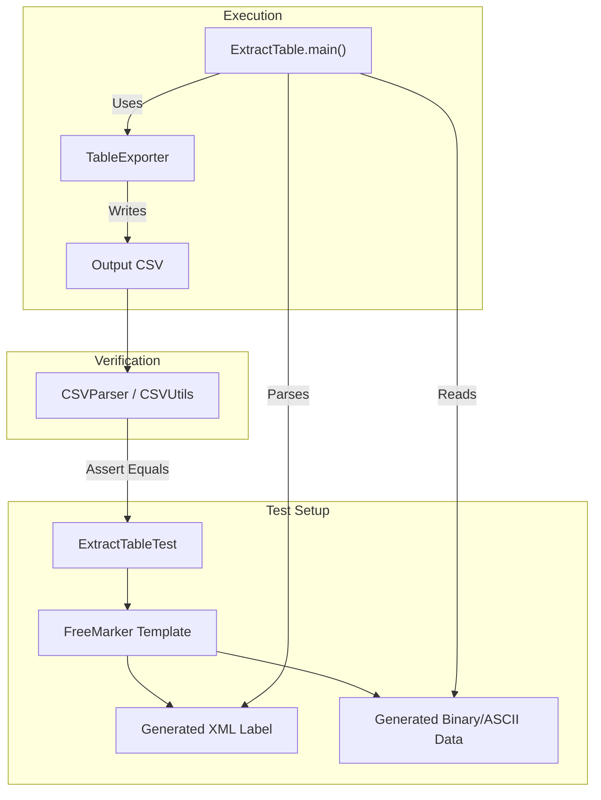
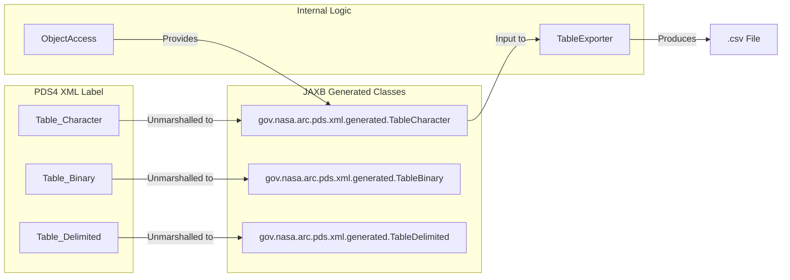

# Page: Integration and Example Tests — ExtractTable, Group Fields, and DPH Products

# Integration and Example Tests — ExtractTable, Group Fields, and DPH Products

Relevant source files

The following files were used as context for generating this wiki page:

- [src/test/java/gov/nasa/pds/objectAccess/TableExporterTest.java](src/test/java/gov/nasa/pds/objectAccess/TableExporterTest.java)
- [src/test/java/gov/nasa/pds/objectAccess/example/ExtractTableTest.java](src/test/java/gov/nasa/pds/objectAccess/example/ExtractTableTest.java)
- [src/test/java/gov/nasa/pds/objectAccess/example/TestGroupFieldWithRepetitions.java](src/test/java/gov/nasa/pds/objectAccess/example/TestGroupFieldWithRepetitions.java)
- [src/test/java/gov/nasa/pds/objectAccess/example/TestPDS368.java](src/test/java/gov/nasa/pds/objectAccess/example/TestPDS368.java)

This page documents the integration-level testing suite for the `pds4-jparser` library. These tests verify the end-to-end data flow from PDS4 XML labels to exported data formats (primarily CSV), ensuring that complex structures like grouped fields, repetitions, and various PDS4 Data Provider's Handbook (DPH) example products are handled correctly.

## ExtractTable Integration Tests

The `ExtractTableTest` class serves as the primary integration test for the `ExtractTable` CLI tool. It validates the library's ability to parse and export every supported PDS4 data type across character, binary, and delimited tables.

### Implementation and Data Flow
The test suite utilizes a dynamic approach by generating temporary PDS4 labels and data files using FreeMarker templates [src/test/java/gov/nasa/pds/objectAccess/example/ExtractTableTest.java:57-60](). This allows for exhaustive testing of various `FieldType` combinations without maintaining hundreds of static files.

**Key Components:**
*   **FieldType Definitions:** Static arrays defining PDS4 types (e.g., `ASCII_Integer`, `Binary_Real`), their accessors, and expected values [src/test/java/gov/nasa/pds/objectAccess/example/ExtractTableTest.java:99-137]().
*   **Template Engine:** Uses `freemarker.template.Configuration` to inject field metadata into XML label templates [src/test/java/gov/nasa/pds/objectAccess/example/ExtractTableTest.java:57-60]().
*   **CLI Verification:** Invokes `ExtractTable.main(args)` and verifies the resulting CSV output using `CSVParser` [src/test/java/gov/nasa/pds/objectAccess/example/ExtractTableTest.java:48-50]().

### Data Flow: CLI Integration Test
The following diagram illustrates how `ExtractTableTest` orchestrates the system to verify data integrity.

**ExtractTable Test Execution Flow**

**Sources:** [src/test/java/gov/nasa/pds/objectAccess/example/ExtractTableTest.java:1-137]()

## Group Fields and Repetitions (PDS-339)

The `TestGroupFieldWithRepetitions` class addresses specific requirements for PDS4 `Group_Field` elements that include `repetitions`. This test ensures that the flattened CSV output correctly accounts for nested structures.

*   **PDS-339 Verification:** Tests a label with 56 top-level fields plus two groups containing 4 and 1414 repetitions respectively [src/test/java/gov/nasa/pds/objectAccess/example/TestGroupFieldWithRepetitions.java:55-57]().
*   **Column Calculation:** The test validates that the resulting CSV contains exactly 1474 columns (56 + 4*1 + 1414*1) [src/test/java/gov/nasa/pds/objectAccess/example/TestGroupFieldWithRepetitions.java:56-57]().

**Sources:** [src/test/java/gov/nasa/pds/objectAccess/example/TestGroupFieldWithRepetitions.java:44-60]()

## MAVEN Events CSV Integration (PDS-368)

`TestPDS368` validates the extraction of MAVEN (Mars Atmosphere and Volatile EvolutioN) mission event files. This serves as a real-world integration test for delimited tables with high row counts.

*   **Input:** `maven_events_20140801.xml` [src/test/java/gov/nasa/pds/objectAccess/example/TestPDS368.java:49]().
*   **Validation:** Verifies that the extraction produces 7,162 rows and 9 columns [src/test/java/gov/nasa/pds/objectAccess/example/TestPDS368.java:54]().

**Sources:** [src/test/java/gov/nasa/pds/objectAccess/example/TestPDS368.java:43-57]()

## TableExporter and TableWriter Tests

The `TableExporterTest` class focuses on the `TableExporter` component, which is the engine behind the `ExtractTable` tool. It tests the conversion of `TableCharacter`, `TableBinary`, and `TableDelimited` objects into CSV format.

### Key Test Cases
| Test Method | Target Object | Description |
| :--- | :--- | :--- |
| `testExportCharacterTableToCSV` | `TableCharacter` | Validates fixed-width ASCII table conversion [src/test/java/gov/nasa/pds/objectAccess/TableExporterTest.java:95-104](). |
| `testExportBinaryTableToCSV` | `TableBinary` | Validates conversion of bit-packed and binary numeric fields [src/test/java/gov/nasa/pds/objectAccess/TableExporterTest.java:120-130](). |
| `testExportDelimitedTableToCSV` | `TableDelimited` | Validates comma/stream-delimited parsing [src/test/java/gov/nasa/pds/objectAccess/TableExporterTest.java:133-134](). |
| `testExportGoupedFieldCharacterTableToCSV` | `TableCharacter` | Specifically checks for `InvalidTableException` when handling complex grouped fields in character tables [src/test/java/gov/nasa/pds/objectAccess/TableExporterTest.java:108-117](). |

### Object Mapping Diagram
This diagram bridges the PDS4 XML concepts to the Java classes tested in `TableExporterTest`.

**PDS4 Object to Code Mapping**

**Sources:** [src/test/java/gov/nasa/pds/objectAccess/TableExporterTest.java:46-51](), [src/test/java/gov/nasa/pds/objectAccess/TableExporterTest.java:97-100]()

## DPH Example Products

The library includes test fixtures based on the PDS4 Data Provider's Handbook (DPH). These are used across various tests to ensure compliance with official PDS4 examples.

*   **Location:** `src/test/resources/1000/` contains version 1.0.0.0 DPH examples [src/test/java/gov/nasa/pds/objectAccess/TableExporterTest.java:55]().
*   **Product Types:** Includes `Product_Table_Character.xml`, `Product_Table_Delimited.xml`, and `Binary_Table_Test.xml` [src/test/java/gov/nasa/pds/objectAccess/TableExporterTest.java:96, 122, 134]().
*   **Usage:** These products are used to verify that the `ObjectAccess` implementation correctly identifies `FileAreaObservational` sections and extracts the appropriate table objects [src/test/java/gov/nasa/pds/objectAccess/TableExporterTest.java:98-100]().

**Sources:** [src/test/java/gov/nasa/pds/objectAccess/TableExporterTest.java:54-134]()
