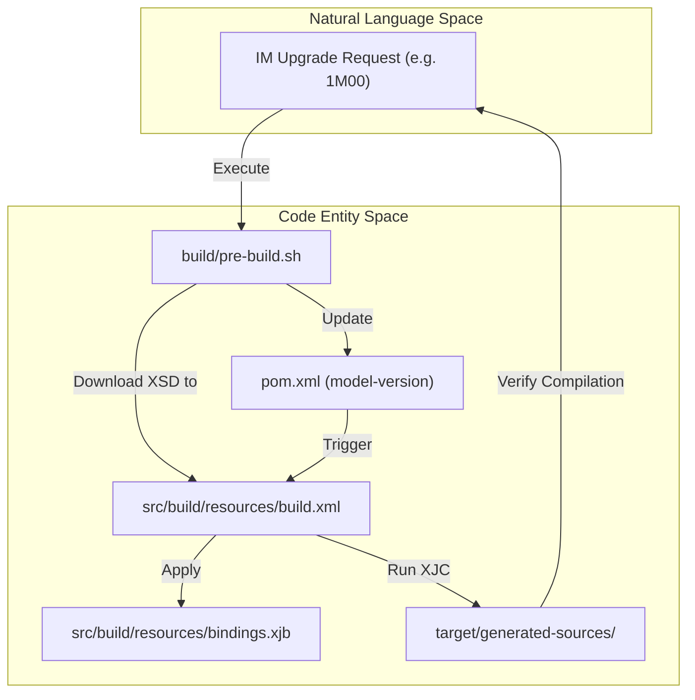
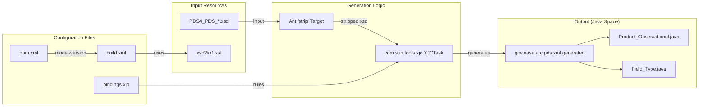

# Page: JAXB Code Generation and PDS4 Schema Management

# JAXB Code Generation and PDS4 Schema Management

Relevant source files

The following files were used as context for generating this wiki page:

- [CHANGELOG.md](CHANGELOG.md)
- [build/pre-build.sh](build/pre-build.sh)
- [pom.xml](pom.xml)
- [src/build/resources/bindings.xjb](src/build/resources/bindings.xjb)
- [src/build/resources/build.xml](src/build/resources/build.xml)
- [src/build/resources/schema/1A10/PDS4_DISP_1A10.xsd](src/build/resources/schema/1A10/PDS4_DISP_1A10.xsd)
- [src/build/resources/schema/1A10/PDS4_PDS_1A10.xsd](src/build/resources/schema/1A10/PDS4_PDS_1A10.xsd)
- [src/build/resources/schema/1B00/PDS4_DISP_1B00.xsd](src/build/resources/schema/1B00/PDS4_DISP_1B00.xsd)
- [src/build/resources/schema/1B00/PDS4_PDS_1B00.xsd](src/build/resources/schema/1B00/PDS4_PDS_1B00.xsd)
- [src/build/resources/schema/1G00/PDS4_DISP_1G00.xsd](src/build/resources/schema/1G00/PDS4_DISP_1G00.xsd)
- [src/build/resources/schema/1G00/PDS4_PDS_1G00.xsd](src/build/resources/schema/1G00/PDS4_PDS_1G00.xsd)
- [src/build/resources/schema/1G00/PDS4_PDS_1G00.xsd.1](src/build/resources/schema/1G00/PDS4_PDS_1G00.xsd.1)
- [src/build/resources/schema/1L00/PDS4_DISP_1L00.xsd](src/build/resources/schema/1L00/PDS4_DISP_1L00.xsd)
- [src/build/resources/schema/1L00/PDS4_PDS_1L00.xsd](src/build/resources/schema/1L00/PDS4_PDS_1L00.xsd)
- [src/build/resources/schema/1M00/PDS4_DISP_1M00.xsd](src/build/resources/schema/1M00/PDS4_DISP_1M00.xsd)
- [src/build/resources/schema/1M00/PDS4_PDS_1M00.xsd](src/build/resources/schema/1M00/PDS4_PDS_1M00.xsd)
- [src/build/resources/schema/1N00/PDS4_PDS_1N00.xsd](src/build/resources/schema/1N00/PDS4_PDS_1N00.xsd)
- [src/build/resources/schema/PDS4_DISP_template.xsd](src/build/resources/schema/PDS4_DISP_template.xsd)
- [src/changes/changes.xml](src/changes/changes.xml)

This page describes the build-time pipeline that transforms PDS4 XML Schema Definitions (XSD) into Java classes. The `pds4-jparser` library relies on JAXB (Java Architecture for XML Binding) to provide a type-safe object model of PDS4 labels, enabling the rest of the library to interact with product metadata as standard Java objects.

## Code Generation Pipeline

The generation process is integrated into the Maven lifecycle but delegated to an Ant script for fine-grained control over schema manipulation and XJC (JAXB Binding Compiler) execution.

### Maven Integration
The `pom.xml` uses the `maven-antrun-plugin` to trigger the generation during the `generate-sources` phase [pom.xml:74-93](). It passes the Maven classpaths and the `${model-version}` property to the Ant environment [pom.xml:84-89](). Generated sources are subsequently added to the project's source folders via the `build-helper-maven-plugin` [pom.xml:54-71]().

### Ant Build Logic (`build.xml`)
The Ant script `src/build/resources/build.xml` manages the actual transformation. Key steps include:
1.  **Schema Stripping**: Uses an XSLT transform (`xsd2to1.xsl`) to convert the original PDS4 schema into a "stripped" version [src/build/resources/build.xml:87-90]().
2.  **Display Dictionary Preparation**: Copies the Display Dictionary (DISP) schema and replaces the remote PDS4 schema reference with a local reference to the stripped version [src/build/resources/build.xml:50-51]().
3.  **XJC Execution**: Runs the JAXB compiler using the prepared schema and the `bindings.xjb` file to generate Java classes into `target/generated-sources/main/java` [src/build/resources/build.xml:80-85]().

### Data Flow: XSD to Java

| Step | Entity | Action |
| :--- | :--- | :--- |
| 1 | `PDS4_PDS_${model-version}.xsd` | Original Information Model schema [src/build/resources/build.xml:45](). |
| 2 | `xsd2to1.xsl` | Strips unnecessary constraints for cleaner code generation [src/build/resources/build.xml:89](). |
| 3 | `schema-stripped.xsd` | Intermediate local schema used for binding [src/build/resources/build.xml:46](). |
| 4 | `bindings.xjb` | Customizes package names, class names, and property mappings [src/build/resources/bindings.xjb:1-41](). |
| 5 | `gov.nasa.arc.pds.xml.generated` | Final package containing generated Java POJOs [src/build/resources/build.xml:41](). |

**Sources:** [pom.xml:74-93](), [src/build/resources/build.xml:34-51](), [src/build/resources/build.xml:80-90]()

## JAXB Customizations (`bindings.xjb`)

The `bindings.xjb` file provides essential overrides to ensure the generated Java code is idiomatic and avoids naming collisions or character encoding issues.

*   **Property Renaming**: Resolves naming conflicts, such as renaming `document_editions` to `editionCount` to avoid collisions in `Product_Document` [src/build/resources/bindings.xjb:71-74]().
*   **Enumeration Cleaning**: Maps complex XML string values to clean Java Enum constants (e.g., mapping `W*m**-2*sr**-1` to `W_PER_M2_PER_SR`) [src/build/resources/bindings.xjb:78-83]().
*   **Character Handling**: Replaces problematic Unicode characters like the "mu" symbol (`μ`) which JAXB cannot process in identifiers [src/build/resources/bindings.xjb:95-97]().
*   **Choice Flattening**: Renames generic `xs:choice` elements to `dataObjects` for better API readability in classes like `File_Area_Observational` [src/build/resources/bindings.xjb:116-124]().

**Sources:** [src/build/resources/bindings.xjb:71-124]()

## PDS4 Schema Management

The library maintains local copies of the PDS4 Information Model (IM) schemas to ensure build reproducibility and offline capability.

### Directory Structure
Schemas are organized by IM version identifier (e.g., 1G00, 1L00, 1M00) within `src/build/resources/schema/` [src/build/resources/build.xml:44](). Each directory typically contains:
*   `PDS4_PDS_${version}.xsd`: The core PDS4 schema [src/build/resources/schema/1L00/PDS4_PDS_1L00.xsd:1-10]().
*   `PDS4_DISP_${version}.xsd`: The associated Display Dictionary schema [src/build/resources/schema/1L00/PDS4_DISP_1L00.xsd:1-11]().

### The `model-version` Property
The specific IM version used for code generation is controlled by the `${model-version}` Maven property [src/build/resources/build.xml:43](). Changing this property directs the Ant script to a different subdirectory in the schema repository.

**Sources:** [src/build/resources/build.xml:43-47](), [src/build/resources/schema/1L00/PDS4_PDS_1L00.xsd:1-10]()

## IM Upgrade Procedure

Upgrading the library to a new PDS4 Information Model version involves the `pre-build.sh` helper script and manual verification.

### Automated Helper: `pre-build.sh`
The `build/pre-build.sh` script automates the retrieval of new schemas:
1.  **Download**: Fetches the core PDS4 XSD from the PDS release or development URL [build/pre-build.sh:15-28]().
2.  **Template Generation**: Uses `PDS4_DISP_template.xsd` to create a versioned Display Dictionary schema [build/pre-build.sh:30]().
3.  **Property Update**: Uses `mvn versions:set-property` to update the `model-version` in `pom.xml` [build/pre-build.sh:32]().

### Step-by-Step Upgrade Workflow

#### Workflow: Information Model Upgrade

1.  **Run Script**: Execute `./build/pre-build.sh ops 1N00` (substituting the desired version).
2.  **Verify Schema**: Ensure the XSD files are correctly placed in `src/build/resources/schema/${version}/`.
3.  **Build**: Run `mvn clean compile`.
4.  **Resolve Conflicts**: If the new IM introduces elements that conflict with JAXB reserved words or existing mappings, update `src/build/resources/bindings.xjb`.
5.  **Fix Regressions**: Check for breaking changes in generated class signatures. For example, IM 1M00 changes to `AxisArray.getSequenceNumber()` required manual code adjustments in downstream logic [CHANGELOG.md:9-10]().

**Sources:** [build/pre-build.sh:1-38](), [CHANGELOG.md:9-10](), [src/build/resources/build.xml:80-85]()

## System Architecture Diagram

The following diagram bridges the build configuration files to the generated Java entities.

#### Diagram: JAXB Generation Architecture

**Sources:** [src/build/resources/build.xml:41-47](), [src/build/resources/build.xml:80-90](), [src/build/resources/bindings.xjb:1-40]()
