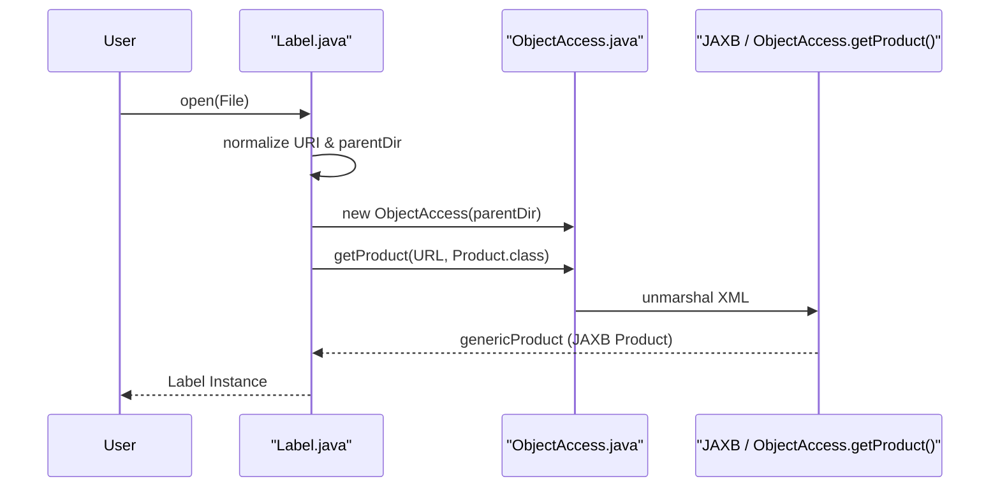
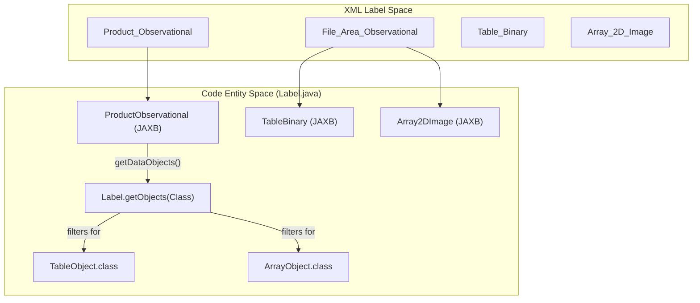

# Page: Label Parsing and the Label API

# Label Parsing and the Label API

Relevant source files

The following files were used as context for generating this wiki page:

- [CLAUDE.md](CLAUDE.md)
- [README.md](README.md)
- [src/build/resources/schema/1Q00/PDS4_DISP_1Q00.xsd](src/build/resources/schema/1Q00/PDS4_DISP_1Q00.xsd)
- [src/build/resources/schema/1Q00/PDS4_PDS_1Q00.xsd](src/build/resources/schema/1Q00/PDS4_PDS_1Q00.xsd)
- [src/main/java/gov/nasa/pds/label/DisplayDirection.java](src/main/java/gov/nasa/pds/label/DisplayDirection.java)
- [src/main/java/gov/nasa/pds/label/Label.java](src/main/java/gov/nasa/pds/label/Label.java)
- [src/main/java/gov/nasa/pds/label/ProductType.java](src/main/java/gov/nasa/pds/label/ProductType.java)
- [src/main/java/gov/nasa/pds/label/jaxb/PDSNamespacePrefixMapper.java](src/main/java/gov/nasa/pds/label/jaxb/PDSNamespacePrefixMapper.java)
- [src/main/java/gov/nasa/pds/label/jaxb/PDSXMLEventReader.java](src/main/java/gov/nasa/pds/label/jaxb/PDSXMLEventReader.java)
- [src/main/java/gov/nasa/pds/label/jaxb/XMLLabelContext.java](src/main/java/gov/nasa/pds/label/jaxb/XMLLabelContext.java)
- [src/main/resources/namespaces.properties](src/main/resources/namespaces.properties)
- [src/site/xdoc/develop/index.xml.vm](src/site/xdoc/develop/index.xml.vm)
- [src/test/java/gov/nasa/pds/objectAccess/table/DelimiterTypeTest.java](src/test/java/gov/nasa/pds/objectAccess/table/DelimiterTypeTest.java)

The `gov.nasa.pds.label` package provides the primary entry point for interacting with PDS4 product labels. It abstracts the complexities of JAXB unmarshalling, namespace management, and File Area traversal, providing a unified interface to access both metadata and the underlying data objects (tables, arrays, and images).

### The Label Class

The `Label` class is the central handle for a PDS4 product. It manages an instance of `ObjectAccess` to perform the actual XML-to-Java mapping and provides high-level methods to query the product type and its constituent data objects.

#### Lifecycle: Open and Close
Users typically instantiate a `Label` using the static `open()` methods. The constructor normalizes the file path or URL to establish a `parentDir`, which is essential for resolving relative file references within the label [src/main/java/gov/nasa/pds/label/Label.java:131-149]().

| Method | Description |
| :--- | :--- |
| `static Label open(File labelFile)` | Opens a label from a local file system [src/main/java/gov/nasa/pds/label/Label.java:167-173](). |
| `static Label open(URL label)` | Opens a label from a remote or local URL [src/main/java/gov/nasa/pds/label/Label.java:181-187](). |
| `void close()` | Nullifies internal references to `ObjectAccess` and the JAXB `Product` [src/main/java/gov/nasa/pds/label/Label.java:154-158](). |

#### Data Flow: Label Initialization
The following diagram illustrates the transition from a physical XML file to the `Label` entity and its internal JAXB representation.

**Label Initialization Sequence**

Sources: [src/main/java/gov/nasa/pds/label/Label.java:135-149](), [src/main/java/gov/nasa/pds/label/Label.java:167-173]()

---

### Product Identification and Types

The library uses the `ProductType` enum to categorize PDS4 products based on their root XML element. This categorization determines how the library traverses the label to find data objects.

#### ProductType Enum
The `ProductType` enum maps JAXB-generated classes (e.g., `Product_Observational`) to internal constants [src/main/java/gov/nasa/pds/label/ProductType.java:47-74](). If a product root is not explicitly handled, it defaults to `PRODUCT_OTHER` [src/main/java/gov/nasa/pds/label/ProductType.java:95]().

| Enum Constant | JAXB Class Reference |
| :--- | :--- |
| `PRODUCT_OBSERVATIONAL` | `ProductObservational.class` |
| `PRODUCT_BROWSE` | `ProductBrowse.class` |
| `PRODUCT_BUNDLE` | `ProductBundle.class` |
| `PRODUCT_COLLECTION` | `ProductCollection.class` |
| `PRODUCT_RESOURCE` | `ProductResource.class` |

Sources: [src/main/java/gov/nasa/pds/label/ProductType.java:47-74](), [src/main/java/gov/nasa/pds/label/Label.java:232-238]()

---

### File Area Traversal and Object Extraction

The `Label.getObjects()` method is the primary mechanism for retrieving data objects. It delegates to `getDataObjects(Product product)`, which performs a type-check on the unmarshalled JAXB object and dispatches to specific handlers [src/main/java/gov/nasa/pds/label/Label.java:271-300]().

#### Data Object Discovery
The library iterates through various `File_Area` elements defined in the PDS4 Information Model. For example, in a `Product_Observational`, it checks both `File_Area_Observational` and `File_Area_Observational_Supplemental` [src/main/java/gov/nasa/pds/label/Label.java:311-318]().

**Entity Mapping: XML Elements to Data Objects**

Sources: [src/main/java/gov/nasa/pds/label/Label.java:271-300](), [src/main/java/gov/nasa/pds/label/Label.java:311-325]()

---

### DataObjectLocation and Coordinates

When `Label` extracts data objects, it assigns a `DataObjectLocation` to each. This coordinate system is vital for downstream readers to locate the physical bytes within a data file.

#### Coordinate Assignment
The `DataObjectLocation` is constructed using:
1.  **Data File**: The `file_name` extracted from the `File` element within a `File_Area` [src/main/java/gov/nasa/pds/label/Label.java:625-630]().
2.  **Offset**: The `offset` value (in bytes) defined within the specific object (e.g., `Table_Binary/offset`) [src/main/java/gov/nasa/pds/label/Label.java:632-636]().

For objects that lack an explicit offset, the library defaults to `0` [src/main/java/gov/nasa/pds/label/Label.java:636]().

---

### JAXB Unmarshalling and Namespace Management

The library utilizes a custom unmarshalling pipeline to handle PDS4-specific XML features, such as multiple namespaces and schema locations.

#### PDSXMLEventReader and Context
During unmarshalling, `ObjectAccess` uses `PDSXMLEventReader` to intercept the XML stream. It captures:
*   **Namespaces**: Collected via `collectXmlns()` and stored in a `PDSNamespacePrefixMapper` [src/main/java/gov/nasa/pds/label/jaxb/PDSXMLEventReader.java:118-134]().
*   **Schema Locations**: Extracted from the `xsi:schemaLocation` attribute [src/main/java/gov/nasa/pds/label/jaxb/PDSXMLEventReader.java:90-96]().
*   **Processing Instructions**: Specifically `xml-model` instructions for Schematron references [src/main/java/gov/nasa/pds/label/jaxb/PDSXMLEventReader.java:98-105]().

These are stored in `XMLLabelContext`, allowing the library to maintain the original XML's structural metadata even after unmarshalling into Java objects [src/main/java/gov/nasa/pds/label/jaxb/XMLLabelContext.java:42-59]().

#### Namespace Mapping
The `PDSNamespacePrefixMapper` provides a consistent way to map URI strings to preferred prefixes (e.g., `pds`, `disp`), often driven by a `namespaces.properties` file [src/main/java/gov/nasa/pds/label/jaxb/PDSNamespacePrefixMapper.java:49-71]().

Sources: [src/main/java/gov/nasa/pds/label/jaxb/PDSXMLEventReader.java:74-107](), [src/main/java/gov/nasa/pds/label/jaxb/XMLLabelContext.java:42-59](), [src/main/java/gov/nasa/pds/label/jaxb/PDSNamespacePrefixMapper.java:123-133]()
