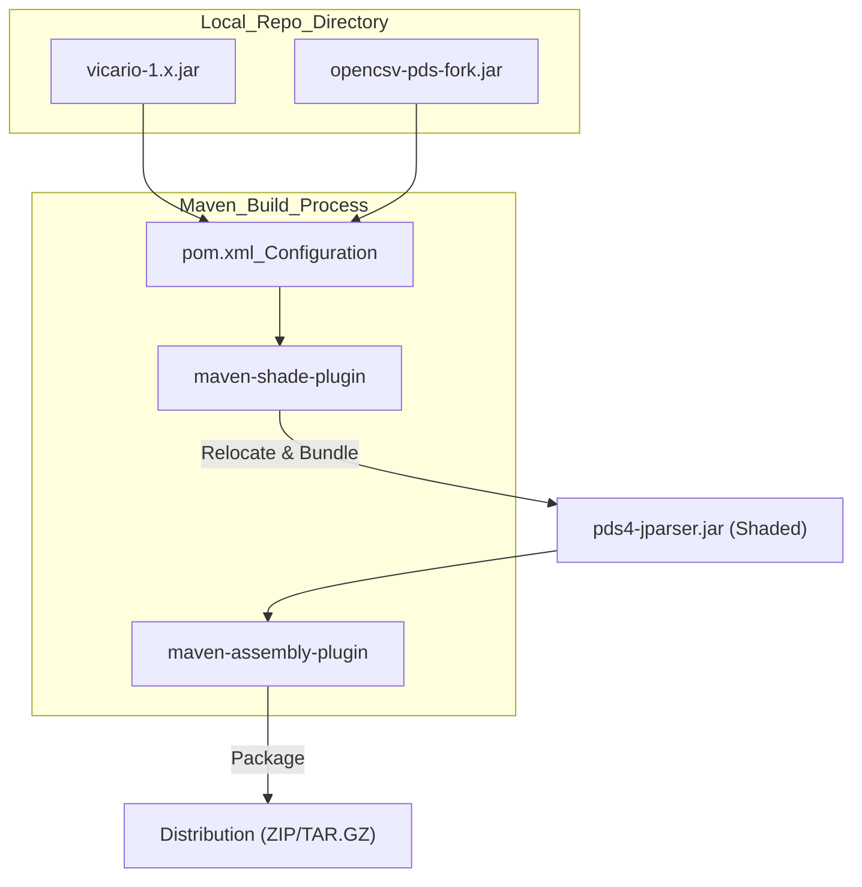
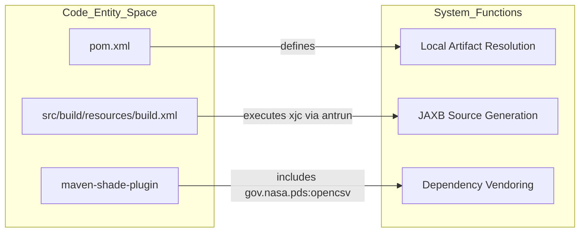

# Page: Local Maven Repository and Vendored Dependencies

# Local Maven Repository and Vendored Dependencies

Relevant source files

The following files were used as context for generating this wiki page:

- [CHANGELOG.md](CHANGELOG.md)
- [pom.xml](pom.xml)
- [src/changes/changes.xml](src/changes/changes.xml)

This page describes the management of non-standard and modified third-party dependencies within the `pds4-jparser` project. To ensure build reproducibility and support specific PDS4 requirements, the project utilizes a local Maven repository and a shading strategy for "vendored" libraries.

## Purpose of the Local Repository

The `pds4-jparser` project relies on several libraries that are either not available in public Maven repositories or require specific modifications (forks) to handle PDS4-specific data structures correctly. These are stored in a local directory structure and referenced during the Maven build process.

Key vendored dependencies include:
*   **Vicario**: A library used for VICAR image format support.
*   **OpenCSV (PDS Fork)**: A customized version of the OpenCSV library tailored to handle the specific delimited-text requirements of the PDS4 standard.

### Configuration in pom.xml

The project configuration defines how these local artifacts are resolved and integrated into the final build. The `maven-shade-plugin` is used to bundle these specific dependencies directly into the `pds4-jparser` JAR to prevent classpath conflicts in downstream applications like the PDS `validate` tool.

[pom.xml:115-145]()

Sources: [pom.xml:115-145]()

## Dependency Bundling Strategy

The project employs the `maven-shade-plugin` to create a "shaded" JAR. This process embeds the bytecode of specific dependencies into the primary artifact.

### Shading Configuration

The `artifactSet` configuration explicitly includes the vendored PDS artifacts while excluding standard public dependencies. This ensures that downstream users only need to manage the `pds4-jparser` dependency without worrying about locating the specialized PDS forks of `vicario` or `opencsv`.

| Feature | Implementation Detail |
| :--- | :--- |
| **Included Artifacts** | `gov.nasa.pds:vicario`, `gov.nasa.pds:opencsv` |
| **Dependency Reduction** | `createDependencyReducedPom` is set to `true` to clean the resulting POM. |
| **Transitive Promotion** | `promoteTransitiveDependencies` is enabled to simplify the dependency graph. |
| **Manifest Preservation** | `ManifestResourceTransformer` ensures default specification entries are maintained. |

[pom.xml:123-142]()

### Dependency Flow Diagram

The following diagram illustrates how local artifacts are pulled from the repository and bundled into the final distribution.

**Local Dependency Integration Flow**

Sources: [pom.xml:115-167]()

## Legacy Modules and Evolution

The project structure has evolved from a multi-module system to a more consolidated library. Historically, the project utilized sub-modules for different layers of the API.

### objectAccess/ and dependencies/
In earlier versions (e.g., prior to 0.7.0), the codebase was split into modules such as `objectAccess`. The current architecture integrates these into the core `gov.nasa.pds.objectAccess` package, while the `dependencies/` folder in the source tree typically houses the source or binaries for the local repository.

*   **Refactoring History**: Around version 0.7.0, the Maven hierarchy was cleaned up to simplify integration for downstream tools.
*   **Java Compatibility**: The build system has been updated across versions to support transitions from Java 1.8 to Java 11, and eventually Java 17+, necessitating updates to how these local dependencies are shaded to avoid `NoSuchMethodError` issues related to `ByteBuffer` and other NIO components.

[CHANGELOG.md:106-108](), [CHANGELOG.md:124-127](), [CHANGELOG.md:133-134]()

**Build System Entity Mapping**

Sources: [pom.xml:74-93](), [pom.xml:115-145](), [src/changes/changes.xml:106-108]()

## Build Lifecycle Integration

The local dependencies are utilized during the `package` phase of the Maven lifecycle.

1.  **Generate Sources**: The `maven-antrun-plugin` triggers the JAXB generation.
2.  **Compile**: Standard Java compilation occurs, referencing both public and local repository artifacts.
3.  **Prepare Package**: The `maven-source-plugin` creates source JARs.
4.  **Package (Shade)**: The `maven-shade-plugin` intercepts the packaging to merge `vicario` and `opencsv` into the main JAR.
5.  **Assembly**: The `maven-assembly-plugin` creates the final distribution formats (ZIP and TAR.GZ) containing the shaded JAR and documentation.

[pom.xml:74-91](), [pom.xml:118-122](), [pom.xml:148-167]()

Sources: [pom.xml:1-177](), [CHANGELOG.md:1-150](), [src/changes/changes.xml:105-118]()
