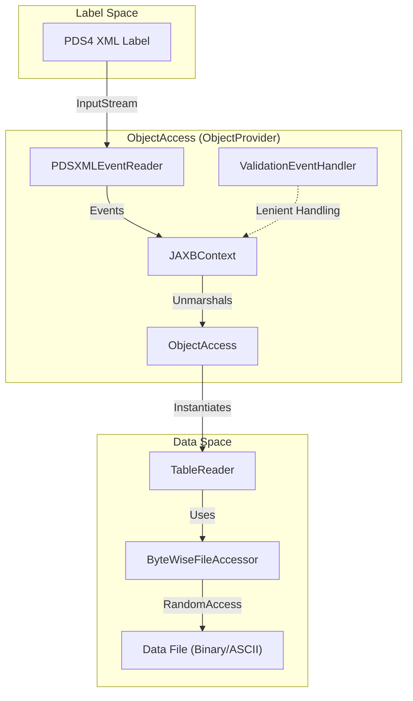
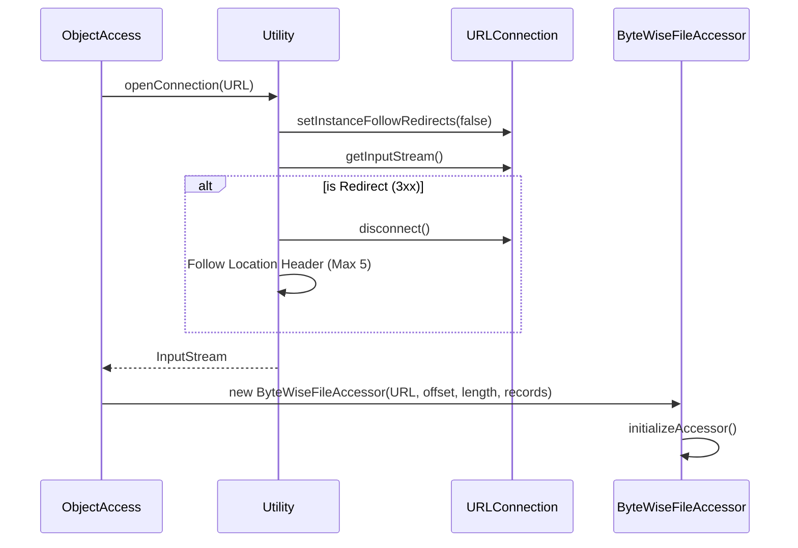

# Page: ObjectAccess and the ObjectProvider Interface

# ObjectAccess and the ObjectProvider Interface

Relevant source files

The following files were used as context for generating this wiki page:

- [src/main/java/gov/nasa/pds/objectAccess/ByteWiseFileAccessor.java](src/main/java/gov/nasa/pds/objectAccess/ByteWiseFileAccessor.java)
- [src/main/java/gov/nasa/pds/objectAccess/ObjectAccess.java](src/main/java/gov/nasa/pds/objectAccess/ObjectAccess.java)
- [src/main/java/gov/nasa/pds/objectAccess/ObjectProvider.java](src/main/java/gov/nasa/pds/objectAccess/ObjectProvider.java)
- [src/main/java/gov/nasa/pds/objectAccess/RawTableReader.java](src/main/java/gov/nasa/pds/objectAccess/RawTableReader.java)
- [src/main/java/gov/nasa/pds/objectAccess/TableReader.java](src/main/java/gov/nasa/pds/objectAccess/TableReader.java)
- [src/main/java/gov/nasa/pds/objectAccess/utility/Utility.java](src/main/java/gov/nasa/pds/objectAccess/utility/Utility.java)

The `ObjectAccess` class serves as the primary entry point for the high-level data-access API in the PDS4 JParser library. It implements the `ObjectProvider` interface to provide a unified mechanism for unmarshalling PDS4 XML labels into Java objects and subsequently accessing the underlying data (tables, arrays, and headers) described by those labels.

## The ObjectProvider Interface

The `ObjectProvider` interface defines the contract for accessing PDS4 objects from various file areas. It provides methods to retrieve specific types of data objects, such as arrays and tables, by passing JAXB-generated metadata objects (e.g., `Product`, `FileAreaObservational`).

Key responsibilities of an `ObjectProvider` implementation include:
*   **Navigation**: Traversing the hierarchy of a PDS4 product to find data components [src/main/java/gov/nasa/pds/objectAccess/ObjectProvider.java:76-147]().
*   **Typed Access**: Providing specialized methods for specific object types like `Array2DImage`, `TableBinary`, or `TableDelimited` [src/main/java/gov/nasa/pds/objectAccess/ObjectProvider.java:103-185]().
*   **Metadata Extraction**: Retrieving field-level definitions (e.g., `FieldCharacter`, `FieldBinary`) from table objects [src/main/java/gov/nasa/pds/objectAccess/ObjectProvider.java:188-210]().

**Sources:**
* [src/main/java/gov/nasa/pds/objectAccess/ObjectProvider.java:60-210]()

## ObjectAccess Implementation

`ObjectAccess` is the concrete implementation of `ObjectProvider`. It manages the JAXB context required for XML unmarshalling and maintains the state of the archive root, which can be a local file path or a URL [src/main/java/gov/nasa/pds/objectAccess/ObjectAccess.java:114-162]().

### Label Unmarshalling and Lenient Parsing
When a label is opened, `ObjectAccess` uses a `JAXBContext` to convert the XML into Java objects. To handle labels that may contain schema violations or unknown elements without failing the entire process, it utilizes a `ValidationEventHandler`.

The unmarshalling process involves:
1.  Initializing a `JAXBContext` for the generated PDS4 classes [src/main/java/gov/nasa/pds/objectAccess/ObjectAccess.java:116-120]().
2.  Using `PDSXMLEventReader` to process the XML stream [src/main/java/gov/nasa/pds/objectAccess/ObjectAccess.java:97]().
3.  Employing a `LenientEventHandler` (implied by the unmarshalling logic) to capture validation events while allowing the parser to continue [src/main/java/gov/nasa/pds/objectAccess/ObjectAccess.java:104-105]().

### Data Retrieval Methods
`ObjectAccess` provides several high-level methods to extract data objects from a parsed `Product`:

| Method | Description |
| :--- | :--- |
| `getDataObjects(Product)` | Returns a generic list of all data objects found in all file areas of the product [src/main/java/gov/nasa/pds/objectAccess/ObjectAccess.java:310-312](). |
| `getTableObjects(FileAreaObservational)` | Specifically extracts `TableBinary`, `TableCharacter`, and `TableDelimited` objects [src/main/java/gov/nasa/pds/objectAccess/ObjectAccess.java:543-562](). |
| `getArrays(FileArea)` | Extracts all `Array` types (including Images and Spectrums) from a given file area [src/main/java/gov/nasa/pds/objectAccess/ObjectAccess.java:439-463](). |

### ObjectAccess Component Interaction
The following diagram illustrates how `ObjectAccess` interacts with the JAXB context and the filesystem/network to provide data objects.

**ObjectAccess Data Flow**

**Sources:**
* [src/main/java/gov/nasa/pds/objectAccess/ObjectAccess.java:114-151]()
* [src/main/java/gov/nasa/pds/objectAccess/ObjectAccess.java:310-312]()
* [src/main/java/gov/nasa/pds/objectAccess/TableReader.java:132-159]()

---

## Connection Management via Utility Class

The `gov.nasa.pds.objectAccess.utility.Utility` class provides centralized management for I/O operations, particularly for handling remote data access via HTTP and HTTPS.

### HTTP/HTTPS and Redirects
The `openConnection(URLConnection)` method implements robust connection handling, including:
*   **Redirect Support**: Manually follows HTTP redirects (up to 5 levels) to ensure compatibility across different server configurations [src/main/java/gov/nasa/pds/objectAccess/utility/Utility.java:77-128]().
*   **SSL/TLS Configuration**: Specifically configures `HttpsURLConnection` to use `TLSv1.2` and sets a custom hostname verifier for `pds.nasa.gov` to handle Server Name Indication (SNI) issues [src/main/java/gov/nasa/pds/objectAccess/utility/Utility.java:56-67, 86-97]().

### Connection Lifecycle Diagram
The following diagram shows the sequence of establishing a connection to a data file, whether local or remote.

**Connection and Access Flow**

**Sources:**
* [src/main/java/gov/nasa/pds/objectAccess/utility/Utility.java:77-128]()
* [src/main/java/gov/nasa/pds/objectAccess/ByteWiseFileAccessor.java:149-166]()

---

## Data Access Infrastructure

Once metadata is unmarshalled, `ObjectAccess` relies on `TableReader` and `ByteWiseFileAccessor` to perform the actual byte-level reading.

### ByteWiseFileAccessor
This class provides common I/O functionality for all PDS data objects. It supports:
*   **Memory Mapping**: For large files, it uses `FileChannel` to map regions of the data file into memory using `ByteBuffer` [src/main/java/gov/nasa/pds/objectAccess/ByteWiseFileAccessor.java:59-66, 145]().
*   **Random Access**: It can read specific records or byte ranges based on the offsets defined in the PDS4 label [src/main/java/gov/nasa/pds/objectAccess/ByteWiseFileAccessor.java:189-191]().

### TableReader and RawTableReader
*   **TableReader**: Uses an `AdapterFactory` to select the correct `TableAdapter` (Binary, Character, or Delimited) and iterates through records [src/main/java/gov/nasa/pds/objectAccess/TableReader.java:132, 144-168]().
*   **RawTableReader**: A specialized version that allows reading a table line-by-line rather than strictly record-by-record. This is useful for previewing data or handling malformed files where the record count in the label might be incorrect [src/main/java/gov/nasa/pds/objectAccess/RawTableReader.java:17-23, 104-174]().

**Sources:**
* [src/main/java/gov/nasa/pds/objectAccess/ByteWiseFileAccessor.java:51-68]()
* [src/main/java/gov/nasa/pds/objectAccess/TableReader.java:67-82]()
* [src/main/java/gov/nasa/pds/objectAccess/RawTableReader.java:23-51]()
