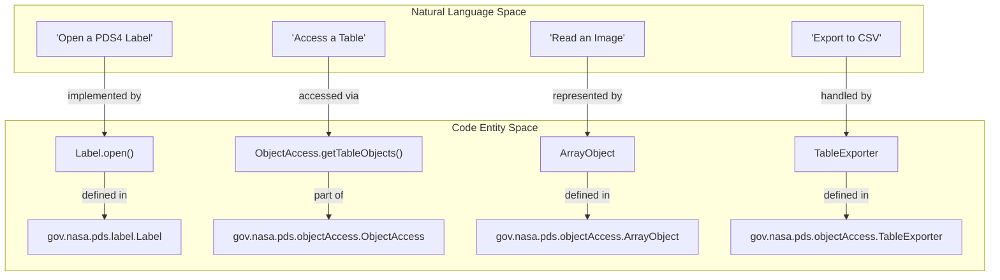
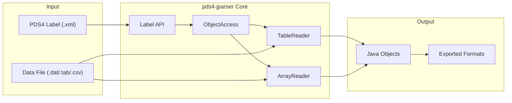

# Page: PDS4 JParser — Project Overview

# PDS4 JParser — Project Overview

Relevant source files

The following files were used as context for generating this wiki page:

- [.github/CODEOWNERS](.github/CODEOWNERS)
- [.gitignore](.gitignore)
- [.zenodo.json](.zenodo.json)
- [CHANGELOG.md](CHANGELOG.md)
- [LICENSE.md](LICENSE.md)
- [NOTICE.txt](NOTICE.txt)
- [README.md](README.md)
- [pom.xml](pom.xml)
- [src/changes/changes.xml](src/changes/changes.xml)
- [src/main/assembly/tar-assembly.xml](src/main/assembly/tar-assembly.xml)
- [src/main/assembly/zip-assembly.xml](src/main/assembly/zip-assembly.xml)
- [src/site/resources/images/pds4_logo.png](src/site/resources/images/pds4_logo.png)
- [src/site/site.xml](src/site/site.xml)
- [src/site/xdoc/develop/index.xml.vm](src/site/xdoc/develop/index.xml.vm)
- [src/site/xdoc/index.xml](src/site/xdoc/index.xml)
- [src/site/xdoc/install/index.xml.vm](src/site/xdoc/install/index.xml.vm)

The **PDS4 JParser** is a Java-based library designed to provide high-level APIs for parsing PDS4 (Planetary Data System v4) labels and accessing the underlying data objects, such as tables and images [README.md:5-7](). It serves as a foundational component in the NASA PDS ecosystem, enabling tools to read, validate, and export planetary data into common formats like CSV, PNG, FITS, and Vicar [README.md:5-7](), [src/site/xdoc/index.xml:41-43]().

## System Role and Ecosystem

PDS4 JParser is primarily used by other PDS tools, such as the **Validate Tool** for content validation and the **Transform Tool** for data conversion [src/site/xdoc/index.xml:41-43](). It manages the complexity of the PDS4 Information Model (IM) by providing a unified interface for different product types [README.md:40-42]().

### Core Capabilities
*   **Label Parsing:** Automated unmarshalling of PDS4 XML labels into Java objects using JAXB [README.md:40-42]().
*   **Data Access:** High-level access to Fixed-width, Character, and Delimited tables, as well as N-dimensional Arrays (images and spectra) [README.md:5-7](), [CHANGELOG.md:34-34]().
*   **Data Export:** Transformation of PDS4 data objects into standard formats (CSV, PNG, TIFF, FITS, etc.) [README.md:5-7]().
*   **Remote Access:** Support for retrieving data via URLs [src/changes/changes.xml:91-93]().

### Code Entity Mapping
The following diagram illustrates how natural language requirements map to specific high-level code entities within the library.

**System Entry Points and Data Flow**

**Sources:** [README.md:109-115](), [src/site/xdoc/develop/index.xml.vm:43-51]()

---

## Library Architecture

The project is structured as a Maven-managed Java library [pom.xml:12-15](). It utilizes a code-generation pipeline that transforms PDS4 XML Schema Definitions (XSD) into Java classes via JAXB during the build process [pom.xml:74-93]().

**High-Level Component Interaction**

**Sources:** [pom.xml:30-41](), [README.md:40-42]()

---

## Child Pages and Further Reading

For detailed technical documentation, please refer to the following sub-pages:

### [Getting Started — Installation and Quick-Start](#1.1)
Covers the prerequisites for using the library, including **Java 17+** and **Maven 3** [README.md:14-17](). It provides instructions for building the JAR from source [README.md:25-36](), adding it as a dependency, and using the `ExtractTable` CLI tool [src/site/xdoc/install/index.xml.vm:114-116]().

### [Project History and Requirements](#1.2)
Summarizes the evolution of the library across different versions of the PDS4 Information Model [README.md:38-42](). This page tracks functional requirements addressed in various releases, such as support for 4D arrays [CHANGELOG.md:34-34]() and updates for specific IM versions like 1C00 or 1M00 [src/changes/changes.xml:52-54](), [CHANGELOG.md:9-10]().

---

## Contributing and Governance

The project is maintained by the NASA Planetary Data System and is hosted on GitHub.
*   **License:** Apache License, Version 2.0 [pom.xml:23-28]().
*   **Code Owners:** Managed by the `@NASA-PDS/validate-committers` team [.github/CODEOWNERS:43-43]().
*   **Issue Tracking:** Bugs and feature requests are handled via GitHub Issues [CHANGELOG.md:7-14]().

**Sources:** [pom.xml:1-30](), [CHANGELOG.md:1-20](), [README.md:1-20](), [src/site/xdoc/index.xml:1-50](), [src/site/xdoc/install/index.xml.vm:1-112](), [src/site/xdoc/develop/index.xml.vm:1-60](), [.github/CODEOWNERS:1-47]().
