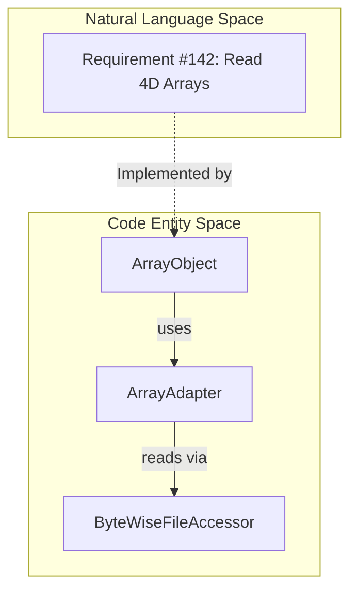
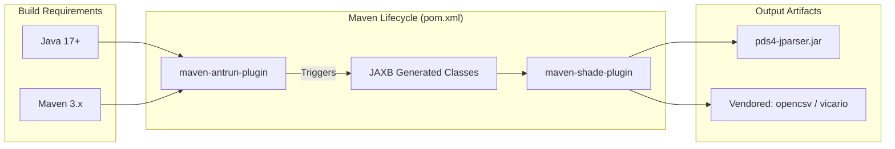

# Page: Project History and Requirements

# Project History and Requirements

Relevant source files

The following files were used as context for generating this wiki page:

- [CHANGELOG.md](CHANGELOG.md)
- [docs/requirements/v2.1.0/REQUIREMENTS.md](docs/requirements/v2.1.0/REQUIREMENTS.md)
- [docs/requirements/v2.1.1/REQUIREMENTS.md](docs/requirements/v2.1.1/REQUIREMENTS.md)
- [docs/requirements/v2.10.1/REQUIREMENTS.md](docs/requirements/v2.10.1/REQUIREMENTS.md)
- [docs/requirements/v2.11.0/REQUIREMENTS.md](docs/requirements/v2.11.0/REQUIREMENTS.md)
- [docs/requirements/v2.12.0/REQUIREMENTS.md](docs/requirements/v2.12.0/REQUIREMENTS.md)
- [docs/requirements/v2.2.0/REQUIREMENTS.md](docs/requirements/v2.2.0/REQUIREMENTS.md)
- [docs/requirements/v2.2.1/REQUIREMENTS.md](docs/requirements/v2.2.1/REQUIREMENTS.md)
- [docs/requirements/v2.3.0/REQUIREMENTS.md](docs/requirements/v2.3.0/REQUIREMENTS.md)
- [docs/requirements/v2.3.1/REQUIREMENTS.md](docs/requirements/v2.3.1/REQUIREMENTS.md)
- [docs/requirements/v2.4.0/REQUIREMENTS.md](docs/requirements/v2.4.0/REQUIREMENTS.md)
- [docs/requirements/v2.5.0/REQUIREMENTS.md](docs/requirements/v2.5.0/REQUIREMENTS.md)
- [docs/requirements/v2.6.0/REQUIREMENTS.md](docs/requirements/v2.6.0/REQUIREMENTS.md)
- [docs/requirements/v2.7.1/REQUIREMENTS.md](docs/requirements/v2.7.1/REQUIREMENTS.md)
- [docs/requirements/v2.8.4/REQUIREMENTS.md](docs/requirements/v2.8.4/REQUIREMENTS.md)
- [docs/requirements/v2.9.0/REQUIREMENTS.md](docs/requirements/v2.9.0/REQUIREMENTS.md)
- [docs/requirements/v3.0.0/REQUIREMENTS.md](docs/requirements/v3.0.0/REQUIREMENTS.md)
- [pom.xml](pom.xml)
- [src/changes/changes.xml](src/changes/changes.xml)

This page documents the evolution of the `pds4-jparser` library, tracing its development from early operational releases to its current state as a Java 17+ library supporting PDS4 Information Model (IM) 1.23.0 (1M00). It summarizes functional requirements addressed in major versions and technical milestones in the codebase.

## Evolution of Capabilities

The `pds4-jparser` library has evolved through three major phases: initial development for PDS4 system integration, modernization for large data handling, and recent transitions to modern Java environments.

### Major Version Milestones

| Version | Key Focus | Notable Requirements Addressed |
| :--- | :--- | :--- |
| **0.x.x** | Initial PDS4 Support | Support for FITS transformation, `Product_Metadata_Supplemental`, and basic Table/Array validation [src/changes/changes.xml:42-132](). |
| **1.x.x** | Performance & Scalability | Memory footprint improvements for large tables and transition to NIO for file access [CHANGELOG.md:128-145](). |
| **2.x.x** | Standards Compliance | Support for 4D arrays, `ASCII_Numeric_Base16` types, and migration to Java 11 [CHANGELOG.md:20-123](). |
| **3.x.x** | Modernization | Upgrade to Java 17, support for IM 1M00, and `Product_Resource` types [CHANGELOG.md:3-15](). |

### Functional Requirements Tracking
The project maintains versioned requirements in `docs/requirements/`. A recurring high-priority requirement across the `v2.x` and `v3.x` series has been the support for 4-Dimensional arrays [docs/requirements/v3.0.0/REQUIREMENTS.md:7-10]().

**Sources:** [CHANGELOG.md:1-163](), [src/changes/changes.xml:42-132](), [docs/requirements/v3.0.0/REQUIREMENTS.md:1-10]()

---

## Technical History and IM Upgrades

The library is tightly coupled to the PDS4 Information Model. As the IM evolves, the library undergoes a JAXB code-generation process to update its internal object model.

### Information Model (IM) Support History
*   **IM 1.12.0 (1C00):** Added support for `ASCII_BibCode` and `Field_Character` validation attributes [src/changes/changes.xml:46-54]().
*   **IM 1.21.0 (1L00) to 1.23.0 (1M00):** Recent upgrades addressed breaking changes in `AxisArray.getSequenceNumber()` and introduced support for `Product_Resource` [CHANGELOG.md:9-11]().

### Data Access Evolution
Historically, the library struggled with files exceeding 2GB. Significant refactoring in the `0.10.1` and `1.11.0` releases introduced `ByteWiseFileAccessor` and improved memory management for large products [src/changes/changes.xml:70-72](), [CHANGELOG.md:139-140]().

### Requirement to Code Mapping: Array Access
The following diagram illustrates how the requirement for multi-dimensional array access (Requirement #142) is realized through the `ArrayObject` and its associated adapter logic.

**Requirement #142 Implementation Flow**

**Sources:** [CHANGELOG.md:34-34](), [docs/requirements/v2.10.1/REQUIREMENTS.md:7-10]()

---

## Change Management and Dependency Evolution

The project has transitioned its build and dependency management to support modern DevOps practices, including a shift from Ant-based logic to a hybrid Maven/Ant approach.

### Build System Milestones
1.  **Java 8 to 11:** Addressed NIO library conflicts and `ByteBuffer` errors [CHANGELOG.md:126-138]().
2.  **Java 17 Upgrade:** Version 3.1.0-SNAPSHOT targets Java 17 to align with downstream tools like `validate` [CHANGELOG.md:14-15](), [pom.xml:14-15]().
3.  **Dependency Hardening:** Migration from legacy logging to `log4j-core`/`api` and removal of `antlr` dependencies [CHANGELOG.md:50-54]().

### Maven Configuration and Artifacts
The `pom.xml` manages a complex lifecycle where PDS4 schemas are unmarshalled into Java classes during the `generate-sources` phase [pom.xml:74-93](). It also uses the `maven-shade-plugin` to bundle local "vendored" dependencies like `vicario` and `opencsv` that are modified specifically for PDS4 requirements [pom.xml:114-145]().

**Project Infrastructure Mapping**

**Sources:** [pom.xml:1-145](), [CHANGELOG.md:14-15](), [CHANGELOG.md:126-138]()
