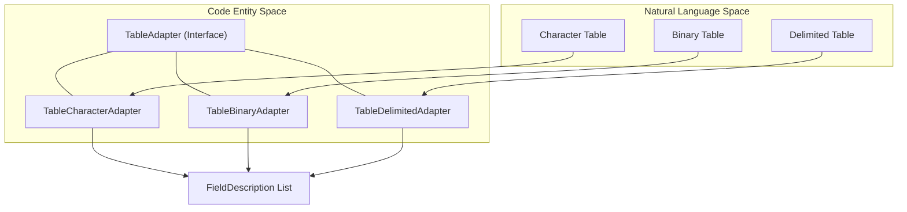
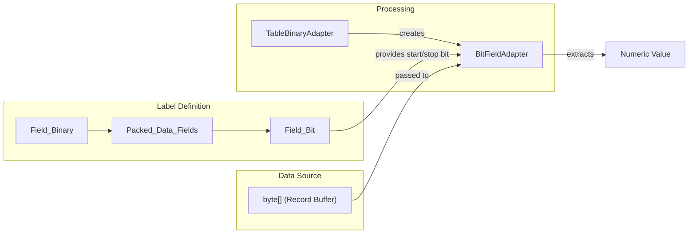

# Page: Table Adapters and Field Types

# Table Adapters and Field Types

Relevant source files

The following files were used as context for generating this wiki page:

- [src/main/java/gov/nasa/pds/label/object/FieldDescription.java](src/main/java/gov/nasa/pds/label/object/FieldDescription.java)
- [src/main/java/gov/nasa/pds/label/object/FieldType.java](src/main/java/gov/nasa/pds/label/object/FieldType.java)
- [src/main/java/gov/nasa/pds/objectAccess/table/BitFieldAdapter.java](src/main/java/gov/nasa/pds/objectAccess/table/BitFieldAdapter.java)
- [src/main/java/gov/nasa/pds/objectAccess/table/DefaultFieldAdapter.java](src/main/java/gov/nasa/pds/objectAccess/table/DefaultFieldAdapter.java)
- [src/main/java/gov/nasa/pds/objectAccess/table/IntegerBinaryFieldAdapter.java](src/main/java/gov/nasa/pds/objectAccess/table/IntegerBinaryFieldAdapter.java)
- [src/main/java/gov/nasa/pds/objectAccess/table/NumericTextFieldAdapter.java](src/main/java/gov/nasa/pds/objectAccess/table/NumericTextFieldAdapter.java)
- [src/main/java/gov/nasa/pds/objectAccess/table/TableBinaryAdapter.java](src/main/java/gov/nasa/pds/objectAccess/table/TableBinaryAdapter.java)
- [src/main/java/gov/nasa/pds/objectAccess/table/TableCharacterAdapter.java](src/main/java/gov/nasa/pds/objectAccess/table/TableCharacterAdapter.java)
- [src/main/java/gov/nasa/pds/objectAccess/table/TableDelimitedAdapter.java](src/main/java/gov/nasa/pds/objectAccess/table/TableDelimitedAdapter.java)
- [src/test/java/gov/nasa/pds/objectAccess/TableReaderTest.java](src/test/java/gov/nasa/pds/objectAccess/TableReaderTest.java)
- [src/test/java/gov/nasa/pds/objectAccess/array/DoubleAdapterTest.java](src/test/java/gov/nasa/pds/objectAccess/array/DoubleAdapterTest.java)
- [src/test/java/gov/nasa/pds/objectAccess/array/FloatAdapterTest.java](src/test/java/gov/nasa/pds/objectAccess/array/FloatAdapterTest.java)
- [src/test/java/gov/nasa/pds/objectAccess/array/IntegerAdapterTest.java](src/test/java/gov/nasa/pds/objectAccess/array/IntegerAdapterTest.java)
- [src/test/java/gov/nasa/pds/objectAccess/table/BitFieldAdapterTest.java](src/test/java/gov/nasa/pds/objectAccess/table/BitFieldAdapterTest.java)
- [src/test/java/gov/nasa/pds/objectAccess/table/DefaultFieldAdapterTest.java](src/test/java/gov/nasa/pds/objectAccess/table/DefaultFieldAdapterTest.java)
- [src/test/java/gov/nasa/pds/objectAccess/table/DoubleBinaryFieldAdapterTest.java](src/test/java/gov/nasa/pds/objectAccess/table/DoubleBinaryFieldAdapterTest.java)
- [src/test/java/gov/nasa/pds/objectAccess/table/FieldTypeTest.java](src/test/java/gov/nasa/pds/objectAccess/table/FieldTypeTest.java)
- [src/test/java/gov/nasa/pds/objectAccess/table/FloatBinaryFieldAdapterTest.java](src/test/java/gov/nasa/pds/objectAccess/table/FloatBinaryFieldAdapterTest.java)
- [src/test/java/gov/nasa/pds/objectAccess/table/NumericTextFieldAdapterTest.java](src/test/java/gov/nasa/pds/objectAccess/table/NumericTextFieldAdapterTest.java)

The table subsystem in `pds4-jparser` relies on a specialized adapter layer to bridge the gap between PDS4 XML label definitions and the underlying byte-stream or text-file data. This page describes the `TableAdapter` interface, its specific implementations for different PDS4 table types, and the `FieldAdapter` mechanism used for type-specific data extraction.

## Table Adapters

The `TableAdapter` interface provides a common API for accessing table-level metadata, regardless of whether the underlying data is stored as fixed-width ASCII, binary, or delimited text. The `AdapterFactory` (referenced in `TableReader`) selects the appropriate implementation based on the JAXB object type unmarshalled from the label.

### TableCharacterAdapter
This adapter handles `Table_Character` objects. It is responsible for expanding `Record_Character` and `Group_Field_Character` definitions into a flat list of `FieldDescription` objects [src/main/java/gov/nasa/pds/objectAccess/table/TableCharacterAdapter.java:45-59](). It calculates absolute byte offsets by recursively traversing groups and applying repetitions [src/main/java/gov/nasa/pds/objectAccess/table/TableCharacterAdapter.java:113-141]().

### TableBinaryAdapter
This adapter handles `Table_Binary` objects. Similar to the character adapter, it flattens the record structure but also supports `Packed_Data_Fields` [src/main/java/gov/nasa/pds/objectAccess/table/TableBinaryAdapter.java:94-99](). When a binary field contains packed data, the adapter generates multiple `FieldDescription` entries—one for each `Field_Bit` defined within the field [src/main/java/gov/nasa/pds/objectAccess/table/TableBinaryAdapter.java:129-133]().

### TableDelimitedAdapter
This adapter handles `Table_Delimited` objects. Unlike fixed-width adapters, it does not calculate byte offsets, as fields are separated by delimiters (e.g., commas). It focuses on identifying the field delimiter and record delimiter from the label [src/main/java/gov/nasa/pds/objectAccess/table/TableDelimitedAdapter.java:139-146]().

### Table Adapter Hierarchy
Title: Table Adapter Implementation Mapping

Sources: [src/main/java/gov/nasa/pds/objectAccess/table/TableCharacterAdapter.java:45-48](), [src/main/java/gov/nasa/pds/objectAccess/table/TableBinaryAdapter.java:45-48](), [src/main/java/gov/nasa/pds/objectAccess/table/TableDelimitedAdapter.java:43-46]().

---

## Field Types and Descriptions

Every field in a table is represented by a `FieldDescription` object, which encapsulates the metadata required to extract and interpret the data.

### FieldDescription
The `FieldDescription` class stores:
*   **Name**: The field name from the label [src/main/java/gov/nasa/pds/label/object/FieldDescription.java:40-40]().
*   **Type**: A `FieldType` enum value [src/main/java/gov/nasa/pds/label/object/FieldDescription.java:41-41]().
*   **Coordinates**: `offset` and `length` for fixed-width tables; `startBit` and `stopBit` for bit fields [src/main/java/gov/nasa/pds/label/object/FieldDescription.java:42-46]().
*   **Constraints**: Minimum, maximum, and special constants [src/main/java/gov/nasa/pds/label/object/FieldDescription.java:49-51]().

### FieldType Enum
The `FieldType` enum maps PDS4 data type strings (e.g., `ASCII_Integer`, `IEEE754MSBDouble`) to specific `FieldAdapter` implementations [src/main/java/gov/nasa/pds/label/object/FieldType.java:48-186](). It also defines whether a type is typically right-justified [src/main/java/gov/nasa/pds/label/object/FieldType.java:57-57]().

| PDS4 Data Type | FieldAdapter Implementation |
| :--- | :--- |
| `ASCII_Integer` | `NumericTextFieldAdapter` (Radix 10) |
| `ASCII_Numeric_Base16` | `NumericTextFieldAdapter` (Radix 16) |
| `SignedMSB4` | `IntegerBinaryFieldAdapter` (4 bytes, Signed, Big-Endian) |
| `IEEE754LSBDouble` | `DoubleBinaryFieldAdapter` (Little-Endian) |
| `UnsignedByte` | `IntegerBinaryFieldAdapter` (1 byte, Unsigned) |

Sources: [src/main/java/gov/nasa/pds/label/object/FieldDescription.java:38-52](), [src/main/java/gov/nasa/pds/label/object/FieldType.java:48-186]().

---

## Bit-Level Extraction

PDS4 allows for "Packed Data Fields" where a single binary field contains multiple sub-fields defined at the bit level.

### BitFieldAdapter
The `BitFieldAdapter` is used to extract values from these sub-fields. It operates on a `byte[]` representing the entire parent field and uses bit-shifting and masking to isolate the requested bits [src/main/java/gov/nasa/pds/objectAccess/table/BitFieldAdapter.java:42-48]().

**Key logic in `getFieldValue()`**:
1.  Determines the starting byte and the bit offset within that byte [src/main/java/gov/nasa/pds/objectAccess/table/BitFieldAdapter.java:190-192]().
2.  Aggregates bits into a `long` value [src/main/java/gov/nasa/pds/objectAccess/table/BitFieldAdapter.java:109-111]().
3.  Handles signedness by checking the `isSigned` flag [src/main/java/gov/nasa/pds/objectAccess/table/BitFieldAdapter.java:50-59]().

### Packed Data Flow
Title: Bit-Level Data Extraction Flow

Sources: [src/main/java/gov/nasa/pds/objectAccess/table/TableBinaryAdapter.java:129-157](), [src/main/java/gov/nasa/pds/objectAccess/table/BitFieldAdapter.java:171-200]().

---

## Specialized Field Adapters

Different data types require specific logic for byte-order (endianness) and string conversion.

*   **`NumericTextFieldAdapter`**: Extends `DefaultFieldAdapter`. It uses a `radix` to parse strings into integers, allowing it to handle hex (`Base16`), octal (`Base8`), and binary (`Base2`) ASCII representations [src/main/java/gov/nasa/pds/objectAccess/table/NumericTextFieldAdapter.java:39-45]().
*   **`IntegerBinaryFieldAdapter`**: Handles binary integers of varying lengths (1, 2, 4, 8 bytes). It uses `java.nio.ByteBuffer` to manage `ByteOrder` [src/main/java/gov/nasa/pds/objectAccess/table/IntegerBinaryFieldAdapter.java:127-158]().
*   **`FloatBinaryFieldAdapter` / `DoubleBinaryFieldAdapter`**: Specifically designed for IEEE 754 floating-point types, managing the conversion from raw bytes to Java `float` and `double` primitives.

Sources: [src/main/java/gov/nasa/pds/objectAccess/table/NumericTextFieldAdapter.java:39-45](), [src/main/java/gov/nasa/pds/objectAccess/table/IntegerBinaryFieldAdapter.java:43-53](), [src/main/java/gov/nasa/pds/label/object/FieldType.java:150-160]().
