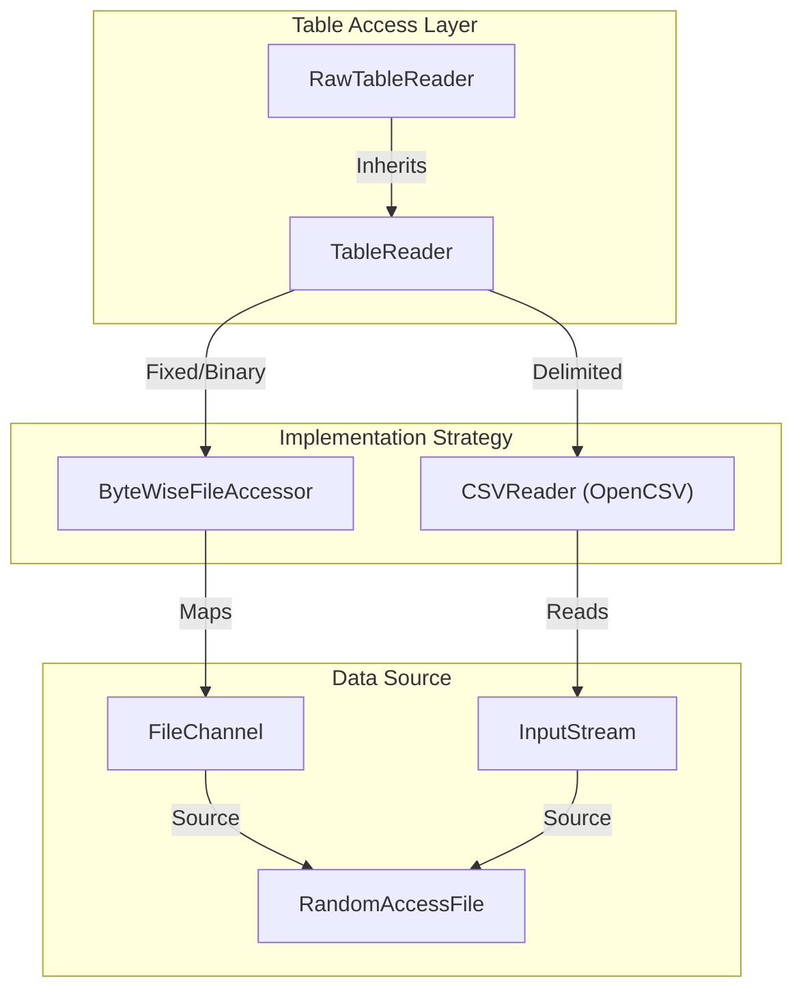
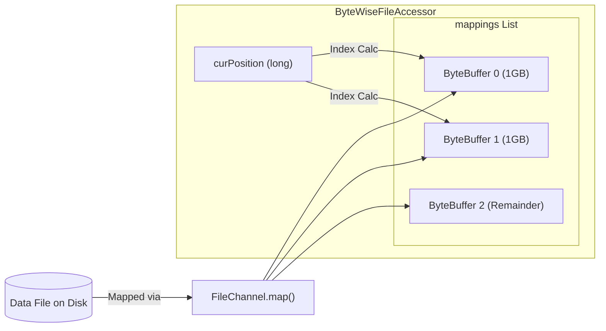

# Page: Table Reading — TableReader, RawTableReader, and ByteWiseFileAccessor

# Table Reading — TableReader, RawTableReader, and ByteWiseFileAccessor

Relevant source files

The following files were used as context for generating this wiki page:

- [src/main/java/gov/nasa/pds/label/object/RecordLocation.java](src/main/java/gov/nasa/pds/label/object/RecordLocation.java)
- [src/main/java/gov/nasa/pds/label/object/TableRecord.java](src/main/java/gov/nasa/pds/label/object/TableRecord.java)
- [src/main/java/gov/nasa/pds/objectAccess/ByteWiseFileAccessor.java](src/main/java/gov/nasa/pds/objectAccess/ByteWiseFileAccessor.java)
- [src/main/java/gov/nasa/pds/objectAccess/DataType.java](src/main/java/gov/nasa/pds/objectAccess/DataType.java)
- [src/main/java/gov/nasa/pds/objectAccess/DelimitedTableRecord.java](src/main/java/gov/nasa/pds/objectAccess/DelimitedTableRecord.java)
- [src/main/java/gov/nasa/pds/objectAccess/ExporterFactory.java](src/main/java/gov/nasa/pds/objectAccess/ExporterFactory.java)
- [src/main/java/gov/nasa/pds/objectAccess/FixedTableRecord.java](src/main/java/gov/nasa/pds/objectAccess/FixedTableRecord.java)
- [src/main/java/gov/nasa/pds/objectAccess/ObjectAccess.java](src/main/java/gov/nasa/pds/objectAccess/ObjectAccess.java)
- [src/main/java/gov/nasa/pds/objectAccess/ObjectProvider.java](src/main/java/gov/nasa/pds/objectAccess/ObjectProvider.java)
- [src/main/java/gov/nasa/pds/objectAccess/RawTableReader.java](src/main/java/gov/nasa/pds/objectAccess/RawTableReader.java)
- [src/main/java/gov/nasa/pds/objectAccess/TableReader.java](src/main/java/gov/nasa/pds/objectAccess/TableReader.java)
- [src/main/java/gov/nasa/pds/objectAccess/table/DelimiterType.java](src/main/java/gov/nasa/pds/objectAccess/table/DelimiterType.java)
- [src/main/java/gov/nasa/pds/objectAccess/table/TableAdapter.java](src/main/java/gov/nasa/pds/objectAccess/table/TableAdapter.java)
- [src/main/java/gov/nasa/pds/objectAccess/utility/Utility.java](src/main/java/gov/nasa/pds/objectAccess/utility/Utility.java)
- [src/test/java/gov/nasa/pds/objectAccess/ByteWiseFileAccessorTest.java](src/test/java/gov/nasa/pds/objectAccess/ByteWiseFileAccessorTest.java)

This page details the technical implementation of table reading within the `pds4-jparser` library. It covers the lifecycle of a `TableReader`, the abstraction provided by `ByteWiseFileAccessor` for random access and large-file handling, and the specialized `RawTableReader` for line-by-line validation and access.

## Table Reading Lifecycle

The reading process begins when a table object (e.g., `TableBinary`, `TableCharacter`, or `TableDelimited`) is passed to the `TableReader` constructor. The reader uses a factory pattern to determine the appropriate access strategy based on the PDS4 table type.

### Adapter Selection and Initialization
The `TableReader` delegates structural logic to a `TableAdapter` obtained via the `AdapterFactory` [src/main/java/gov/nasa/pds/objectAccess/TableReader.java:132-132](). The initialization flow branches based on the table type:

1.  **Delimited Tables**: Uses `TableDelimitedAdapter`. It initializes an `InputStream` (supporting remote URLs via `Utility.openConnection`) and wraps it in a `CSVReader` using a custom `CSVParser` [src/main/java/gov/nasa/pds/objectAccess/TableReader.java:144-167]().
2.  **Fixed/Binary Tables**: Uses `TableCharacterAdapter` or `TableBinaryAdapter`. It initializes a `ByteWiseFileAccessor` to provide random access to fixed-length records [src/main/java/gov/nasa/pds/objectAccess/TableReader.java:168-185]().

### Table Reading Logic Flow
The following diagram illustrates the relationship between the reader, the file accessor, and the underlying data source.

**Diagram: Table Reading Component Interaction**

**Sources:** [src/main/java/gov/nasa/pds/objectAccess/TableReader.java:144-185](), [src/main/java/gov/nasa/pds/objectAccess/RawTableReader.java:23-48](), [src/main/java/gov/nasa/pds/objectAccess/ByteWiseFileAccessor.java:133-145]().

---

## ByteWiseFileAccessor and Memory Mapping

The `ByteWiseFileAccessor` is the core class for reading fixed-width and binary data. It uses Java NIO `FileChannel` to map file regions into memory, providing high-performance random access.

### Multi-Mapping for Large Files (> 2 GB)
Because Java's `MappedByteBuffer` is limited to $2^{31}-1$ bytes (approx. 2 GB), `ByteWiseFileAccessor` implements a multi-mapping strategy. It splits files into chunks of 1 GB (`MAPPING_SIZE = 1 << 30`) and stores them in a `List<ByteBuffer> mappings` [src/main/java/gov/nasa/pds/objectAccess/ByteWiseFileAccessor.java:59-66]().

Key functions for byte access:
*   `readRecordBytes(long row, int offset, int length)`: Calculates which buffer(s) contain the requested record and retrieves the bytes [src/main/java/gov/nasa/pds/objectAccess/ByteWiseFileAccessor.java:227-230]().
*   `readByte()`: Reads a single byte and automatically increments the internal position, crossing mapping boundaries if necessary [src/main/java/gov/nasa/pds/objectAccess/ByteWiseFileAccessor.java:275-296]().

**Diagram: Large File Multi-Mapping Strategy**

**Sources:** [src/main/java/gov/nasa/pds/objectAccess/ByteWiseFileAccessor.java:59-68](), [src/main/java/gov/nasa/pds/objectAccess/ByteWiseFileAccessor.java:185-213]().

---

## RawTableReader: Line-by-Line Access

`RawTableReader` extends `TableReader` to provide "raw" access to table data. While `TableReader` is strict and relies on label metadata to define record boundaries, `RawTableReader` allows for line-by-line reading which is useful for validating record delimiters or handling malformed files.

### Key Methods
*   `readNextLine()`: Reads until a `\r`, `\n`, or `\r\n` is encountered, regardless of the defined record length in the label [src/main/java/gov/nasa/pds/objectAccess/RawTableReader.java:104-174]().
*   `readNextFixedLine()`: Reads a string of length equal to the `TableAdapter.getRecordLength()`, providing a fixed-width view of the data [src/main/java/gov/nasa/pds/objectAccess/RawTableReader.java:183-193]().
*   `toRecord(String line, long row)`: Manually converts a raw string into a `FixedTableRecord` object for further processing [src/main/java/gov/nasa/pds/objectAccess/RawTableReader.java:203-208]().

**Sources:** [src/main/java/gov/nasa/pds/objectAccess/RawTableReader.java:23-23](), [src/main/java/gov/nasa/pds/objectAccess/RawTableReader.java:104-193]().

---

## Record and Location Tracking

As tables are read, the library tracks the physical and logical location of every record. This is encapsulated in the `RecordLocation` class.

| Class | Purpose | Key Attributes |
| :--- | :--- | :--- |
| `RecordLocation` | Holds coordinates for a specific record. | `label` (URL), `dataFile` (URL), `record` (index) [src/main/java/gov/nasa/pds/label/object/RecordLocation.java:41-54]() |
| `FixedTableRecord` | Implementation of `TableRecord` for fixed-width data. | `recordBytes` (byte[]), `fields` (FieldDescription[]) [src/main/java/gov/nasa/pds/objectAccess/FixedTableRecord.java:52-58]() |
| `DelimitedTableRecord` | Implementation of `TableRecord` for delimited data. | `recordValue` (String[]), `fieldMap` [src/main/java/gov/nasa/pds/objectAccess/DelimitedTableRecord.java:47-53]() |

### Data Flow: From Bytes to Record
1.  `TableReader.readNext()` is called.
2.  The reader uses `ByteWiseFileAccessor` (fixed) or `CSVReader` (delimited) to get raw data.
3.  A `TableRecord` implementation is instantiated with the raw data.
4.  The `RecordLocation` is attached to the record via `record.setLocation()` [src/main/java/gov/nasa/pds/objectAccess/RawTableReader.java:216-223]().
5.  Fields are accessed lazily via the `TableRecord.get<Type>(index/name)` methods, which use field adapters to parse the underlying bytes [src/main/java/gov/nasa/pds/objectAccess/FixedTableRecord.java:140-189]().

**Sources:** [src/main/java/gov/nasa/pds/objectAccess/TableReader.java:70-81](), [src/main/java/gov/nasa/pds/objectAccess/FixedTableRecord.java:102-107](), [src/main/java/gov/nasa/pds/objectAccess/DelimitedTableRecord.java:81-86]().
