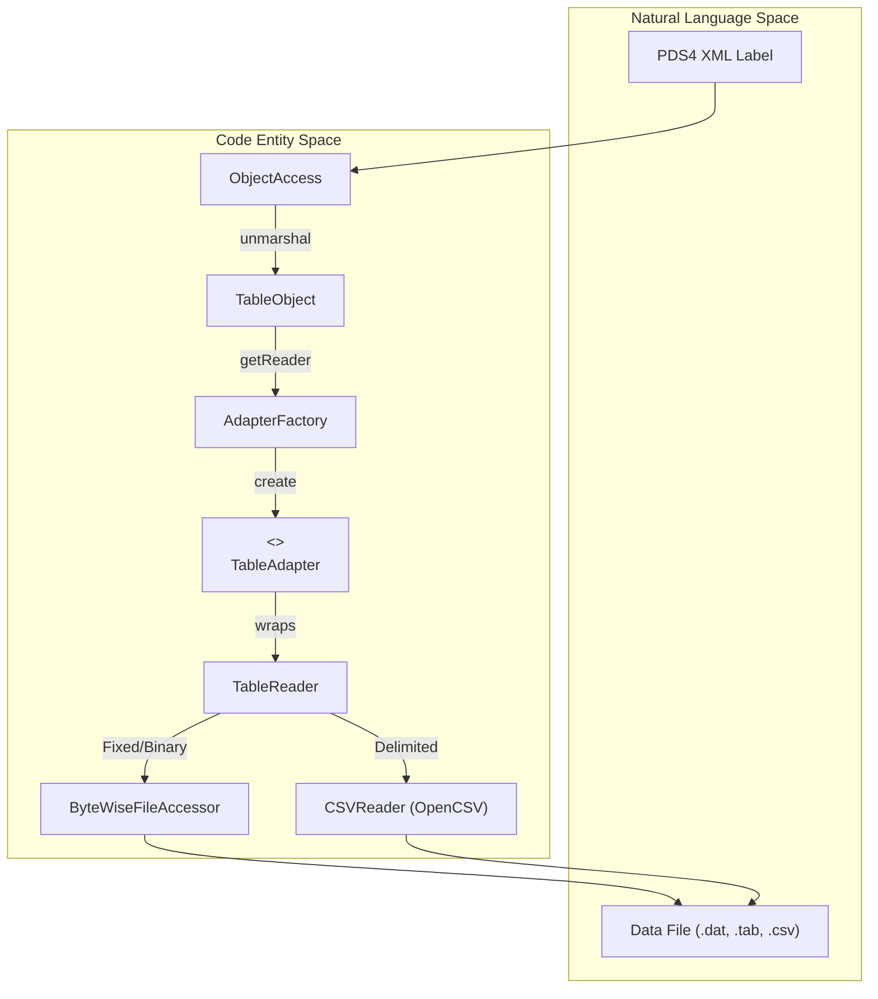
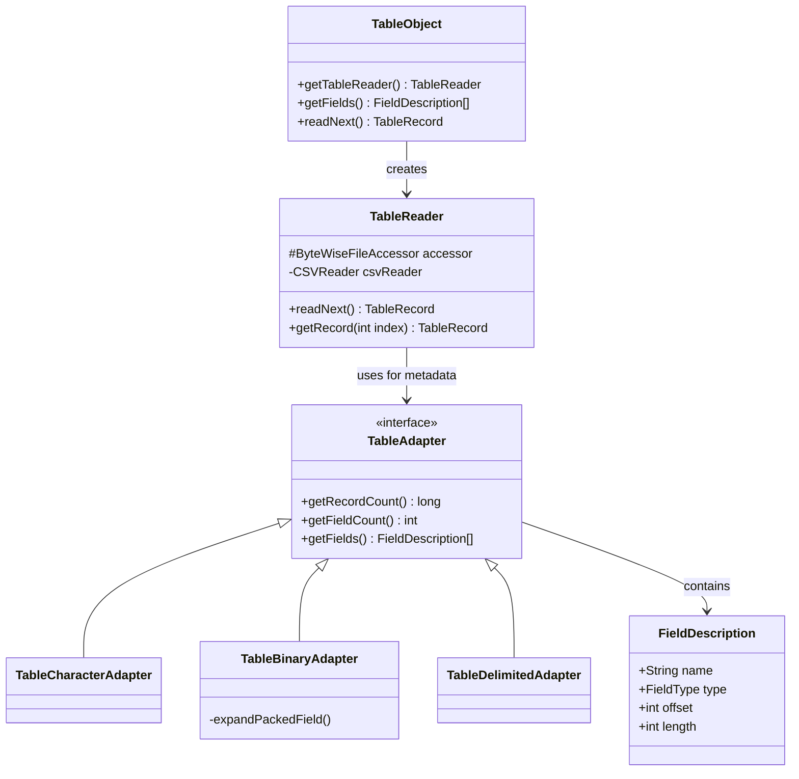

# Page: Table Subsystem

# Table Subsystem

Relevant source files

The following files were used as context for generating this wiki page:

- [src/main/java/gov/nasa/pds/label/object/FieldDescription.java](src/main/java/gov/nasa/pds/label/object/FieldDescription.java)
- [src/main/java/gov/nasa/pds/label/object/GenericObject.java](src/main/java/gov/nasa/pds/label/object/GenericObject.java)
- [src/main/java/gov/nasa/pds/label/object/TableObject.java](src/main/java/gov/nasa/pds/label/object/TableObject.java)
- [src/main/java/gov/nasa/pds/objectAccess/ByteWiseFileAccessor.java](src/main/java/gov/nasa/pds/objectAccess/ByteWiseFileAccessor.java)
- [src/main/java/gov/nasa/pds/objectAccess/Exporter.java](src/main/java/gov/nasa/pds/objectAccess/Exporter.java)
- [src/main/java/gov/nasa/pds/objectAccess/InvalidTableException.java](src/main/java/gov/nasa/pds/objectAccess/InvalidTableException.java)
- [src/main/java/gov/nasa/pds/objectAccess/ObjectAccess.java](src/main/java/gov/nasa/pds/objectAccess/ObjectAccess.java)
- [src/main/java/gov/nasa/pds/objectAccess/ObjectProvider.java](src/main/java/gov/nasa/pds/objectAccess/ObjectProvider.java)
- [src/main/java/gov/nasa/pds/objectAccess/RawTableReader.java](src/main/java/gov/nasa/pds/objectAccess/RawTableReader.java)
- [src/main/java/gov/nasa/pds/objectAccess/TableReader.java](src/main/java/gov/nasa/pds/objectAccess/TableReader.java)
- [src/main/java/gov/nasa/pds/objectAccess/TableWriter.java](src/main/java/gov/nasa/pds/objectAccess/TableWriter.java)
- [src/main/java/gov/nasa/pds/objectAccess/table/AdapterFactory.java](src/main/java/gov/nasa/pds/objectAccess/table/AdapterFactory.java)
- [src/main/java/gov/nasa/pds/objectAccess/table/TableBinaryAdapter.java](src/main/java/gov/nasa/pds/objectAccess/table/TableBinaryAdapter.java)
- [src/main/java/gov/nasa/pds/objectAccess/table/TableCharacterAdapter.java](src/main/java/gov/nasa/pds/objectAccess/table/TableCharacterAdapter.java)
- [src/main/java/gov/nasa/pds/objectAccess/table/TableDelimitedAdapter.java](src/main/java/gov/nasa/pds/objectAccess/table/TableDelimitedAdapter.java)
- [src/main/java/gov/nasa/pds/objectAccess/utility/Utility.java](src/main/java/gov/nasa/pds/objectAccess/utility/Utility.java)
- [src/test/java/gov/nasa/pds/objectAccess/TableReaderTest.java](src/test/java/gov/nasa/pds/objectAccess/TableReaderTest.java)

The Table Subsystem provides a robust framework for reading, writing, and exporting PDS4 table objects. It supports the three primary PDS4 table formats: Character (fixed-width text), Binary (fixed-width binary), and Delimited (e.g., CSV). The subsystem abstracts the underlying file I/O and data type conversions through a series of adapters and readers, allowing developers to interact with table data as high-level `TableRecord` objects.

## System Overview

The entry point for table access is typically through `ObjectAccess` or `TableObject`. These classes utilize the `AdapterFactory` to determine the correct `TableAdapter` implementation based on the PDS4 label definition.

### Table Access Data Flow

The following diagram illustrates how a PDS4 Table is transformed from a label definition into accessible Java objects.

**Table Access Logic Flow**

Sources: [src/main/java/gov/nasa/pds/objectAccess/ObjectAccess.java:108-114](), [src/main/java/gov/nasa/pds/label/object/TableObject.java:106-113](), [src/main/java/gov/nasa/pds/objectAccess/table/AdapterFactory.java:1-50](), [src/main/java/gov/nasa/pds/objectAccess/TableReader.java:132-167]()

---

## Component Breakdown

### 3.1 Table Reading
The reading logic is split between `TableReader`, which handles record-level access using PDS4 metadata, and `RawTableReader`, which allows for more flexible line-by-line reading. For large files (exceeding 2 GB), the system employs `ByteWiseFileAccessor`, which uses a memory-mapping strategy with multiple `ByteBuffer` chunks to bypass Java's 2 GB limit on single mappings.

*   **TableReader:** The standard interface for record-by-record traversal.
*   **ByteWiseFileAccessor:** Handles low-level random access and memory mapping for fixed-width and binary files.
*   **CSVReader Integration:** Uses a PDS-specific fork of OpenCSV for parsing delimited files.

For details, see [Table Reading — TableReader, RawTableReader, and ByteWiseFileAccessor](#3.1).

Sources: [src/main/java/gov/nasa/pds/objectAccess/TableReader.java:67-81](), [src/main/java/gov/nasa/pds/objectAccess/ByteWiseFileAccessor.java:51-68](), [src/main/java/gov/nasa/pds/objectAccess/RawTableReader.java:23-32]()

### 3.2 Table Adapters and Field Types
The `TableAdapter` interface provides a common API for different table formats. The `AdapterFactory` instantiates the appropriate implementation:
*   `TableCharacterAdapter`: For `Table_Character` objects.
*   `TableBinaryAdapter`: For `Table_Binary` objects.
*   `TableDelimitedAdapter`: For `Table_Delimited` objects.

These adapters use `FieldDescription` to map PDS4 `Field` and `Group_Field` definitions to byte offsets and lengths. The system also supports bit-level extraction for `Packed_Data_Fields` via start/stop bit definitions in binary tables.

For details, see [Table Adapters and Field Types](#3.2).

Sources: [src/main/java/gov/nasa/pds/objectAccess/table/TableAdapter.java:1-50](), [src/main/java/gov/nasa/pds/objectAccess/table/TableBinaryAdapter.java:45-56](), [src/main/java/gov/nasa/pds/label/object/FieldDescription.java:38-51]()

### 3.3 Table Writing and Export
The subsystem includes tools for generating PDS4-compliant data files. `TableWriter` supports writing `TableRecord` objects back to disk in fixed or delimited formats. The `TableExporter` and the `ExtractTable` CLI utility provide high-level capabilities to convert PDS4 tables into standard CSV files, facilitating interoperability with external data analysis tools.

For details, see [Table Writing and Export — TableWriter, TableExporter, and ExtractTable CLI](#3.3).

Sources: [src/main/java/gov/nasa/pds/objectAccess/TableWriter.java:56-66](), [src/main/java/gov/nasa/pds/objectAccess/Exporter.java:1-50]()

---

## Class Relationship Diagram

This diagram shows the relationship between the high-level access classes and the internal adapter/reader implementation.

**Table Subsystem Architecture**

Sources: [src/main/java/gov/nasa/pds/label/object/TableObject.java:47-51](), [src/main/java/gov/nasa/pds/objectAccess/TableReader.java:70-81](), [src/main/java/gov/nasa/pds/objectAccess/table/TableBinaryAdapter.java:45-48](), [src/main/java/gov/nasa/pds/label/object/FieldDescription.java:38-51]()
