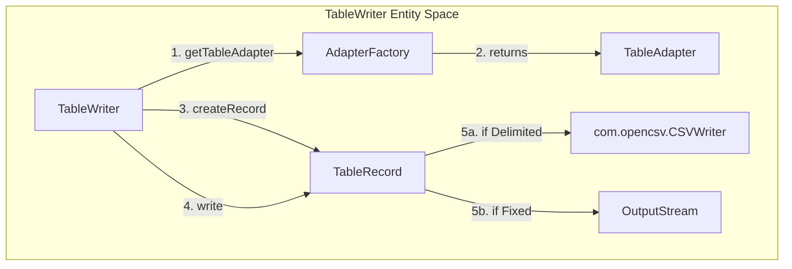
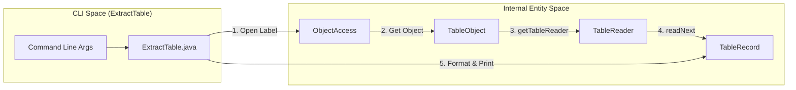

# Page: Table Writing and Export — TableWriter, TableExporter, and ExtractTable CLI

# Table Writing and Export — TableWriter, TableExporter, and ExtractTable CLI

Relevant source files

The following files were used as context for generating this wiki page:

- [src/main/java/gov/nasa/pds/label/object/GenericObject.java](src/main/java/gov/nasa/pds/label/object/GenericObject.java)
- [src/main/java/gov/nasa/pds/label/object/TableObject.java](src/main/java/gov/nasa/pds/label/object/TableObject.java)
- [src/main/java/gov/nasa/pds/objectAccess/Exporter.java](src/main/java/gov/nasa/pds/objectAccess/Exporter.java)
- [src/main/java/gov/nasa/pds/objectAccess/InvalidTableException.java](src/main/java/gov/nasa/pds/objectAccess/InvalidTableException.java)
- [src/main/java/gov/nasa/pds/objectAccess/TableExporter.java](src/main/java/gov/nasa/pds/objectAccess/TableExporter.java)
- [src/main/java/gov/nasa/pds/objectAccess/TableWriter.java](src/main/java/gov/nasa/pds/objectAccess/TableWriter.java)
- [src/main/java/gov/nasa/pds/objectAccess/example/ExtractTable.java](src/main/java/gov/nasa/pds/objectAccess/example/ExtractTable.java)
- [src/main/java/gov/nasa/pds/objectAccess/table/AdapterFactory.java](src/main/java/gov/nasa/pds/objectAccess/table/AdapterFactory.java)
- [src/test/java/gov/nasa/pds/objectAccess/TableExporterTest.java](src/test/java/gov/nasa/pds/objectAccess/TableExporterTest.java)
- [src/test/java/gov/nasa/pds/objectAccess/TableWriterTest.java](src/test/java/gov/nasa/pds/objectAccess/TableWriterTest.java)
- [src/test/java/gov/nasa/pds/objectAccess/example/ExtractTableTest.java](src/test/java/gov/nasa/pds/objectAccess/example/ExtractTableTest.java)
- [src/test/java/gov/nasa/pds/objectAccess/example/TestGroupFieldWithRepetitions.java](src/test/java/gov/nasa/pds/objectAccess/example/TestGroupFieldWithRepetitions.java)
- [src/test/java/gov/nasa/pds/objectAccess/example/TestPDS368.java](src/test/java/gov/nasa/pds/objectAccess/example/TestPDS368.java)

This page covers the components responsible for writing PDS4 table data back to disk, converting tables between formats (primarily to CSV), and the command-line interface for table extraction.

## TableWriter

The `TableWriter` class provides the capability to write fixed-width text, fixed-width binary, and delimited data files based on PDS4 table definitions [src/main/java/gov/nasa/pds/objectAccess/TableWriter.java:56-56](). It acts as a bridge between `TableRecord` objects and the physical storage.

### Implementation Details
`TableWriter` utilizes the `AdapterFactory` to obtain a `TableAdapter` suitable for the specific table type (Binary, Character, or Delimited) [src/main/java/gov/nasa/pds/objectAccess/TableWriter.java:79-79]().

*   **Fixed-Width Writing**: For `TableCharacter` and `TableBinary`, it writes raw bytes to an `OutputStream`. It uses a `FixedTableRecord` to manage the byte buffer for each record [src/main/java/gov/nasa/pds/objectAccess/TableWriter.java:123-125]().
*   **Delimited Writing**: For `TableDelimited`, it wraps an `opencsv` `CSVWriter`. It configures the writer with the field delimiter defined in the label and defaults to `CARRIAGE_RETURN_LINE_FEED` for record delimiters [src/main/java/gov/nasa/pds/objectAccess/TableWriter.java:108-111]().

### Data Flow: Writing a Record
1.  Call `createRecord()` to get a `TableRecord` instance (either `DelimitedTableRecord` or `FixedTableRecord`) [src/main/java/gov/nasa/pds/objectAccess/TableWriter.java:118-131]().
2.  Populate the record using `record.set()` methods.
3.  Pass the record to `write(TableRecord)` [src/main/java/gov/nasa/pds/objectAccess/TableWriter.java:139-145]().

**Table Writing Logic**

Sources: [src/main/java/gov/nasa/pds/objectAccess/TableWriter.java:77-111](), [src/main/java/gov/nasa/pds/objectAccess/TableWriter.java:139-145]()

## TableExporter

The `TableExporter` class is a specialized implementation of `ObjectExporter` designed to convert PDS4 table objects (`TableCharacter`, `TableBinary`, `TableDelimited`) into export formats, primarily CSV [src/main/java/gov/nasa/pds/objectAccess/TableExporter.java:67-70]().

### Key Functions
*   **`convert(Object, OutputStream)`**: The entry point for conversion. It determines the export type (defaulting to "CSV") and initiates the process [src/main/java/gov/nasa/pds/objectAccess/TableExporter.java:148-157]().
*   **`exportToCSV(...)`**: This internal method handles the heavy lifting of reading from the source data file (using a `TableReader`) and writing to the output stream via a `CSVWriter` [src/main/java/gov/nasa/pds/objectAccess/TableExporter.java:155-155]().
*   **Charset Management**: Supports setting specific encoders and decoders (defaulting to "US-ASCII") to handle different character encodings during the export process [src/main/java/gov/nasa/pds/objectAccess/TableExporter.java:105-106]().

Sources: [src/main/java/gov/nasa/pds/objectAccess/TableExporter.java:67-157]()

## ExtractTable CLI

`ExtractTable` is a command-line application that provides a user interface for extracting data from PDS4 tables [src/main/java/gov/nasa/pds/objectAccess/example/ExtractTable.java:67-67](). It uses the Apache Commons CLI library for argument parsing.

### Command-Line Flags
The tool supports the following key options [src/main/java/gov/nasa/pds/objectAccess/example/ExtractTable.java:132-179]():

| Flag | Long Option | Description |
| :--- | :--- | :--- |
| `-f` | `--fields` | Comma-separated list of field names or 1-based indices to extract. |
| `-o` | `--output-file` | Destination file path (defaults to stdout). |
| `-d` | `--data-file` | Specific data file to process if the label references multiple. |
| `-n` | `--index` | 1-based index of the table within the file area (default is 1). |
| `-a` | `--all` | Extract all tables found in the product. |
| `-c` | `--csv` | Force output to CSV format. |
| `-w` | `--fixed-width` | Force output to fixed-width format (default). |
| `-l` | `--list-tables` | List all tables present in the product and exit. |
| `-t` | `--field-separator`| Define a custom field separator for output. |

### Execution Flow
The `run(String[] args)` method coordinates the extraction [src/main/java/gov/nasa/pds/objectAccess/example/ExtractTable.java:125-127]():
1.  **Parse Arguments**: Processes the `Options` object [src/main/java/gov/nasa/pds/objectAccess/example/ExtractTable.java:132-179]().
2.  **Initialize ObjectAccess**: Opens the PDS4 label [src/main/java/gov/nasa/pds/objectAccess/example/ExtractTable.java:106-106]().
3.  **Retrieve Table**: Locates the specific `TableObject` based on the index or name.
4.  **Read and Write**: Iterates through the table using a `TableReader` and writes formatted output to the destination `PrintWriter` [src/main/java/gov/nasa/pds/objectAccess/example/ExtractTable.java:109-109]().

**CLI to Internal API Mapping**

Sources: [src/main/java/gov/nasa/pds/objectAccess/example/ExtractTable.java:125-179](), [src/main/java/gov/nasa/pds/label/object/TableObject.java:111-113]()

## Summary of Table Objects
The `TableObject` class is the high-level representation used by both the Exporter and the CLI to interact with data [src/main/java/gov/nasa/pds/label/object/TableObject.java:47-47](). It provides convenience methods to access the underlying readers:
*   `getTableReader()`: Returns a reader for structured field access [src/main/java/gov/nasa/pds/label/object/TableObject.java:111-113]().
*   `getRawTableReader()`: Returns a reader for line-by-line access [src/main/java/gov/nasa/pds/label/object/TableObject.java:121-124]().
*   `readNext()`: Advances the internal reader to the next record [src/main/java/gov/nasa/pds/label/object/TableObject.java:146-151]().

Sources: [src/main/java/gov/nasa/pds/label/object/TableObject.java:47-151]()
