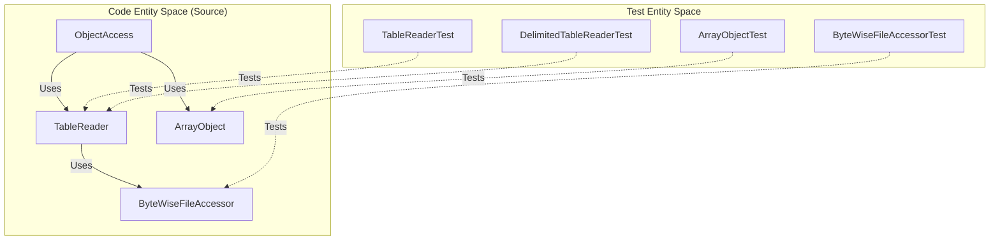

# Page: Testing Infrastructure

# Testing Infrastructure

<details>
<summary>Relevant source files</summary>

The following files were used as context for generating this wiki page:

- [src/main/java/gov/nasa/pds/label/object/ArrayObject.java](src/main/java/gov/nasa/pds/label/object/ArrayObject.java)
- [src/main/java/gov/nasa/pds/label/object/DataObject.java](src/main/java/gov/nasa/pds/label/object/DataObject.java)
- [src/main/java/gov/nasa/pds/label/object/FieldDescription.java](src/main/java/gov/nasa/pds/label/object/FieldDescription.java)
- [src/main/java/gov/nasa/pds/objectAccess/ImageExporter.java](src/main/java/gov/nasa/pds/objectAccess/ImageExporter.java)
- [src/main/java/gov/nasa/pds/objectAccess/ThreeDImageExporter.java](src/main/java/gov/nasa/pds/objectAccess/ThreeDImageExporter.java)
- [src/main/java/gov/nasa/pds/objectAccess/ThreeDSpectrumExporter.java](src/main/java/gov/nasa/pds/objectAccess/ThreeDSpectrumExporter.java)
- [src/main/java/gov/nasa/pds/objectAccess/TwoDImageExporter.java](src/main/java/gov/nasa/pds/objectAccess/TwoDImageExporter.java)
- [src/main/java/gov/nasa/pds/objectAccess/array/ArrayAdapter.java](src/main/java/gov/nasa/pds/objectAccess/array/ArrayAdapter.java)
- [src/main/java/gov/nasa/pds/objectAccess/table/TableBinaryAdapter.java](src/main/java/gov/nasa/pds/objectAccess/table/TableBinaryAdapter.java)
- [src/main/java/gov/nasa/pds/objectAccess/table/TableCharacterAdapter.java](src/main/java/gov/nasa/pds/objectAccess/table/TableCharacterAdapter.java)
- [src/main/java/gov/nasa/pds/objectAccess/table/TableDelimitedAdapter.java](src/main/java/gov/nasa/pds/objectAccess/table/TableDelimitedAdapter.java)
- [src/test/java/gov/nasa/pds/label/object/ArrayObjectTest.java](src/test/java/gov/nasa/pds/label/object/ArrayObjectTest.java)
- [src/test/java/gov/nasa/pds/label/object/GenericObjectTest.java](src/test/java/gov/nasa/pds/label/object/GenericObjectTest.java)
- [src/test/java/gov/nasa/pds/objectAccess/DelimitedTableReaderTest.java](src/test/java/gov/nasa/pds/objectAccess/DelimitedTableReaderTest.java)
- [src/test/java/gov/nasa/pds/objectAccess/TableReaderTest.java](src/test/java/gov/nasa/pds/objectAccess/TableReaderTest.java)
- [src/test/java/gov/nasa/pds/objectAccess/table/TableBinaryAdapterTest.java](src/test/java/gov/nasa/pds/objectAccess/table/TableBinaryAdapterTest.java)

</details>


The `pds4-jparser` testing infrastructure is designed to ensure the integrity of PDS4 label unmarshalling and the subsequent data access for various digital object types (Tables, Arrays, and Images). The project utilizes the **TestNG** framework for executing both unit and integration tests.

## Test Strategy Overview

The testing strategy is divided into three primary layers:
1.  **Unit Tests:** Focused on individual components like field adapters, table readers, and byte-level file accessors.
2.  **Integration Tests:** Verifying the end-to-end flow from a PDS4 XML label to data extraction using the `ObjectAccess` and `TableReader` APIs.
3.  **Fixture-based Validation:** Utilizing standard PDS4 example products (e.g., from the PDS4 Data Provider's Handbook) to ensure compliance with the PDS4 Information Model.

### Core Testing Entities

The following diagram maps the relationship between the primary data access classes and their corresponding test entities.

**Data Access to Test Mapping**

Sources: [src/main/java/gov/nasa/pds/objectAccess/ObjectAccess.java](), [src/test/java/gov/nasa/pds/objectAccess/TableReaderTest.java](), [src/test/java/gov/nasa/pds/label/object/ArrayObjectTest.java]()

## Test Resource Layout

Test resources are organized within `src/test/resources`, containing both PDS4 labels (`.xml`) and their associated data files (`.dat`, `.csv`, `.tab`).

| Resource Category | Description |
| :--- | :--- |
| **dph_example_products** | Standard PDS4 examples used for regression testing against the Information Model. |
| **1.x.x.x** | Version-specific test cases for different PDS4 IM versions. |
| **table_test** | Specific fixtures for testing fixed-width character, binary, and delimited tables. |

## Major Test Components

### Unit Testing: Adapters and Readers
Unit tests verify that specific PDS4 data types are correctly converted into Java primitives. This includes testing `TableCharacterAdapter`, `TableBinaryAdapter`, and `TableDelimitedAdapter` to ensure field offsets and lengths are calculated correctly, especially when `Group_Field` repetitions are involved [src/main/java/gov/nasa/pds/objectAccess/table/TableCharacterAdapter.java:113-141]().

For details, see [Unit Tests — Adapters, Readers, and Writers](#6.1).

### Integration and Example Tests
Integration tests exercise the `ObjectProvider` interface [src/main/java/gov/nasa/pds/objectAccess/ObjectProvider.java]() to ensure that `ArrayObject` [src/main/java/gov/nasa/pds/label/object/ArrayObject.java:49]() and `TableReader` can handle complex multi-dimensional arrays and tables across different storage formats. Tests like `ArrayObjectTest` verify element-by-element access for 2D, 3D, and 4D arrays [src/test/java/gov/nasa/pds/label/object/ArrayObjectTest.java:58-186]().

For details, see [Integration and Example Tests — ExtractTable, Group Fields, and DPH Products](#6.2).

### Image Export Validation
The infrastructure includes tests for the `ImageExporter` hierarchy, ensuring that `TwoDImageExporter`, `ThreeDImageExporter`, and `ThreeDSpectrumExporter` correctly apply `DisplaySettings` and scaling factors during conversion to PNG or TIFF [src/main/java/gov/nasa/pds/objectAccess/ImageExporter.java:52-106]().

**Image Export Testing Flow**
```mermaid
graph LR
    "PDS4 Label" -->|"ObjectAccess.getArrayObjects()"| AO["ArrayObject"]
    AO -->|"ExporterFactory.getExporter()"| IE["ImageExporter"]
    IE -->|"convert()"| "Output Stream (PNG/TIFF)"
    
    subgraph "Validation Logic"
        "Output Stream (PNG/TIFF)" --> "Pixel Integrity Check"
        "DisplaySettings" -->|"Applied to"| IE
    end
```
Sources: [src/main/java/gov/nasa/pds/objectAccess/TwoDImageExporter.java:148-182](), [src/main/java/gov/nasa/pds/objectAccess/ThreeDSpectrumExporter.java:156-180]()

## External Integration: NASA-PDS/validate
The library's CI/CD pipeline includes downstream integration tests where the `pds4-jparser` is used as a dependency within the [NASA-PDS/validate](https://github.com/NASA-PDS/validate) tool. This ensures that changes to the parser do not break the core PDS validation logic used by the planetary science community.

---

### Child Pages
- [Unit Tests — Adapters, Readers, and Writers](#6.1)
- [Integration and Example Tests — ExtractTable, Group Fields, and DPH Products](#6.2)
