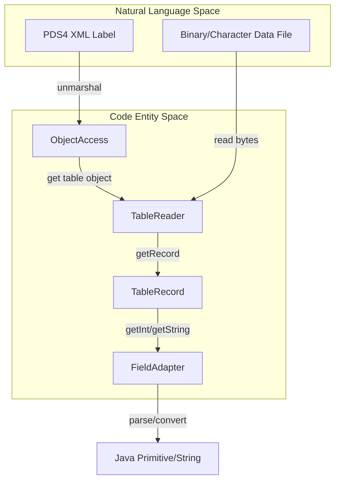
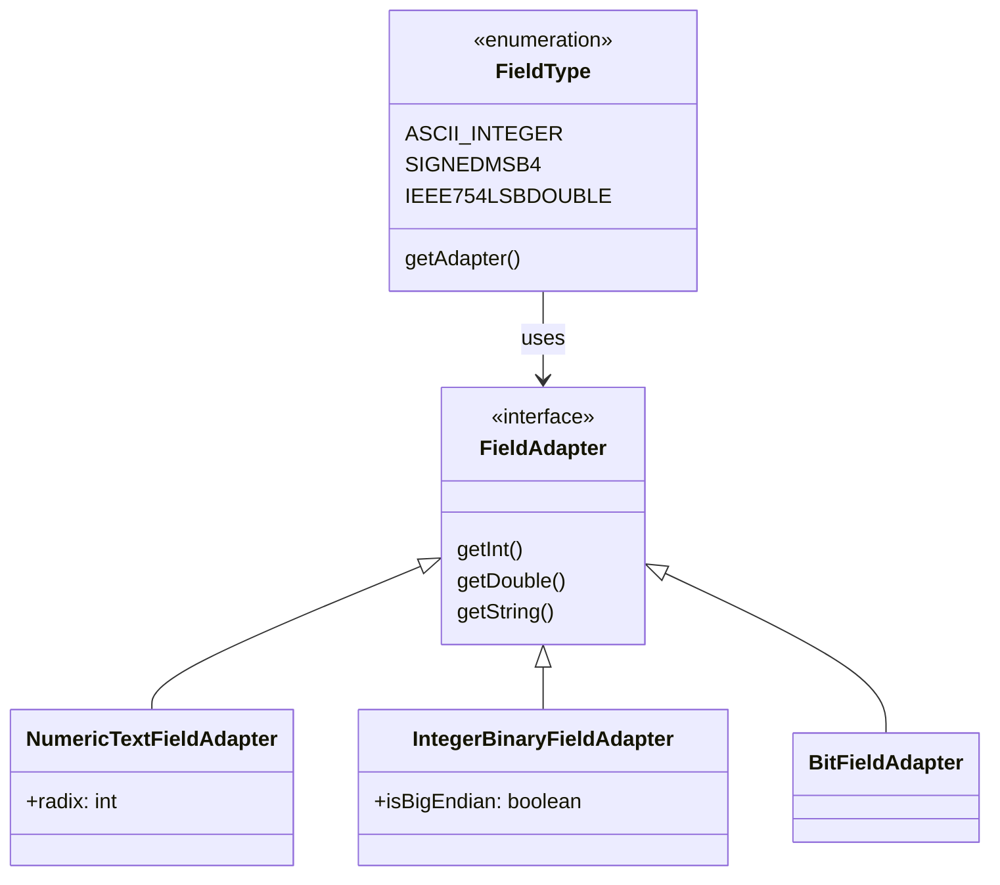

# Page: Unit Tests — Adapters, Readers, and Writers

# Unit Tests — Adapters, Readers, and Writers

Relevant source files

The following files were used as context for generating this wiki page:

- [src/main/java/gov/nasa/pds/label/object/FieldDescription.java](src/main/java/gov/nasa/pds/label/object/FieldDescription.java)
- [src/main/java/gov/nasa/pds/label/object/FieldType.java](src/main/java/gov/nasa/pds/label/object/FieldType.java)
- [src/main/java/gov/nasa/pds/objectAccess/table/BitFieldAdapter.java](src/main/java/gov/nasa/pds/objectAccess/table/BitFieldAdapter.java)
- [src/main/java/gov/nasa/pds/objectAccess/table/DefaultFieldAdapter.java](src/main/java/gov/nasa/pds/objectAccess/table/DefaultFieldAdapter.java)
- [src/main/java/gov/nasa/pds/objectAccess/table/IntegerBinaryFieldAdapter.java](src/main/java/gov/nasa/pds/objectAccess/table/IntegerBinaryFieldAdapter.java)
- [src/main/java/gov/nasa/pds/objectAccess/table/NumericTextFieldAdapter.java](src/main/java/gov/nasa/pds/objectAccess/table/NumericTextFieldAdapter.java)
- [src/main/java/gov/nasa/pds/objectAccess/table/TableBinaryAdapter.java](src/main/java/gov/nasa/pds/objectAccess/table/TableBinaryAdapter.java)
- [src/main/java/gov/nasa/pds/objectAccess/table/TableCharacterAdapter.java](src/main/java/gov/nasa/pds/objectAccess/table/TableCharacterAdapter.java)
- [src/main/java/gov/nasa/pds/objectAccess/table/TableDelimitedAdapter.java](src/main/java/gov/nasa/pds/objectAccess/table/TableDelimitedAdapter.java)
- [src/test/java/gov/nasa/pds/objectAccess/TableReaderTest.java](src/test/java/gov/nasa/pds/objectAccess/TableReaderTest.java)
- [src/test/java/gov/nasa/pds/objectAccess/array/DoubleAdapterTest.java](src/test/java/gov/nasa/pds/objectAccess/array/DoubleAdapterTest.java)
- [src/test/java/gov/nasa/pds/objectAccess/array/FloatAdapterTest.java](src/test/java/gov/nasa/pds/objectAccess/array/FloatAdapterTest.java)
- [src/test/java/gov/nasa/pds/objectAccess/array/IntegerAdapterTest.java](src/test/java/gov/nasa/pds/objectAccess/array/IntegerAdapterTest.java)
- [src/test/java/gov/nasa/pds/objectAccess/table/BitFieldAdapterTest.java](src/test/java/gov/nasa/pds/objectAccess/table/BitFieldAdapterTest.java)
- [src/test/java/gov/nasa/pds/objectAccess/table/DefaultFieldAdapterTest.java](src/test/java/gov/nasa/pds/objectAccess/table/DefaultFieldAdapterTest.java)
- [src/test/java/gov/nasa/pds/objectAccess/table/DoubleBinaryFieldAdapterTest.java](src/test/java/gov/nasa/pds/objectAccess/table/DoubleBinaryFieldAdapterTest.java)
- [src/test/java/gov/nasa/pds/objectAccess/table/FieldTypeTest.java](src/test/java/gov/nasa/pds/objectAccess/table/FieldTypeTest.java)
- [src/test/java/gov/nasa/pds/objectAccess/table/FloatBinaryFieldAdapterTest.java](src/test/java/gov/nasa/pds/objectAccess/table/FloatBinaryFieldAdapterTest.java)
- [src/test/java/gov/nasa/pds/objectAccess/table/IntegerBinaryFieldAdapterTest.java](src/test/java/gov/nasa/pds/objectAccess/table/IntegerBinaryFieldAdapterTest.java)
- [src/test/java/gov/nasa/pds/objectAccess/table/NumericTextFieldAdapterTest.java](src/test/java/gov/nasa/pds/objectAccess/table/NumericTextFieldAdapterTest.java)

This page covers the unit testing infrastructure for the PDS4 JParser data access layer. The tests ensure that table and array adapters correctly transform raw bytes from PDS4 data files into Java primitive types and strings based on the definitions provided in PDS4 XML labels.

## Overview of Testing Strategy

The testing suite for adapters and readers focuses on verifying the "Adapter Pattern" implementation. It ensures that regardless of the underlying data format (Fixed-width ASCII, Binary, or Delimited), the `TableAdapter` and `FieldAdapter` implementations provide a consistent interface for data retrieval.

### Key Test Components
*   **Table Adapters**: Verify the expansion of nested groups and field definitions from JAXB objects into flat `FieldDescription` lists.
*   **Field Adapters**: Test bit-level manipulation, endianness conversion, and numeric string parsing.
*   **Array Adapters**: Validate coordinate-to-offset mapping for N-dimensional arrays.

## Table Adapter Tests

Table adapter tests verify that the library correctly interprets the structure of PDS4 tables, including complex nested groups and repetitions.

### TableCharacterAdapter and TableBinaryAdapter
These tests ensure that `TableCharacterAdapter` [src/main/java/gov/nasa/pds/objectAccess/table/TableCharacterAdapter.java:45-45]() and `TableBinaryAdapter` [src/main/java/gov/nasa/pds/objectAccess/table/TableBinaryAdapter.java:45-45]() correctly calculate field offsets and lengths.

*   **Group Expansion**: Tests verify that `expandGroupField` correctly handles `repetitions` by duplicating field definitions with adjusted offsets [src/main/java/gov/nasa/pds/objectAccess/table/TableCharacterAdapter.java:113-141]().
*   **Validation**: Tests confirm that the adapter throws `InvalidTableException` if the `group_length` in the label does not match the sum of contained field lengths [src/main/java/gov/nasa/pds/objectAccess/table/TableCharacterAdapter.java:120-134]().

### Delimited Table Testing
`TableDelimitedAdapter` is tested to ensure it correctly identifies field and record delimiters from the label [src/main/java/gov/nasa/pds/objectAccess/table/TableDelimitedAdapter.java:139-146](). Unlike fixed-width tables, these tests focus on the `CSVReader` integration.

**Sources**: [src/main/java/gov/nasa/pds/objectAccess/table/TableCharacterAdapter.java:45-141](), [src/main/java/gov/nasa/pds/objectAccess/table/TableBinaryAdapter.java:45-157](), [src/main/java/gov/nasa/pds/objectAccess/table/TableDelimitedAdapter.java:43-160]()

## Field Adapter Tests

Field adapters are responsible for converting specific byte ranges into Java types. The tests use `DataProvider` to run exhaustive checks against various bit patterns and numeric strings.

### BitFieldAdapterTest
`BitFieldAdapter` handles extraction of bits from packed binary fields. The test suite `BitFieldAdapterTest` [src/test/java/gov/nasa/pds/objectAccess/table/BitFieldAdapterTest.java:39-39]() verifies:
*   **Bit Extraction**: Using `getFieldValue` to mask and shift bits across byte boundaries [src/main/java/gov/nasa/pds/objectAccess/table/BitFieldAdapter.java:171-201]().
*   **Signedness**: Correctly extending the sign bit for `SignedBitString` types.
*   **Boundary Conditions**: Ensuring `ArrayIndexOutOfBoundsException` is thrown for negative start bits or stop bits exceeding the field length [src/test/java/gov/nasa/pds/objectAccess/table/BitFieldAdapterTest.java:160-166]().

### Numeric Field Adapters
*   **IntegerBinaryFieldAdapterTest**: Validates `SignedMSB`, `UnsignedLSB`, etc., by checking endianness logic [src/main/java/gov/nasa/pds/objectAccess/table/IntegerBinaryFieldAdapter.java:49-53]().
*   **NumericTextFieldAdapterTest**: Tests parsing of ASCII numbers (Integers, Reals) with different radices (Base 2, 8, 10, 16) [src/test/java/gov/nasa/pds/objectAccess/table/NumericTextFieldAdapterTest.java:40-125](). It also verifies that values out of range for a `byte` or `short` throw `NumberFormatException` [src/test/java/gov/nasa/pds/objectAccess/table/NumericTextFieldAdapterTest.java:56-96]().

### Data Flow: From Bytes to Java Objects
The following diagram illustrates how `TableReaderTest` [src/test/java/gov/nasa/pds/objectAccess/TableReaderTest.java:58-58]() validates the flow from a PDS4 label to a typed Java value.

**Table Reading Data Flow**

**Sources**: [src/test/java/gov/nasa/pds/objectAccess/TableReaderTest.java:91-139](), [src/main/java/gov/nasa/pds/objectAccess/table/BitFieldAdapter.java:42-121](), [src/test/java/gov/nasa/pds/objectAccess/table/NumericTextFieldAdapterTest.java:40-194]()

## Array Adapter Tests

Array adapter tests (`IntegerAdapterTest`, `FloatAdapterTest`, `DoubleAdapterTest`) verify the logic used to access N-dimensional data.

*   **Coordinate Mapping**: Verifies that the `ArrayAdapter` correctly calculates the 1D offset into the `MappedByteBuffer` based on the array's `Axis_Array` definitions.
*   **Data Conversion**: Ensures that `IEEE754` floating point conversions and signed/unsigned integer conversions match expected values when read from the buffer.

## Comprehensive Reader Tests

`TableReaderTest` [src/test/java/gov/nasa/pds/objectAccess/TableReaderTest.java:58-58]() acts as a functional unit test, combining labels and data files to verify the entire stack.

| Test Method | Purpose | Key Classes Tested |
| :--- | :--- | :--- |
| `testTableCharacterReader` | Verifies reading of ASCII fixed-width tables | `TableCharacterAdapter`, `TableReader` |
| `testTableBinaryReader` | Verifies reading of binary tables with MSB/LSB types | `TableBinaryAdapter`, `TableReader` |
| `testBitField` | Specifically checks packed data field extraction | `BitFieldAdapter`, `TableBinaryAdapter` |

### Field Type Mapping Logic
The `FieldTypeTest` [src/test/java/gov/nasa/pds/objectAccess/table/FieldTypeTest.java:40-40]() ensures that the `FieldType` enum correctly maps PDS4 XML data types to the appropriate internal adapter.

**Field Type Association**

**Sources**: [src/test/java/gov/nasa/pds/objectAccess/TableReaderTest.java:58-160](), [src/main/java/gov/nasa/pds/label/object/FieldType.java:48-187](), [src/test/java/gov/nasa/pds/objectAccess/table/FieldTypeTest.java:40-78]()
