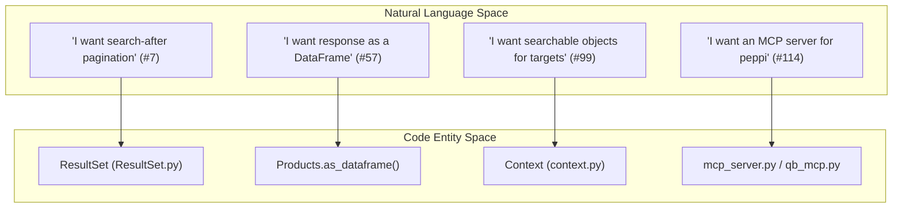
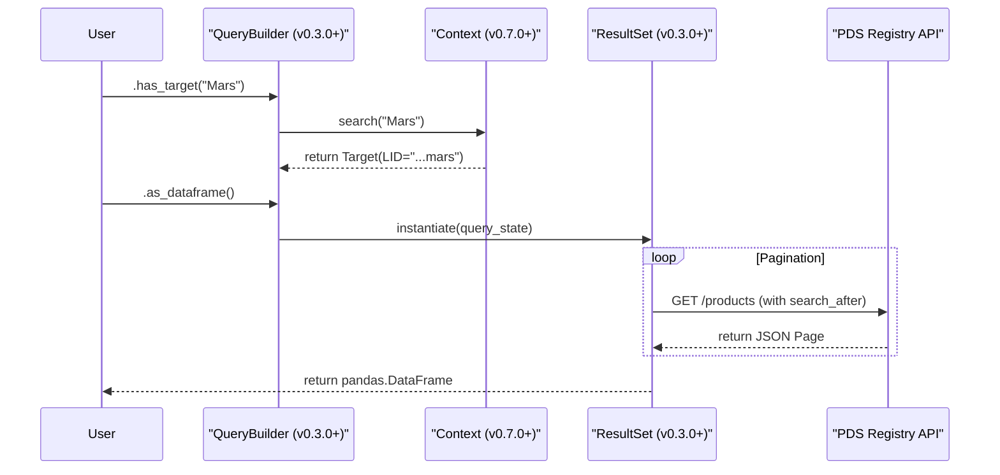

# Page: Changelog and Version History

# Changelog and Version History

Relevant source files

The following files were used as context for generating this wiki page:

- [CHANGELOG.md](CHANGELOG.md)
- [docs/requirements/v0.6.0-dev/REQUIREMENTS.md](docs/requirements/v0.6.0-dev/REQUIREMENTS.md)
- [docs/requirements/v0.8.0/REQUIREMENTS.md](docs/requirements/v0.8.0/REQUIREMENTS.md)
- [docs/requirements/v0.9.0-dev/REQUIREMENTS.md](docs/requirements/v0.9.0-dev/REQUIREMENTS.md)
- [src/pds/peppi/VERSION.txt](src/pds/peppi/VERSION.txt)

This page provides a technical summary of the evolution of the `pds.peppi` library, detailing major releases, feature additions, and architectural shifts from its inception at v0.1.0 to the current v0.9.0 development cycle. The library has evolved from a basic API wrapper into a sophisticated query builder with mission-specific extensions and Model Context Protocol (MCP) integration.

## Release Summary and Evolution

The development of `pds.peppi` has been driven by a set of core requirements focused on simplifying PDS Registry API interactions. The following diagram illustrates the transition from high-level user requirements to the primary code entities that implement them.

### Mapping Requirements to Implementation

**Sources:** [CHANGELOG.md:132-132](), [CHANGELOG.md:97-97](), [CHANGELOG.md:50-50](), [docs/requirements/v0.9.0-dev/REQUIREMENTS.md:131-131]()

---

## Version History

### v0.9.0 (Current Development)
The focus of the v0.9.0 release cycle is the expansion of the context system and spatial search capabilities.
*   **Context Expansion**: Implementation of aliases and object names for instrument hosts and investigations [docs/requirements/v0.9.0-dev/REQUIREMENTS.md:111-118]().
*   **Spatial Search**: Introduction of requirements for point-based and bounding-box spatial queries [docs/requirements/v0.9.0-dev/REQUIREMENTS.md:119-126]().
*   **LLM Support**: Enhanced result count estimation for LLM-based queries [CHANGELOG.md:13-13]().

**Sources:** [src/pds/peppi/VERSION.txt:1-1](), [docs/requirements/v0.9.0-dev/REQUIREMENTS.md:111-138]()

### v0.8.x (Stability and Discovery)
Released between late 2025 and early 2026, this series focused on metadata discovery and performance.
*   **v0.8.1**: Optimized the overhead for the comprehensive MCP server when integrating new `QueryBuilder` methods [CHANGELOG.md:21-21]().
*   **v0.8.0**: 
    *   **DOI Search**: Added the ability to search for products using Digital Object Identifiers (DOIs) [CHANGELOG.md:9-12]().
    *   **Field Discovery**: Introduced capabilities for field discovery and validation within the registry [CHANGELOG.md:10-10]().
    *   **Spatial Export**: Support for exporting results to CSV with flattened spatial columns [CHANGELOG.md:11-11]().
    *   **Performance**: Addressed long runtimes for simple queries and fixed `as_dataframe` failures [CHANGELOG.md:37-38]().

**Sources:** [CHANGELOG.md:3-39]()

### v0.7.0 (Contextual Intelligence)
Released in July 2025, this version introduced the foundational "Context" system.
*   **Searchable Objects**: Implementation of predefined and searchable objects for known targets, moving away from purely string-based LID filtering [CHANGELOG.md:50-50]().
*   **Conda Support**: Formalized installation support for Conda environments [CHANGELOG.md:51-51]().

**Sources:** [CHANGELOG.md:40-52]()

### v0.6.0 (Data Transformation)
Released in April 2025, focusing on usability and data extraction.
*   **Fuzzy Target Search**: Enabled finding products using target names as strings rather than just LIDs [CHANGELOG.md:63-63]().
*   **Table Extraction**: Added the ability to read all tables within a collection directly into a pandas DataFrame [CHANGELOG.md:64-64]().
*   **Binary Conversion**: Support for transforming binary `.dat` tables into CSV format for collection members [CHANGELOG.md:65-65]().
*   **State Management**: Fixed a defect where product objects needed re-instantiation to avoid combining independent requests (enforcing immutability in the fluent interface) [CHANGELOG.md:69-69]().

**Sources:** [CHANGELOG.md:53-78]()

### v0.5.0 (DataFrames and Field Selection)
Released in December 2024.
*   **Pandas Integration**: Initial implementation of `as_dataframe` to return query results as DataFrames [CHANGELOG.md:97-97]().
*   **Field Filtering**: Added the ability to limit the specific metadata fields returned by the API to reduce payload size [CHANGELOG.md:96-96]().

**Sources:** [CHANGELOG.md:79-102]()

### v0.4.0 (Iteration Improvements)
Released in November 2024.
*   **Iterator Optimization**: Improved the internal iterator loop for `ResultSet` based on performance proposals [CHANGELOG.md:113-113]().
*   **Documentation**: Initial launch of the online reference documentation [CHANGELOG.md:109-109]().

**Sources:** [CHANGELOG.md:103-114]()

### v0.3.0 (Core Filter Implementation)
Released in November 2024, this was the first major feature release defining the `QueryBuilder` API.
*   **Product Type Filters**: Added `bundle()`, `collection()`, and `observationals()` filters [CHANGELOG.md:126-128]().
*   **LID Filters**: Implementation of filtering by instrument, investigation, and target LIDs [CHANGELOG.md:129-131]().
*   **Processing Levels**: Added filtering by PDS processing levels [CHANGELOG.md:125-125]().
*   **Pagination**: Implementation of `search-after` keyset pagination for large result sets [CHANGELOG.md:132-132]().
*   **Project Rebrand**: Officially renamed the project to "peppi" on PyPI [CHANGELOG.md:136-136]().

**Sources:** [CHANGELOG.md:115-138]()

### v0.1.0 (Initial Prototype)
Released in February 2024.
*   Initial release providing a basic wrapper for the PDS API Client.

**Sources:** [CHANGELOG.md:139-143]()

---

## Technical Data Flow Evolution

The following diagram traces how a query has evolved from a simple API call in v0.1.0 to the complex, context-aware pipeline in v0.9.0.

### Query Processing Pipeline Evolution

**Sources:** [CHANGELOG.md:132-132](), [CHANGELOG.md:50-50](), [CHANGELOG.md:97-97](), [CHANGELOG.md:63-63]()

## Key Requirements History

The following table summarizes the status of foundational requirements across major versions:

| Requirement ID | Description | Introduced In | Implementation Entity |
| :--- | :--- | :--- | :--- |
| #7 | Search-after pagination | v0.3.0 | `ResultSet` |
| #29, #30, #31 | LID-based filtering | v0.3.0 | `QueryBuilder` |
| #57 | Pandas DataFrame output | v0.5.0 | `Products.as_dataframe` |
| #74 | String-based target search | v0.6.0 | `Context.TARGETS` |
| #99 | Constant target objects | v0.7.0 | `ContextObject` |
| #114 | MCP Server setup | v0.8.1 | `mcp_server.py` |
| #158 | DOI search | v0.8.0 | `QueryBuilder.has_doi` |

**Sources:** [CHANGELOG.md:125-132](), [CHANGELOG.md:97-97](), [CHANGELOG.md:50-50](), [CHANGELOG.md:9-9](), [docs/requirements/v0.9.0-dev/REQUIREMENTS.md:131-131]()
