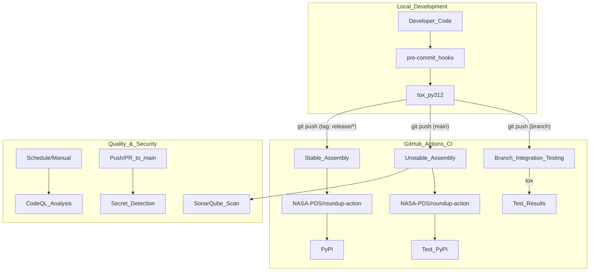
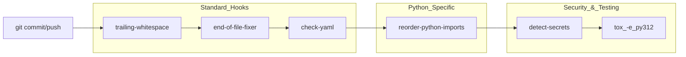

# Page: CI/CD Pipelines and Quality Tools

# CI/CD Pipelines and Quality Tools

Relevant source files

The following files were used as context for generating this wiki page:

- [.github/workflows/branch_cicd.yaml](.github/workflows/branch_cicd.yaml)
- [.github/workflows/codeql-analysis.yml](.github/workflows/codeql-analysis.yml)
- [.github/workflows/secrets-detection.yaml](.github/workflows/secrets-detection.yaml)
- [.github/workflows/stable-cicd.yaml](.github/workflows/stable-cicd.yaml)
- [.github/workflows/unstable-cicd.yaml](.github/workflows/unstable-cicd.yaml)
- [.pre-commit-config.yaml](.pre-commit-config.yaml)
- [sonar-project.properties](sonar-project.properties)
- [tox.ini](tox.ini)

This page documents the automated infrastructure used to maintain code quality, security, and delivery for the `pds.peppi` library. The project utilizes GitHub Actions for continuous integration, `tox` for environment abstraction, and several specialized tools for security and static analysis.

## Pipeline Architecture

The `pds.peppi` CI/CD infrastructure is divided into three primary categories based on the triggering event: branch validation, unstable delivery (main branch), and stable delivery (release tags).

### Workflow Data Flow

The following diagram illustrates how code moves from a local developer environment through the various validation gates to final distribution.

**Diagram: CI/CD Promotion Logic**

**Sources:** [.github/workflows/branch_cicd.yaml:15-20](), [.github/workflows/unstable-cicd.yaml:31-39](), [.github/workflows/stable-cicd.yaml:32-35](), [.github/workflows/codeql-analysis.yml:14-23](), [.github/workflows/secrets-detection.yaml:2-9]()

---

## Continuous Integration Workflows

### Branch Integration Testing
Triggered on pushes to any branch except `main` [.github/workflows/branch_cicd.yaml:15-20](). It ensures that new code does not break existing functionality before a Pull Request is merged.
*   **Environment:** Ubuntu Latest, Python 3.13 [.github/workflows/branch_cicd.yaml:30-45]().
*   **Execution:** Installs the package in editable mode with `[dev]` extras and runs `tox` [.github/workflows/branch_cicd.yaml:60-62]().

### Unstable Integration & Delivery
Triggered on pushes to `main` [.github/workflows/unstable-cicd.yaml:32-34]().
*   **Assembly:** Uses `NASA-PDS/roundup-action@stable` with the `unstable` assembly flag [.github/workflows/unstable-cicd.yaml:74-76]().
*   **Deployment:** Publishes the build to `test.pypi.org` using `TEST_PYPI_USERNAME` and `TEST_PYPI_PASSWORD` secrets [.github/workflows/unstable-cicd.yaml:78-79]().
*   **Analysis:** Executes a SonarQube scan and uploads coverage data [.github/workflows/unstable-cicd.yaml:82-85]().

### Stable Integration & Delivery
Triggered by tags matching the pattern `release/*` [.github/workflows/stable-cicd.yaml:32-35]().
*   **Assembly:** Uses `NASA-PDS/roundup-action@stable` with the `stable` assembly flag [.github/workflows/stable-cicd.yaml:69-71]().
*   **Deployment:** Publishes the official release to `pypi.org` [.github/workflows/stable-cicd.yaml:73-74]().

---

## Quality and Security Tools

### CodeQL Analysis
Performs semantic analysis of the source code to find security vulnerabilities and quality issues.
*   **Schedule:** Runs every Sunday at midnight and via manual dispatch [.github/workflows/codeql-analysis.yml:20-22]().
*   **Queries:** Utilizes `security-and-quality` and `security-extended` query suites [.github/workflows/codeql-analysis.yml:49]().
*   **Post-processing:** Uses `nasa-scrub` to translate SARIF results into `.scrub` and CSV formats for reporting [.github/workflows/codeql-analysis.yml:75-87]().

### Secret Detection
The project uses `slim-detect-secrets` to prevent accidental exposure of credentials.
*   **Workflow:** Scans the repository on pushes and PRs to `main` [.github/workflows/secrets-detection.yaml:2-9]().
*   **Baseline:** Compares current scan results against `.secrets.baseline` [.github/workflows/secrets-detection.yaml:48-63](). If new secrets are detected (indicated by a difference in hashed secrets), the build fails with instructions for local remediation [.github/workflows/secrets-detection.yaml:66-78]().

### SonarQube Configuration
Project metadata for SonarCloud/SonarQube analysis is defined in `sonar-project.properties`.
*   **Key:** `NASA-PDS_peppi` [sonar-project.properties:1]().
*   **Coverage:** Configured to ingest Python coverage reports from `coverage.xml` [sonar-project.properties:3]().

---

## Local Development Orchestration

### Tox Environments
`tox` is used to manage virtual environments and standardize execution across local and CI environments.

| Environment | Description | Command |
| :--- | :--- | :--- |
| `py312` | Python 3.12 test suite | `pytest --cov=src --cov-report=xml` |
| `py313` | Python 3.13 test suite | `pytest --cov=src --cov-report=xml` |
| `docs` | Documentation build | `sphinx-build -b html docs/source docs/build` |
| `lint` | Static analysis | `python -m pre_commit run --all` |

**Sources:** [tox.ini:1-22]()

### Pre-commit Hooks
The `.pre-commit-config.yaml` file defines hooks that run automatically before commits or pushes to ensure code style and basic security.

**Diagram: Hook Execution Pipeline**

**Sources:** [.pre-commit-config.yaml:1-87]()

**Key Hook Details:**
*   **Import Ordering:** `reorder-python-imports` is enforced for all files in `src/` and `tests/` [.pre-commit-config.yaml:15-19]().
*   **Secret Detection:** Uses `NASA-AMMOS/slim-detect-secrets` with a baseline file to exclude known false positives and non-sensitive files (e.g., `.tox`, `venv`, `dist`) [.pre-commit-config.yaml:64-87]().
*   **Automated Testing:** A `tox` hook is configured to run on the `push` stage, specifically executing the `py312` environment with parallelization [.pre-commit-config.yaml:54-62]().
*   **Exclusions:** `black` and `flake8` are currently disabled due to conflicts with import ordering and specific docstring parsing issues in `qb_mcp.py` [.pre-commit-config.yaml:22-53]().

---
**Sources:**
* [.github/workflows/codeql-analysis.yml]()
* [.github/workflows/unstable-cicd.yaml]()
* [.github/workflows/branch_cicd.yaml]()
* [.github/workflows/stable-cicd.yaml]()
* [.github/workflows/secrets-detection.yaml]()
* [.pre-commit-config.yaml]()
* [tox.ini]()
* [sonar-project.properties]()
