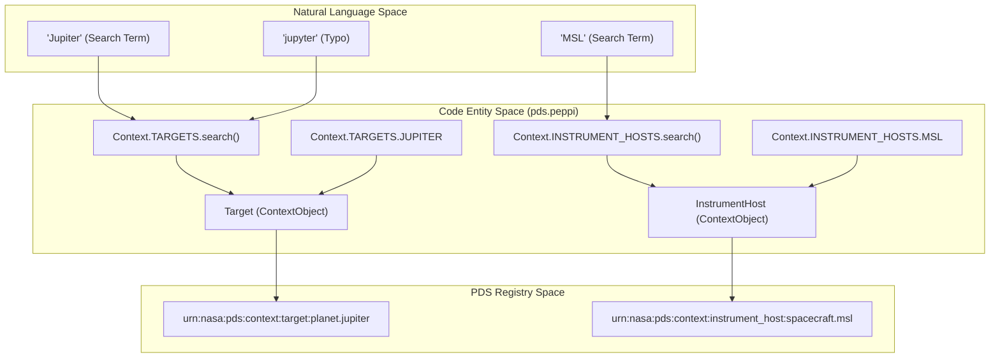
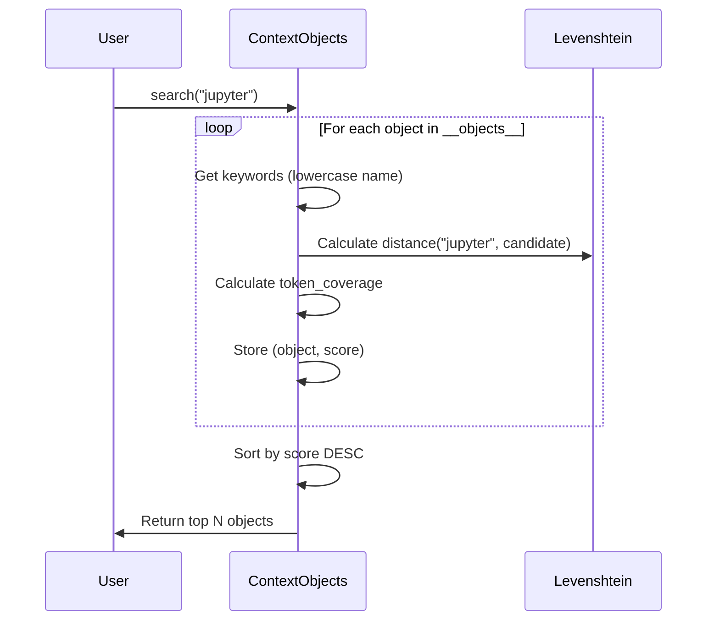

# Page: Context System: Targets and Instrument Hosts

# Context System: Targets and Instrument Hosts

<details>
<summary>Relevant source files</summary>

The following files were used as context for generating this wiki page:

- [src/pds/peppi/context_base.py](src/pds/peppi/context_base.py)
- [src/pds/peppi/contexts.py](src/pds/peppi/contexts.py)
- [src/pds/peppi/mcp_server.py](src/pds/peppi/mcp_server.py)
- [tests/pds/peppi/test_context_base.py](tests/pds/peppi/test_context_base.py)
- [tests/pds/peppi/test_contexts.py](tests/pds/peppi/test_contexts.py)

</details>


The Context system in `pds.peppi` provides a structured, searchable interface for PDS context products, specifically targets (planets, asteroids, etc.) and instrument hosts (spacecraft, rovers). It abstracts the complexity of the PDS Registry API by caching these entities locally and providing both direct attribute access and fuzzy search capabilities.

## Architecture Overview

The system is built on a singleton `Context` class that aggregates collections of `ContextObject` instances. These objects are populated by querying the PDS Registry's `/products` endpoint for context-type products.

### Natural Language to Code Entity Mapping

The following diagram illustrates how natural language search terms or dot-notation access in code map to specific internal classes and PDS Registry entities.

**Context Entity Mapping**


**Sources:** [src/pds/peppi/contexts.py:10-50](), [src/pds/peppi/context_base.py:81-97]()

## The Context Singleton

The `Context` class acts as the central entry point for all context metadata. It implements the singleton pattern to ensure that the potentially large list of context products is only fetched and processed once per session.

- **Initialization**: Upon first instantiation, it creates instances of `Targets` and `InstrumentHosts` [src/pds/peppi/contexts.py:22-23]().
- **Data Loading**: It uses `Products(client).contexts()` to retrieve all context products from the registry [src/pds/peppi/contexts.py:27]().
- **Categorization**: It iterates through the API response and sorts items into `TARGETS` or `INSTRUMENT_HOSTS` based on the presence of specific PDS metadata properties (e.g., `pds:Target.pds:name` vs `pds:Instrument_Host.pds:name`) [src/pds/peppi/contexts.py:29-33]().

**Sources:** [src/pds/peppi/contexts.py:10-50]()

## ContextObject and Collections

Context entities are represented by the `ContextObject` dataclass and managed by `ContextObjects` collection classes.

### ContextObject Base Class
The `ContextObject` [src/pds/peppi/context_base.py:9-16]() stores essential metadata:
- `lid`: The PDS Logical Identifier.
- `code`: A normalized, uppercase string (e.g., `MARS_SCIENCE_LABORATORY`) used for dot-notation access.
- `name`: The human-readable name.
- `type`: The PDS object type (e.g., "Planet", "Spacecraft").
- `uri`: A property that dynamically generates the full API URL for the product [src/pds/peppi/context_base.py:18-22]().

### Collection Classes
`Targets` and `InstrumentHosts` inherit from `ContextObjects`. They implement `api_to_obj` to map specific API JSON structures to the appropriate Python class.

| Class | PDS Property for Name | Target Class |
| :--- | :--- | :--- |
| `Targets` | `pds:Target.pds:name` | `Target` |
| `InstrumentHosts` | `pds:Instrument_Host.pds:name` | `InstrumentHost` |

**Sources:** [src/pds/peppi/contexts.py:65-134](), [src/pds/peppi/context_base.py:32-50]()

## Fuzzy Search and Scoring

The system provides a `search()` method that uses Levenshtein distance to handle typos and partial matches.

### Similarity Algorithm
The `_custom_similarity` method calculates a score between 0.0 and 1.0 based on two factors:
1.  **Levenshtein Distance**: Measures the edit distance between the search term and the best-matching token combination in the target name [src/pds/peppi/context_base.py:68-73]().
2.  **Token Coverage**: Penalizes matches where the number of tokens in the result significantly differs from the search term [src/pds/peppi/context_base.py:75-77]().

The final score is weighted: `(2 * best_levenshtein_score + token_coverage) / 3` [src/pds/peppi/context_base.py:79]().

### Search Data Flow


**Sources:** [src/pds/peppi/context_base.py:51-97](), [tests/pds/peppi/test_context_base.py:6-26]()

## Usage Examples

### Dot-Notation Access
When context objects are added to a collection, the system calls `setattr(self, obj.code, obj)` [src/pds/peppi/context_base.py:49](). This allows direct access if the normalized code is known.

```python
context = Context()
# Accessing via normalized code
mars = context.TARGETS.MARS
curiosity = context.INSTRUMENT_HOSTS.THE_MARS_SCIENCE_LABORATORY_CURIOSITY_ROVER
```

### Search with Typo Tolerance
The `search` method returns a list of matching objects, sorted by relevance.

```python
# Returns Jupiter even with the 'y' typo
results = context.TARGETS.search("jupyter")
print(results[0].lid) 
# Output: urn:nasa:pds:context:target:planet.jupiter
```

**Sources:** [src/pds/peppi/contexts.py:65-81](), [tests/pds/peppi/test_contexts.py:11-23]()
