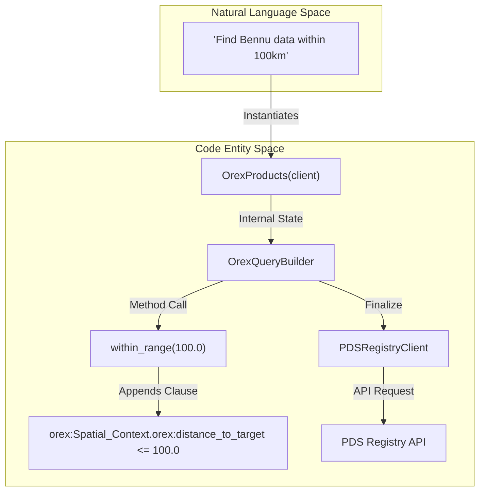
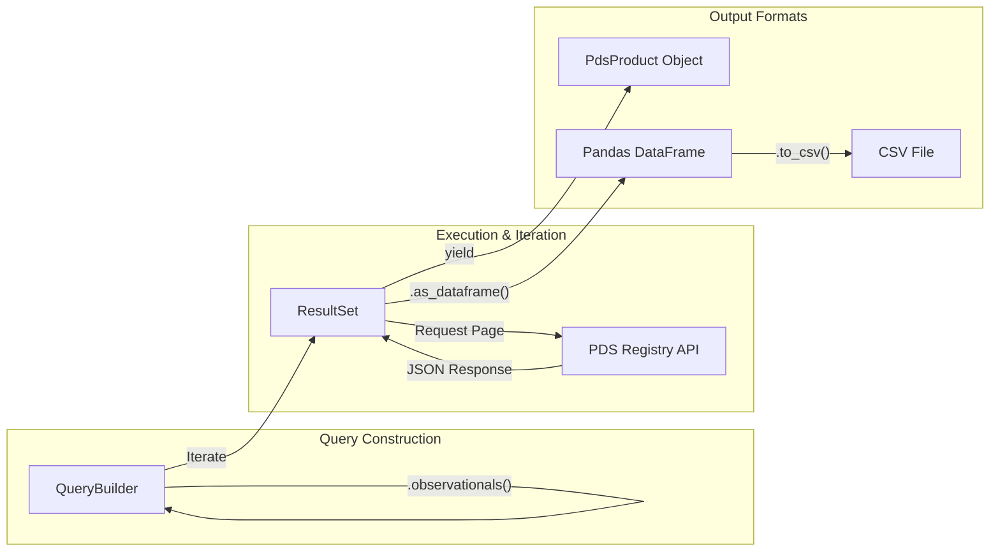

# Page: Cookbook: Recipes and Examples

# Cookbook: Recipes and Examples

<details>
<summary>Relevant source files</summary>

The following files were used as context for generating this wiki page:

- [docs/source/cookbook.rst](docs/source/cookbook.rst)
- [tests/pds/peppi/test_cookbook_advanced.py](tests/pds/peppi/test_cookbook_advanced.py)
- [tests/pds/peppi/test_cookbook_getting_started.py](tests/pds/peppi/test_cookbook_getting_started.py)
- [tests/pds/peppi/test_cookbook_intermediate.py](tests/pds/peppi/test_cookbook_intermediate.py)

</details>


This page provides technical documentation and ready-to-use recipes for common tasks using the `pds.peppi` library. The recipes demonstrate how to leverage the fluent interface of the `QueryBuilder` and the specialized extensions for mission-specific data.

## Purpose and Scope

The cookbook serves as a practical reference for developers and scientists to perform data discovery within the Planetary Data System (PDS). It covers three tiers of complexity:
1.  **Getting Started**: Basic connectivity and single-filter searches.
2.  **Intermediate**: Combining multiple constraints and exporting data to common formats like Pandas DataFrames.
3.  **Advanced**: Utilizing specialized metadata and mission-specific query extensions (e.g., OSIRIS-REx spatial queries).

Sources: `docs/source/cookbook.rst:1-13`[]

---

## Getting Started Recipes

These recipes focus on the core functionality of the `Products` class and the `PDSRegistryClient`.

### Recipe 1: Target Search
Searching for observational data by planetary body. This utilizes the `has_target` filter and scopes the results to `observationals`.

```python
import pds.peppi as pep

client = pep.PDSRegistryClient()
products = pep.Products(client).has_target("Mars").observationals()

for i, product in enumerate(products):
    print(f"{i+1}. {product.id}")
    if i >= 4: break
```

### Recipe 2: Mission and Spacecraft Search
Using the `Context` system to perform fuzzy searches for instrument hosts (spacecraft) and using their Logical Identifiers (LID) for precise filtering.

```python
import pds.peppi as pep

client = pep.PDSRegistryClient()
context = pep.Context()

# Fuzzy search for "curiosity" returns a list of ContextObject
curiosity = context.INSTRUMENT_HOSTS.search("curiosity")[0]

products = pep.Products(client) \
    .has_instrument_host(curiosity.lid) \
    .observationals()
```

### Recipe 3: Date Range Filtering
Applying temporal constraints using `datetime` objects via the `after()` and `before()` methods.

```python
from datetime import datetime
import pds.peppi as pep

client = pep.PDSRegistryClient()
products = pep.Products(client) \
    .has_target("Mercury") \
    .after(datetime(2020, 1, 1)) \
    .before(datetime(2020, 12, 31)) \
    .observationals()
```

Sources: `docs/source/cookbook.rst:24-111`[]; `tests/pds/peppi/test_cookbook_getting_started.py:12-133`[]

---

## Intermediate Recipes

Intermediate recipes demonstrate data manipulation, field selection, and result export.

### Recipe 4: Processing Level and DataFrame Export
Filtering by PDS processing levels (e.g., "calibrated", "raw") and converting the `ResultSet` into a `pandas.DataFrame`.

```python
import pds.peppi as pep

client = pep.PDSRegistryClient()
products = pep.Products(client) \
    .has_target("Mars") \
    .has_processing_level("calibrated") \
    .observationals()

# Convert to DataFrame with a row limit
df = products.as_dataframe(max_rows=100)
df.to_csv('mars_calibrated.csv')
```

### Recipe 5: Metadata Field Selection
Optimizing queries by requesting only specific metadata fields using the `.fields()` method. This reduces payload size and processing time.

```python
import pds.peppi as pep

client = pep.PDSRegistryClient()
fields = [
    'lid',
    'pds:Identification_Area.pds:title',
    'pds:Time_Coordinates.pds:start_date_time'
]

products = pep.Products(client) \
    .has_target("Mars") \
    .observationals() \
    .fields(fields)
```

### Recipe 6: DOI Lookup for Citations
Extracting Digital Object Identifiers (DOIs) from product properties for academic citation.

```python
import pds.peppi as pep

client = pep.PDSRegistryClient()
products = pep.Products(client).has_target("Bennu").bundles()

for product in products:
    doi = product.properties.get('pds:Citation_Information.pds:doi', [None])[0]
    if doi:
        print(f"DOI: {doi}")
```

Sources: `docs/source/cookbook.rst:121-175`[]; `tests/pds/peppi/test_cookbook_intermediate.py:42-210`[]

---

## Advanced Recipes: OSIRIS-REx (OREX)

The `OrexProducts` class extends the standard `Products` interface to include spatial query capabilities specific to the OSIRIS-REx mission.

### Recipe 7: OREX Spatial Queries
Using `within_range` (distance to target) and `within_bbox` (latitude/longitude bounding box) filters.

```python
import pds.peppi as pep

client = pep.PDSRegistryClient()
# Use specialized OrexProducts class
orex_products = pep.OrexProducts(client)

products = orex_products \
    .has_target("Bennu") \
    .within_range(100.0) \
    .within_bbox(min_lat=9.0, max_lat=15.0, min_lon=21.0, max_lon=27.0) \
    .observationals()
```

### Implementation Flow: Natural Language to OREX Query

The following diagram illustrates how a natural language request for OREX data is translated into a technical query using the `OrexQueryBuilder`.

**Figure 1: OREX Query Construction Flow**


Sources: `tests/pds/peppi/test_cookbook_advanced.py:16-35`[]; `docs/source/cookbook.rst:182-203`[]

---

## Data Flow and Result Processing

When a user executes a recipe, the data flows from the `QueryBuilder` through the `ResultSet` iterator.

**Figure 2: Data Retrieval and Transformation**


### Key Functions and Classes
| Entity | Role | Source |
| :--- | :--- | :--- |
| `PDSRegistryClient` | Manages connection to the PDS API. | `pds.peppi.PDSRegistryClient` |
| `Products` | Main entry point for standard PDS queries. | `pds.peppi.Products` |
| `OrexProducts` | Entry point for OSIRIS-REx specific spatial queries. | `pds.peppi.OrexProducts` |
| `ResultSet` | Handles pagination and lazy-loading of results. | `pds.peppi.ResultSet` |
| `as_dataframe()` | Converts results into a tabular format for analysis. | `pds.peppi.ResultSet.as_dataframe` |

Sources: `docs/source/cookbook.rst:5-17`[]; `tests/pds/peppi/test_cookbook_getting_started.py:181-220`[]
