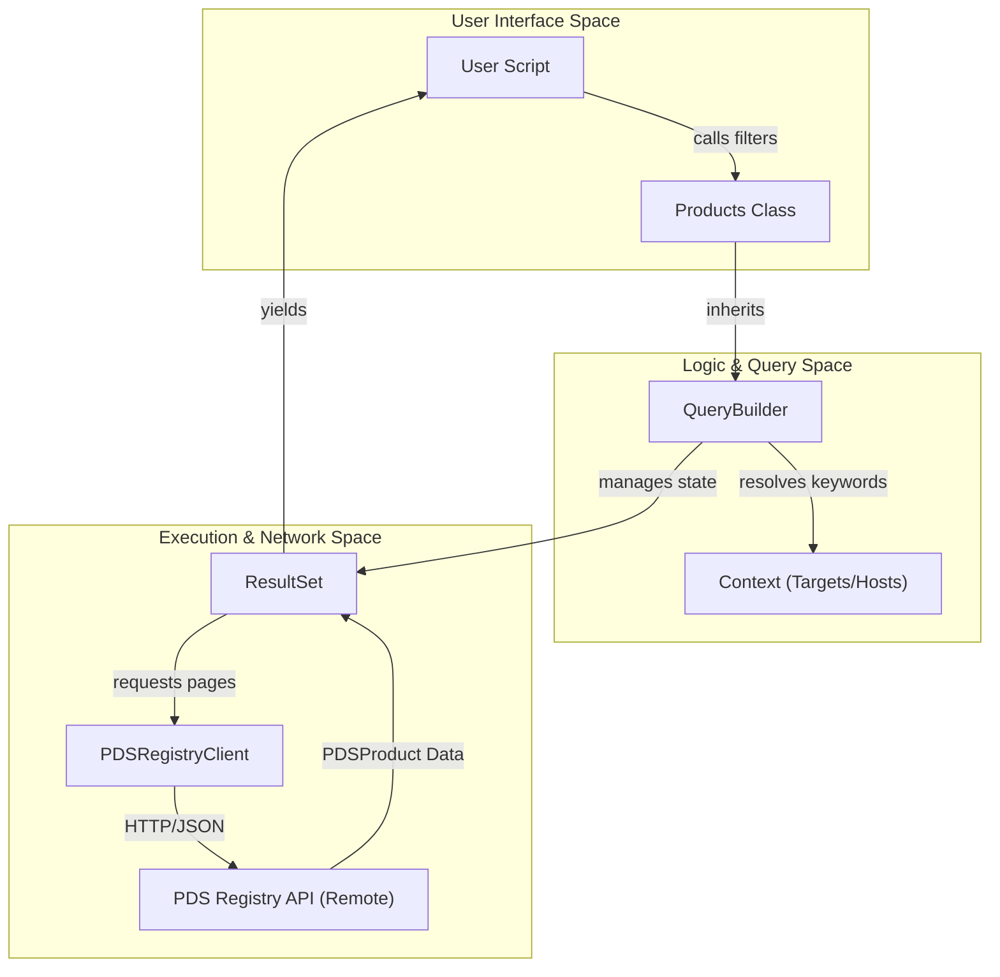
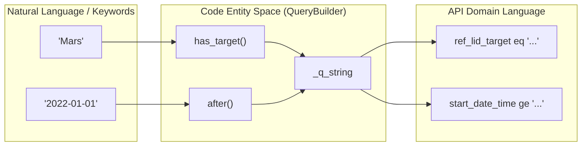

# Page: Core Architecture

# Core Architecture

Relevant source files

The following files were used as context for generating this wiki page:

- [src/pds/peppi/__init__.py](src/pds/peppi/__init__.py)
- [src/pds/peppi/client.py](src/pds/peppi/client.py)
- [src/pds/peppi/products.py](src/pds/peppi/products.py)
- [src/pds/peppi/query_builder.py](src/pds/peppi/query_builder.py)
- [src/pds/peppi/result_set.py](src/pds/peppi/result_set.py)

This page provides a high-level overview of the internal structure of `pds.peppi`. The library is designed with a layered approach that abstracts the complexities of the PDS Search API into a fluent, Pythonic interface. It manages everything from low-level API communication and authentication to high-level fuzzy search for mission contexts and automatic result pagination.

### System Layering and Data Flow

The architecture follows a linear progression from user-defined filters to the execution of HTTP requests against the PDS Registry.

**Architecture Overview: From Query to Results**

Sources: [src/pds/peppi/products.py:6-22](), [src/pds/peppi/query_builder.py:24-32](), [src/pds/peppi/result_set.py:12-28]()

---

### API Client Layer

The foundation of the library is the `PDSRegistryClient`. This class wraps the underlying `pds.api_client` (the auto-generated OpenAPI client) and manages the connection configuration, specifically the base URL for the PDS Registry API. It tracks active instances to allow for context-aware URL retrieval across the library.

For details, see [PDSRegistryClient](#2.1).

Sources: [src/pds/peppi/client.py:19-57]()

---

### Query Construction and Fluent Interface

The `QueryBuilder` class implements the core logic for translating Python method calls into PDS Search API query strings. It uses a "fluent interface" pattern where most methods return `self`, allowing users to chain multiple filters (e.g., `.has_target("Mars").after("2023-01-01")`).

Key behaviors include:
- **Lazy Evaluation**: Query strings are built internally in `self._q_string` but are not sent to the server until the object is iterated over.
- **Clause Management**: Filters are generally joined with logical `AND` operators.
- **Immutability during Iteration**: To prevent inconsistent results, the query state cannot be modified once pagination has begun.

For details, see [QueryBuilder and Fluent Interface](#2.2).

**Code Entity Mapping: Query Translation**

Sources: [src/pds/peppi/query_builder.py:66-139](), [src/pds/peppi/query_builder.py:173-200]()

---

### Results and Pagination Engine

While `QueryBuilder` handles *what* to ask for, the `ResultSet` class handles *how* to retrieve it. The PDS Registry API returns results in pages; `ResultSet` abstracts this by implementing "keyset pagination" (using `search_after`). It tracks the `latest_harvest_time` of the last retrieved product to fetch the next batch seamlessly.

The `Products` class serves as the primary entry point for users, inheriting from `QueryBuilder` and utilizing `ResultSet` to provide a simple iterator interface.

For details, see [Products and ResultSet](#2.3).

Sources: [src/pds/peppi/result_set.py:12-105](), [src/pds/peppi/products.py:6-12]()

---

### Context and Metadata Resolution

To make queries more user-friendly, the `Context` system provides local access to PDS "Context Objects" like Targets (planets, asteroids) and Instrument Hosts (spacecraft). This system allows the library to:
- Perform fuzzy searches on names (e.g., "Osiris" matching "OSIRIS-REx").
- Resolve common names to their official PDS Logical Identifiers (LIDs).
- Provide dot-notation access to metadata.

For details, see [Context System: Targets and Instrument Hosts](#2.4).

Sources: [src/pds/peppi/contexts.py:1-15](), [src/pds/peppi/query_builder.py:163-171]()
