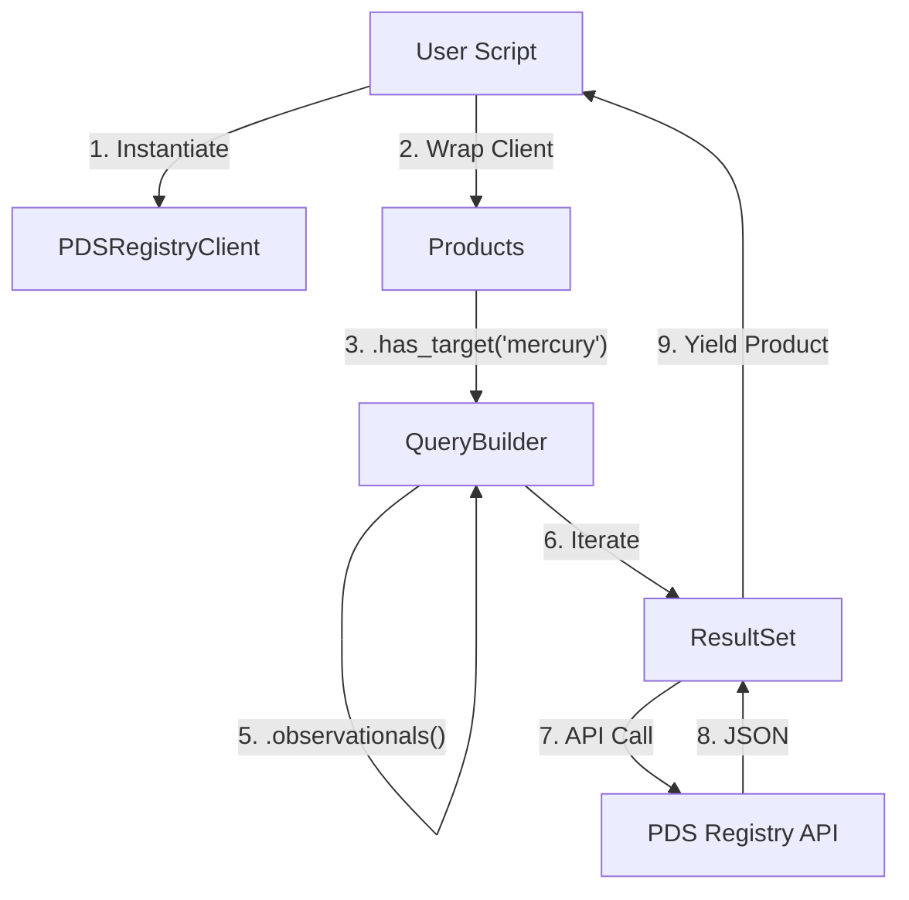
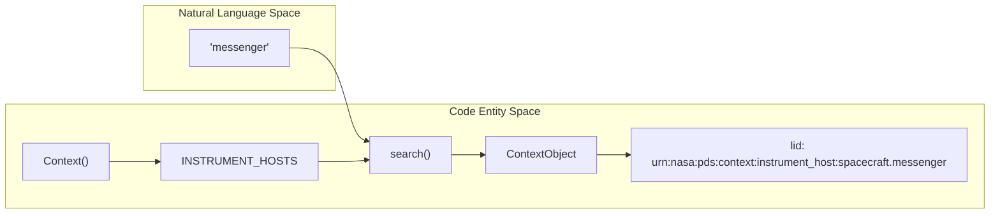

# Page: Getting Started

# Getting Started

<details>
<summary>Relevant source files</summary>

The following files were used as context for generating this wiki page:

- [docs/source/getting_started.rst](docs/source/getting_started.rst)
- [docs/source/quickstart.rst](docs/source/quickstart.rst)
- [setup.cfg](setup.cfg)
- [tests/pds/peppi/quickstart.py](tests/pds/peppi/quickstart.py)

</details>


This page provides the necessary information to install `pds.peppi`, configure the environment, and execute a first search against the Planetary Data System (PDS) Registry. It covers the transition from natural language search intent to executable code entities.

## Prerequisites and Installation

`pds.peppi` is designed for modern Python environments and leverages several key libraries for API interaction and data processing.

### System Requirements
*   **Python 3.12 or newer**: The package specifically targets Python 3.12 and 3.13 [setup.cfg:20-22](), [setup.cfg:45-45]().
*   **Internet Access**: Required to connect to the PDS API endpoints [docs/source/getting_started.rst:78-78]().

### Installation
The package is available via `pip`. It is recommended to use a virtual environment to manage dependencies [docs/source/getting_started.rst:47-51]().

```bash
pip install pds.peppi
```

### Core Dependencies
The following libraries are automatically installed as part of the setup [setup.cfg:31-35]():
*   `pds.api-client`: Provides the underlying communication layer with the PDS Search API.
*   `pandas`: Used for data manipulation and result exporting.
*   `RapidFuzz`: Powers the fuzzy matching for context objects (targets, instruments).
*   `fastmcp`: Enables Model Context Protocol (MCP) server capabilities.

Sources: [setup.cfg:1-45](), [docs/source/getting_started.rst:22-51]()

---

## First Search Example

The following diagram illustrates the flow from initializing a client to iterating over search results. It bridges the gap between user intent and the internal class structure.

### Search Data Flow
"Find observational data for Mercury before Jan 23, 2012"


Sources: [docs/source/quickstart.rst:38-66](), [tests/pds/peppi/quickstart.py:5-25]()

### Implementation Code
To run your first search, follow these steps:

1.  **Initialize the Client**: `PDSRegistryClient` manages the connection to the PDS Web API [docs/source/quickstart.rst:40-40]().
2.  **Build the Query**: Use the `Products` class to start a fluent interface chain [docs/source/quickstart.rst:52-52]().
3.  **Apply Filters**:
    *   `.has_target()`: Filters by planetary body [docs/source/quickstart.rst:59-59]().
    *   `.before()`: Filters by stop time [docs/source/quickstart.rst:52-52]().
    *   `.observationals()`: Scopes the search to `Product_Observational` types [docs/source/quickstart.rst:52-52]().

```python
from datetime import datetime
import pds.peppi as pep

# Connect to the PDS Registry
client = pep.PDSRegistryClient()

# Define constraints
date_limit = datetime.fromisoformat("2012-01-23")

# Execute fluent query
products = pep.Products(client).has_target("mercury").before(date_limit).observationals()

# Iterate over results (lazy-loaded via ResultSet)
for i, product in enumerate(products):
    print(f"ID: {product.id}")
    if i >= 5: break
```
Sources: [docs/source/quickstart.rst:30-70](), [tests/pds/peppi/quickstart.py:1-25]()

---

## Context and Fuzzy Search

Peppi includes a `Context` system to help resolve natural language names (like "messenger") into formal PDS Logical Identifiers (LIDs).

### Context Resolution Mapping

Sources: [tests/pds/peppi/quickstart.py:13-14](), [docs/source/quickstart.rst:48-50]()

### Using Context in Queries
Instead of hardcoding LIDs, you can use the `Context` singleton to find instrument hosts or targets dynamically [tests/pds/peppi/quickstart.py:13-17]().

```python
context = pep.Context()
# Fuzzy search for the Messenger spacecraft
messenger = context.INSTRUMENT_HOSTS.search("messenger")[0]

# Use the resolved LID in a product search
query = pep.Products(client).has_instrument_host(messenger.lid)
```
Sources: [tests/pds/peppi/quickstart.py:13-17]()

---

## Troubleshooting

Common issues encountered by new users often relate to environment setup or API connectivity.

| Issue | Cause | Resolution |
| :--- | :--- | :--- |
| `ModuleNotFoundError: No module named 'pds.peppi'` | Package not installed in the current environment. | Run `pip install pds.peppi` and verify with `pip list` [docs/source/getting_started.rst:191-194](). |
| `ImportError` for `pandas` or `RapidFuzz` | Dependency installation failure. | Run `pip install --upgrade pds.peppi` to force dependency resolution [docs/source/getting_started.rst:196-198](). |
| Python version mismatch | Using Python < 3.12. | Check version with `python --version`. Peppi requires 3.12+ [docs/source/getting_started.rst:199-201](), [setup.cfg:45-45](). |
| `PDSRegistryClientError` | Connectivity issues with PDS servers. | Ensure your network allows outbound HTTPS traffic to `pds.nasa.gov` [docs/source/getting_started.rst:78-78](). |

Sources: [docs/source/getting_started.rst:185-201](), [setup.cfg:45-45]()
