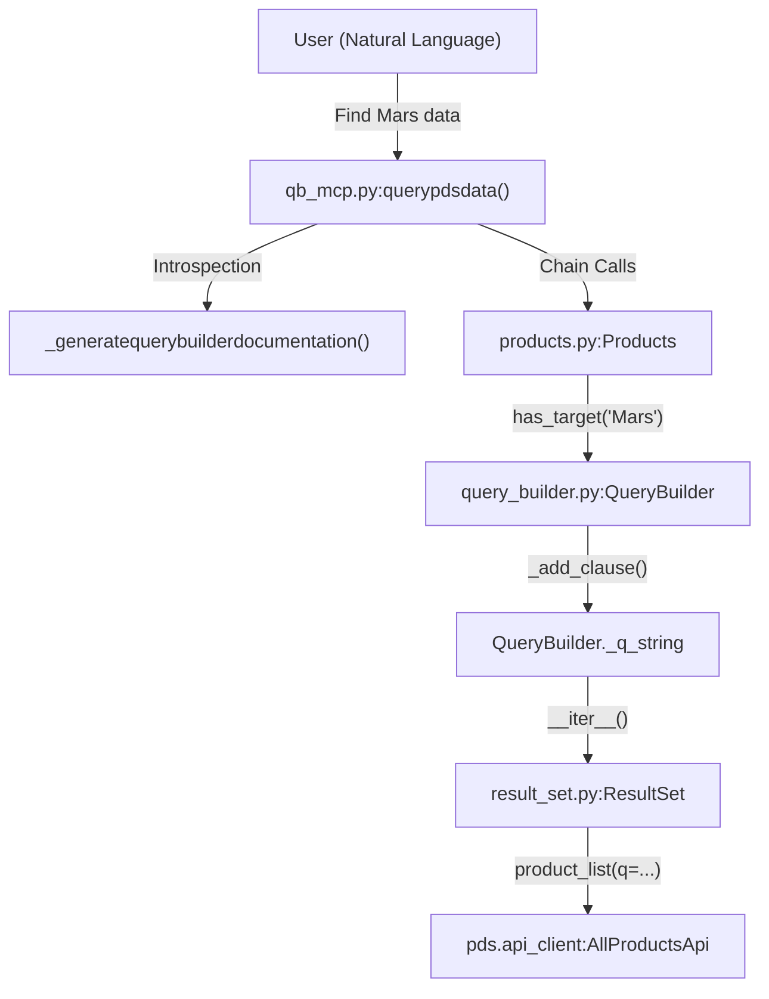
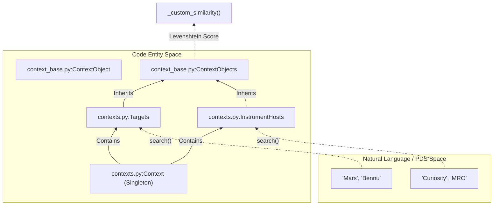

# Page: Glossary

# Glossary

Relevant source files

The following files were used as context for generating this wiki page:

- [CHANGELOG.md](CHANGELOG.md)
- [README.md](README.md)
- [setup.cfg](setup.cfg)
- [src/pds/peppi/client.py](src/pds/peppi/client.py)
- [src/pds/peppi/context_base.py](src/pds/peppi/context_base.py)
- [src/pds/peppi/contexts.py](src/pds/peppi/contexts.py)
- [src/pds/peppi/mcp_server.py](src/pds/peppi/mcp_server.py)
- [src/pds/peppi/products.py](src/pds/peppi/products.py)
- [src/pds/peppi/qb_mcp.py](src/pds/peppi/qb_mcp.py)
- [src/pds/peppi/query_builder.py](src/pds/peppi/query_builder.py)
- [src/pds/peppi/result_set.py](src/pds/peppi/result_set.py)

This page provides definitions for codebase-specific terms, PDS domain concepts, and technical jargon used throughout the `pds.peppi` library. It serves as a reference for onboarding engineers to understand how domain concepts map to implementation details.

## Core Library Terms

### QueryBuilder
The primary engine for constructing PDS4 Search API queries using a fluent (chainable) interface. It manages the internal state of a query string and handles the transition from a set of filters to an executable request.
*   **Implementation**: `QueryBuilder` class in [src/pds/peppi/query_builder.py:24-25]().
*   **Data Flow**: Filters like `has_target()` or `after()` call `_add_clause()` [src/pds/peppi/query_builder.py:66-100](), which appends PDS search syntax to `self._q_string`.

### ResultSet
The pagination engine that wraps the low-level `pds.api-client`. It abstracts the complexity of "search-after" pagination and cursor management.
*   **Implementation**: `ResultSet` class in [src/pds/peppi/result_set.py:12-13]().
*   **Mechanism**: Uses `ops:Harvest_Info.ops:harvest_date_time` as the default sort property for deterministic pagination [src/pds/peppi/result_set.py:15-16]().

### Context System
A singleton-based registry that pre-loads PDS "Context" products (Targets and Instrument Hosts) to allow for fuzzy searching and attribute-based access.
*   **Implementation**: `Context` class in [src/pds/peppi/contexts.py:10-11]().
*   **Data Flow**: On initialization, it fetches all context products using `Products(client).contexts()` [src/pds/peppi/contexts.py:27-28]() and categorizes them into `TARGETS` and `INSTRUMENT_HOSTS`.

### Products
A high-level entry point and thin wrapper around `QueryBuilder`. Users typically instantiate this to begin a query.
*   **Implementation**: `Products` class in [src/pds/peppi/products.py:6-7]().

---

## PDS Domain Concepts

| Term | Definition | Code Reference |
| :--- | :--- | :--- |
| **LID (Logical Identifier)** | A unique string identifying a PDS product (e.g., `urn:nasa:pds:context:target:planet.mars`). | [src/pds/peppi/query_builder.py:141-157]() |
| **LIDVID** | A LID plus a version identifier (e.g., `...::1.0`). | Used in `get()` method. |
| **Bundle** | The highest level of organization in PDS4, containing collections. | `bundles()` in [src/pds/peppi/query_builder.py:257-265]() |
| **Collection** | A group of related products (e.g., all calibration files for a mission). | `collections()` in [src/pds/peppi/query_builder.py:247-255]() |
| **Observational** | Science data products. | `observationals()` in [src/pds/peppi/query_builder.py:237-245]() |
| **Harvest Time** | The timestamp when a product was ingested into the PDS Registry. Used for stable pagination. | `_SORT_PROPERTY` in [src/pds/peppi/result_set.py:15-16]() |

---

## Technical Jargon & Implementation Details

### Keyset Pagination (search_after)
Instead of using offsets (which are slow for large datasets), Peppi uses the "search-after" pattern. It sends the harvest time of the last item in the current page to the API to retrieve the next set of results.
*   **Implementation**: `init_new_page` uses `kwargs["search_after"] = [self._latest_harvest_time]` [src/pds/peppi/result_set.py:63-64]().

### Lazy Evaluation
Queries are not executed when filter methods are called. The request is only sent when the `QueryBuilder` (or `Products`) instance is iterated over or converted (e.g., `as_dataframe()`).
*   **Implementation**: Logic resides in `__iter__` [src/pds/peppi/query_builder.py:38-64]().

### MCP (Model Context Protocol)
A protocol used to expose Peppi's capabilities to LLMs (like Claude).
*   **pds-peppi-mcp-server**: A "simple" server exposing `Context` search tools [src/pds/peppi/mcp_server.py:6-16]().
*   **pds-peppi-qb-mcp**: A "comprehensive" server that uses introspection to turn `QueryBuilder` methods into LLM tools [src/pds/peppi/qb_mcp.py:2-15]().

---

## System Architecture Diagrams

### Natural Language to Query Execution
This diagram shows how a natural language request moves through the MCP integration into the core library entities.

**Diagram: NL to Code Pipeline**

**Sources**: [src/pds/peppi/qb_mcp.py:100-112](), [src/pds/peppi/query_builder.py:38-64](), [src/pds/peppi/result_set.py:78-79]()

### Context and Search Entity Mapping
This diagram bridges the PDS Context domain to the internal class structures used for fuzzy search.

**Diagram: Context Entity Mapping**

**Sources**: [src/pds/peppi/context_base.py:9-32](), [src/pds/peppi/context_base.py:52-79](), [src/pds/peppi/contexts.py:10-24]()

---

## Abbreviations

*   **API**: Application Programming Interface (specifically the PDS Search API).
*   **DOI**: Digital Object Identifier [CHANGELOG.md:9-12]().
*   **LLM**: Large Language Model (e.g., Claude, GPT-4) [README.md:20-25]().
*   **MCP**: Model Context Protocol [src/pds/peppi/qb_mcp.py:2-3]().
*   **PDS**: Planetary Data System [setup.cfg:11]().

**Sources**:
- [CHANGELOG.md:9-12]()
- [setup.cfg:11]()
- [src/pds/peppi/query_builder.py:24-100]()
- [src/pds/peppi/result_set.py:12-104]()
- [src/pds/peppi/contexts.py:10-135]()
- [src/pds/peppi/context_base.py:9-98]()
- [src/pds/peppi/products.py:6-23]()
- [src/pds/peppi/qb_mcp.py:2-112]()
- [src/pds/peppi/mcp_server.py:6-16]()
- [README.md:20-25]()