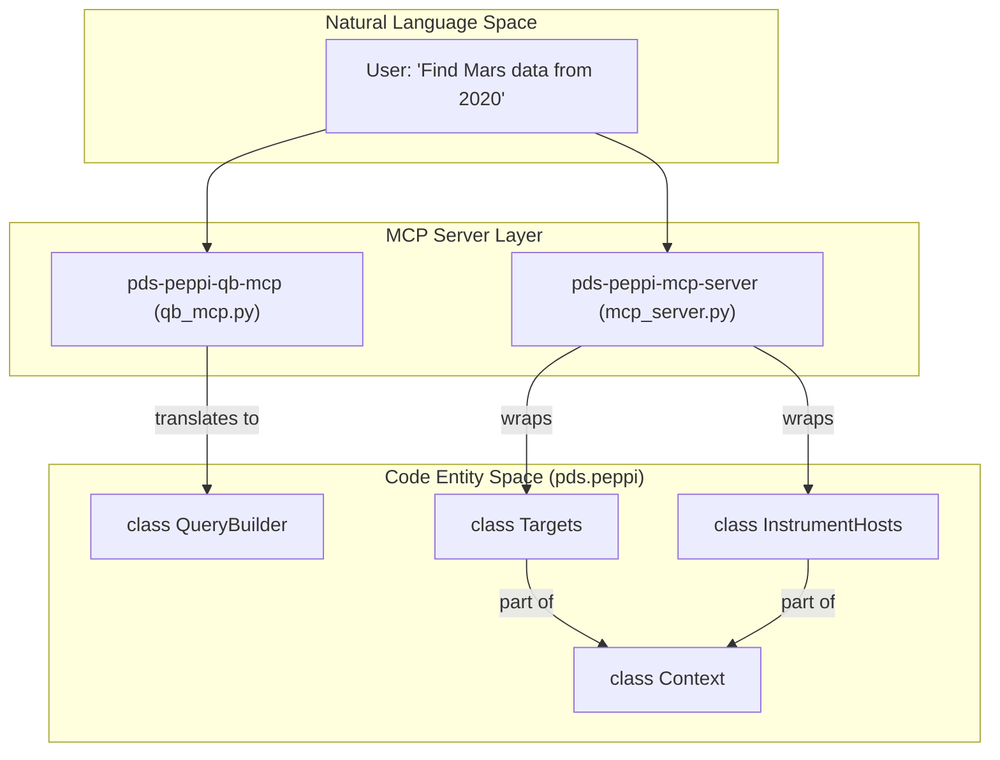
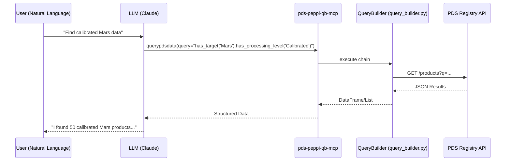

# Page: MCP Server Integration

# MCP Server Integration

Relevant source files

The following files were used as context for generating this wiki page:

- [README.md](README.md)
- [setup.cfg](setup.cfg)
- [src/pds/peppi/context_base.py](src/pds/peppi/context_base.py)
- [src/pds/peppi/contexts.py](src/pds/peppi/contexts.py)
- [src/pds/peppi/mcp_server.py](src/pds/peppi/mcp_server.py)
- [src/pds/peppi/qb_mcp.py](src/pds/peppi/qb_mcp.py)

The `pds.peppi` library provides integration with the **Model Context Protocol (MCP)**, allowing Large Language Models (LLMs) like Claude to interact with the Planetary Data System (PDS) Registry using natural language. By exposing Peppi's search and query capabilities as MCP tools, users can perform complex data discovery tasks through a conversational interface.

The integration is split into two distinct server implementations: a lightweight "Simple" server for context discovery and a comprehensive "QueryBuilder" server for data retrieval.

### Architecture Overview

The following diagram illustrates how the MCP servers bridge the gap between Natural Language (NL) user requests and the underlying PDS Registry code entities.

**NL to Code Entity Mapping**

**Sources:** [src/pds/peppi/mcp_server.py:11-16](), [src/pds/peppi/qb_mcp.py:11-14](), [src/pds/peppi/contexts.py:10-24]()

---

### 4.1. Simple MCP Server (mcp_server.py)

The `pds-peppi-mcp-server` is a proof-of-concept implementation designed for entity discovery. It uses the `FastMCP` framework to expose specific methods from the `Context` system as tools.

Key characteristics:
*   **Tools:** Wraps `Context.TARGETS.search` and `Context.INSTRUMENT_HOSTS.search`.
*   **Transport:** Uses `stdio` transport for direct integration with LLM desktop clients.
*   **Functionality:** Allows LLMs to resolve fuzzy names (e.g., "jupyter") to official PDS Logical Identifiers (LIDs).

For implementation details and tool definitions, see [Simple MCP Server (mcp_server.py)](#4.1).

**Sources:** [src/pds/peppi/mcp_server.py:1-21](), [README.md:25-26]()

---

### 4.2. QueryBuilder MCP Server (qb_mcp.py)

The `pds-peppi-qb-mcp` is a comprehensive server that provides an interface to the full `QueryBuilder` fluent API. It is designed to handle complex, multi-parameter data queries through a single natural language tool.

Key characteristics:
*   **Dynamic Documentation:** Uses Python introspection to generate LLM-friendly documentation of `QueryBuilder` methods at runtime.
*   **Natural Language Pipeline:** Translates user intent into chained Python method calls (e.g., `has_target("Mars").after("2020-01-01")`).
*   **Transport Modes:** Supports both `stdio` (for local CLI use) and `http` (for remote services).
*   **Categorization:** Organizes methods into logical groups like "Spatial Filtering" or "Processing Level Filtering" to help the LLM select the correct filters.

For details on the translation logic and introspection engine, see [QueryBuilder MCP Server (qb_mcp.py)](#4.2).

**Sources:** [src/pds/peppi/qb_mcp.py:44-97](), [src/pds/peppi/qb_mcp.py:100-112](), [README.md:24-25]()

---

### Interaction Flow

The interaction between the LLM and the PDS Registry via Peppi is standardized through the MCP protocol.

**Sequence: Natural Language Query Execution**

**Sources:** [src/pds/peppi/qb_mcp.py:44-97](), [README.md:68-83]()

### Installation and Entrypoints

The MCP servers are registered as console scripts in the package configuration, allowing them to be invoked directly after installation.

| Entrypoint | Module | Description |
| :--- | :--- | :--- |
| `pds-peppi-mcp-server` | `pds.peppi.mcp_server:main` | Context search for targets/hosts |
| `pds-peppi-qb-mcp` | `pds.peppi.qb_mcp:main` | Full QueryBuilder interface |

**Sources:** [setup.cfg:67-71](), [README.md:22-27]()
