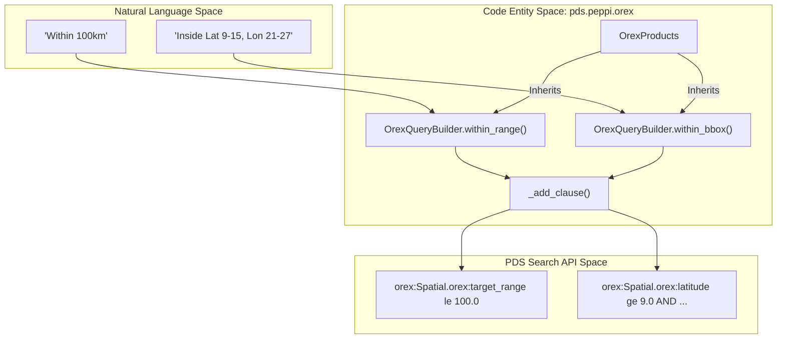

# Page: Mission-Specific Extensions

# Mission-Specific Extensions

<details>
<summary>Relevant source files</summary>

The following files were used as context for generating this wiki page:

- [src/pds/peppi/orex/__init__.py](src/pds/peppi/orex/__init__.py)
- [src/pds/peppi/orex/products.py](src/pds/peppi/orex/products.py)
- [src/pds/peppi/orex/query_builder.py](src/pds/peppi/orex/query_builder.py)
- [tests/pds/peppi/test_orex_products.py](tests/pds/peppi/test_orex_products.py)

</details>


The `pds.peppi` library is designed to be extensible, allowing for mission-specific specializations that simplify querying for unique metadata and spatial constraints. While the core `QueryBuilder` provides general PDS filtering, mission extensions provide tailored interfaces for complex investigations.

The primary example of this extension pattern is the **OSIRIS-REx (OREX)** module, which introduces specialized spatial filters and automatic scoping to the OREX investigation.

### Extensibility Pattern

Mission-specific extensions typically follow a standard inheritance pattern to provide a seamless transition from the general API to specialized ones.

1.  **Specialized QueryBuilder**: Inherits from `pds.peppi.query_builder.QueryBuilder` to add mission-specific query clauses and metadata namespaces [src/pds/peppi/orex/query_builder.py:6-6]().
2.  **Specialized Products**: Inherits from the specialized builder to provide a high-level entry point for users [src/pds/peppi/orex/products.py:6-6]().

### The OSIRIS-REx (OREX) Module

The OREX module demonstrates how `pds.peppi` can be specialized to handle mission-specific metadata fields, such as those within the `orex:` namespace. By using `OrexProducts`, users gain access to spatial query methods that are not available in the standard `Products` class.

#### Key Specializations
*   **Automatic Scoping**: Every query initiated via `OrexProducts` is automatically constrained to the OSIRIS-REx investigation LID (`urn:nasa:pds:context:investigation:mission.orex`) [src/pds/peppi/orex/query_builder.py:22-24]().
*   **Spatial Range Filtering**: The `within_range` method allows filtering products based on target distance in kilometers [src/pds/peppi/orex/query_builder.py:46-61]().
*   **Bounding Box Filtering**: The `within_bbox` method provides a simple interface for latitude and longitude constraints [src/pds/peppi/orex/query_builder.py:63-87]().

#### Structural Overview

The following diagram illustrates how the OREX extension bridges natural language spatial concepts to the underlying PDS Search API query strings.

**OREX Query Translation Flow**

Sources: [src/pds/peppi/orex/query_builder.py:6-87](), [src/pds/peppi/orex/products.py:6-18]()

### Extension Hierarchy

The mission extensions leverage Python's inheritance to enforce constraints. For instance, because `OrexQueryBuilder` is strictly for OREX data, it overrides `has_investigation` to raise a `NotImplementedError`, preventing users from accidentally searching for other missions within the OREX context [src/pds/peppi/orex/query_builder.py:26-44]().

**Mission Extension Class Diagram**
```mermaid
classDiagram
    class "QueryBuilder" {
        +has_target()
        +before()
        +_add_clause()
    }
    class "OrexQueryBuilder" {
        +orex_investigation_lidvid
        +within_range(range_in_km)
        +within_bbox(lat_min, lat_max, ...)
        +has_investigation() : Exception
    }
    class "OrexProducts" {
        +__init__(client)
    }

    "QueryBuilder" <|-- "OrexQueryBuilder"
    "OrexQueryBuilder" <|-- "OrexProducts"
```
Sources: [src/pds/peppi/orex/query_builder.py:6-11](), [src/pds/peppi/orex/products.py:6-9]()

### Detailed Mission Documentation

For a deep dive into the implementation and usage of the OREX extension, including specific metadata fields and spatial logic, see the child page:

*   **[OSIRIS-REx (OREX) Module](#3.1)**: Detailed documentation of `OrexProducts` and `OrexQueryBuilder`: automatic investigation scoping, `within_range`, `within_bbox` spatial filters, the `orex:` metadata namespace, and the disabled `has_investigation` override.

Sources: [src/pds/peppi/orex/query_builder.py:1-88](), [src/pds/peppi/orex/products.py:1-19](), [tests/pds/peppi/test_orex_products.py:1-50]()
