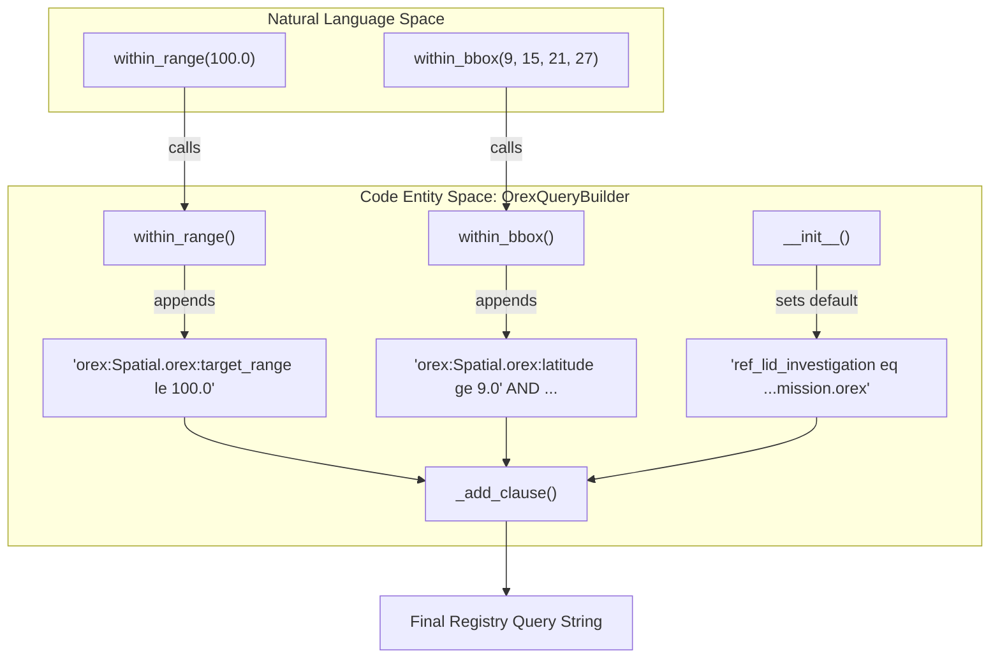
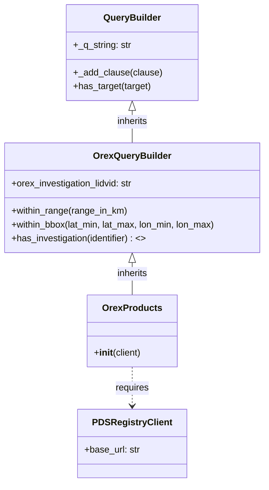

# Page: OSIRIS-REx (OREX) Module

# OSIRIS-REx (OREX) Module

Relevant source files

The following files were used as context for generating this wiki page:

- [src/pds/peppi/orex/__init__.py](src/pds/peppi/orex/__init__.py)
- [src/pds/peppi/orex/products.py](src/pds/peppi/orex/products.py)
- [src/pds/peppi/orex/query_builder.py](src/pds/peppi/orex/query_builder.py)
- [tests/pds/peppi/test_orex_products.py](tests/pds/peppi/test_orex_products.py)

The OSIRIS-REx (OREX) module provides a specialized interface for querying PDS data products specifically associated with the OSIRIS-REx mission. It extends the core `pds.peppi` query architecture to include mission-specific spatial filters and automatic investigation scoping.

## Overview

The OREX module is designed to simplify access to OSIRIS-REx data by pre-configuring the investigation context and exposing filters for mission-specific metadata fields, such as target range and surface coordinates.

### Key Components
*   **`OrexProducts`**: The primary entry point for OREX queries, serving as a specialized version of the standard `Products` class [src/pds/peppi/orex/products.py:6-7]().
*   **`OrexQueryBuilder`**: Implements the logic for mission-specific query clauses and enforces the OREX investigation scope [src/pds/peppi/orex/query_builder.py:6-7]().
*   **Automatic Scoping**: All queries initiated through this module are automatically restricted to `urn:nasa:pds:context:investigation:mission.orex` [src/pds/peppi/orex/query_builder.py:9-24]().

**Sources:**
[src/pds/peppi/orex/products.py:1-19](), [src/pds/peppi/orex/query_builder.py:1-87](), [src/pds/peppi/orex/__init__.py:1-3]()

---

## OrexQueryBuilder Implementation

The `OrexQueryBuilder` inherits from the base `QueryBuilder` and overrides specific behaviors to tailor the search experience for OSIRIS-REx data.

### Investigation Scoping
Upon initialization, the `OrexQueryBuilder` sets the internal `_q_string` to filter by the OREX investigation LID [src/pds/peppi/orex/query_builder.py:22-24](). To maintain the integrity of this scope, the `has_investigation` method is explicitly disabled.

| Feature | Implementation Detail |
| :--- | :--- |
| **Fixed Investigation** | `urn:nasa:pds:context:investigation:mission.orex` [src/pds/peppi/orex/query_builder.py:9]() |
| **`has_investigation`** | Raises `NotImplementedError` to prevent changing the mission scope [src/pds/peppi/orex/query_builder.py:26-44]() |

### Spatial Filters
The module introduces spatial filtering capabilities that utilize the `orex:` metadata namespace in the PDS Registry.

#### `within_range(range_in_km)`
Adds a clause to filter products where the target range is less than or equal to the specified value. It targets the `orex:Spatial.orex:target_range` property [src/pds/peppi/orex/query_builder.py:46-61]().

#### `within_bbox(lat_min, lat_max, lon_min, lon_max)`
Constructs a bounding box filter using four distinct clauses for latitude and longitude. It targets the `orex:Spatial.orex:latitude` and `orex:Spatial.orex:longitude` properties [src/pds/peppi/orex/query_builder.py:63-87]().

### Data Flow: Query Construction
The following diagram illustrates how natural language-like method calls are translated into PDS Registry API query strings within the OREX module.

**OREX Query Translation Flow**

**Sources:**
[src/pds/peppi/orex/query_builder.py:9-87](), [tests/pds/peppi/test_orex_products.py:14-50]()

---

## OrexProducts and Usage

`OrexProducts` is a thin wrapper around `OrexQueryBuilder` [src/pds/peppi/orex/products.py:6-19](). It is designed to be instantiated with a `PDSRegistryClient`.

### Class Hierarchy and Interaction
This diagram shows the relationship between the OREX-specific classes and the core `pds.peppi` architecture.

**OREX Module Class Diagram**

### Integration Testing
The behavior of the OREX module is verified in `tests/pds/peppi/test_orex_products.py`. Tests ensure that:
1.  The OREX investigation LID is present in the query string by default [tests/pds/peppi/test_orex_products.py:16-18]().
2.  The `orex:` namespace properties are correctly returned in the product `properties` dictionary [tests/pds/peppi/test_orex_products.py:29-31]().
3.  Spatial filters correctly bound the numerical values returned from the API [tests/pds/peppi/test_orex_products.py:45-46]().

**Sources:**
[src/pds/peppi/orex/products.py:1-19](), [src/pds/peppi/orex/query_builder.py:1-87](), [tests/pds/peppi/test_orex_products.py:1-50]()
