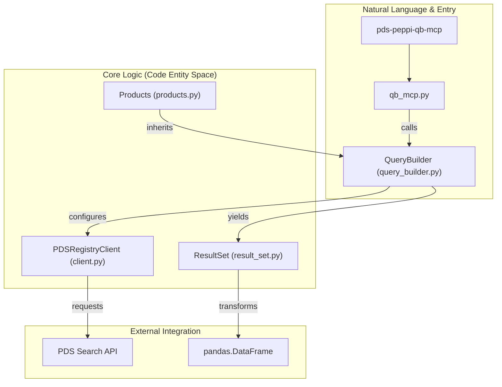
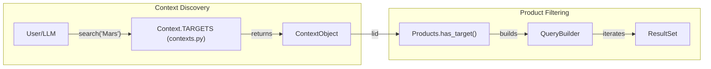

# Page: Overview

# Overview

Relevant source files

The following files were used as context for generating this wiki page:

- [CHANGELOG.md](CHANGELOG.md)
- [README.md](README.md)
- [docs/source/index.rst](docs/source/index.rst)
- [src/pds/peppi/VERSION.txt](src/pds/peppi/VERSION.txt)
- [src/pds/peppi/qb_mcp.py](src/pds/peppi/qb_mcp.py)

The **Peppi Open-Source Python Library** (`pds.peppi`) provides an intuitive, high-level interface for the research community to query and extract data from the [Planetary Data System (PDS)](https://pds.nasa.gov) [docs/source/index.rst:1-4](). It abstracts the complexities of the underlying PDS Search API, allowing users to build complex queries using a fluent, "chainable" Pythonic interface [docs/source/index.rst:26-29]().

Peppi is designed to support a wide range of users, from planetary scientists and researchers building data pipelines to students and data engineers integrating PDS data into applications [docs/source/index.rst:50-60]().

## Key Features

*   **Fluent Query Interface**: Chainable methods for filtering by target, mission, instrument, time range, and processing level [src/pds/peppi/qb_mcp.py:44-97]().
*   **Context Discovery**: Fuzzy-searchable collections for finding valid PDS targets and instrument hosts [docs/source/index.rst:40-45]().
*   **Automatic Pagination**: Seamlessly handles large result sets using keyset pagination (`search_after`) [CHANGELOG.md:132-132]().
*   **Data Analysis Ready**: Direct export of search results to `pandas` DataFrames [docs/source/index.rst:42-42]().
*   **LLM Integration**: Built-in support for the Model Context Protocol (MCP), allowing Large Language Models to query PDS data via natural language [README.md:16-25]().

**Sources:** [docs/source/index.rst:37-46](), [src/pds/peppi/qb_mcp.py:44-97](), [README.md:16-25]()

## Architecture Summary

Peppi acts as a wrapper around the `pds.api-client`. It organizes the discovery and retrieval process into three main layers:

1.  **Context Layer**: Provides singletons for discovering PDS metadata (Targets, Missions, Instruments) to find valid Logical Identifiers (LIDs).
2.  **Query Layer**: The `QueryBuilder` and `Products` classes manage the state of a PDS API request, allowing users to apply filters incrementally.
3.  **Result Layer**: The `ResultSet` handles the iteration over API responses and the automatic fetching of subsequent pages.

### System Entity Mapping

The following diagram bridges the high-level functional areas to the specific classes and modules in the codebase.

**Code Entity Map: Query to Result Pipeline**

**Sources:** [src/pds/peppi/qb_mcp.py:14-15](), [docs/source/index.rst:20-29](), [README.md:24-25]()

### Component Interaction

This diagram illustrates how a user typically interacts with the system to resolve metadata before executing a product search.

**Code Entity Map: Context Discovery and Filtering**

**Sources:** [docs/source/index.rst:23-29](), [src/pds/peppi/qb_mcp.py:45-48]()

## Child Pages

For more detailed information, please refer to the following pages:

*   **[Getting Started](#1.1)**: Detailed installation instructions (requires Python 3.12+), environment setup, and a "Hello World" search example.
*   **[Changelog and Version History](#1.2)**: A history of the project's evolution, including the addition of DOI searching, spatial filters, and MCP support in recent versions like `v0.8.0` and `v0.9.0`.

**Sources:** [README.md:8-8](), [src/pds/peppi/VERSION.txt:1-1](), [CHANGELOG.md:1-15]()
