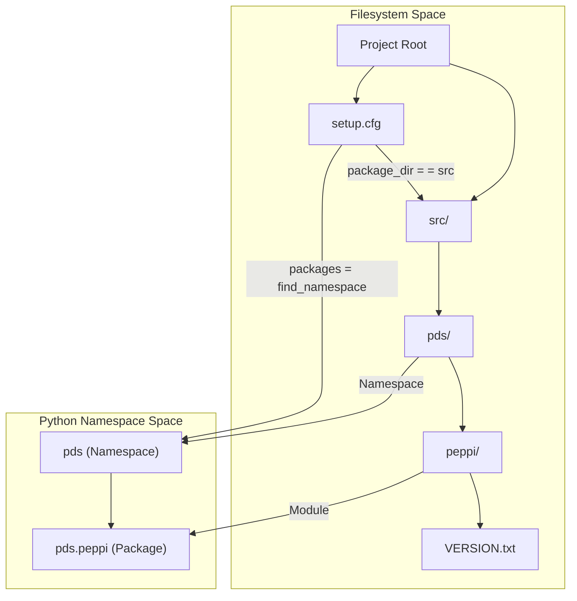
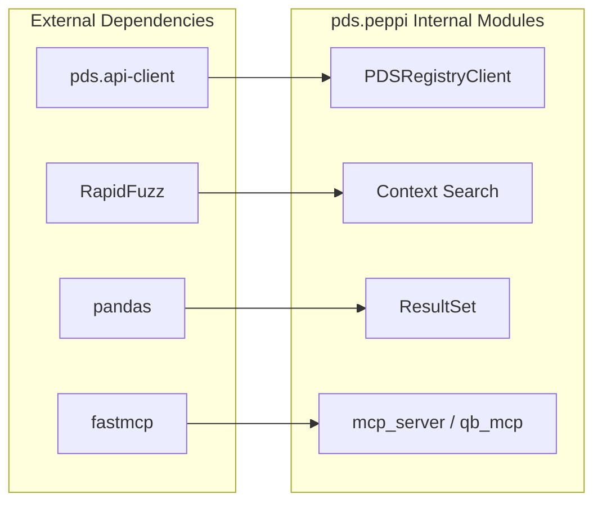

# Page: Package Setup and Dependencies

# Package Setup and Dependencies

Relevant source files

The following files were used as context for generating this wiki page:

- [pyproject.toml](pyproject.toml)
- [setup.cfg](setup.cfg)

This page provides a technical breakdown of the `pds.peppi` packaging configuration, dependency management, and source layout. The project utilizes a modern `src/` layout and relies on `setup.cfg` for declarative configuration, ensuring compatibility with the NASA PDS ecosystem.

## Packaging Configuration

`pds.peppi` is configured primarily through `setup.cfg`, using `setuptools` as the build backend [pyproject.toml:1-3](). The package is defined as a namespace package within the `pds` hierarchy [setup.cfg:44]().

### Metadata and Versioning
The package identity and metadata are defined in the `[metadata]` section:
*   **Name**: `pds.peppi` [setup.cfg:8]()
*   **License**: Apache-2.0 [setup.cfg:15]()
*   **Version Management**: The version is sourced dynamically from `src/pds/peppi/VERSION.txt` [setup.cfg:14]().
*   **Python Requirement**: Requires Python 3.12 or higher [setup.cfg:45]().

### Source Layout and Discovery
The project adopts the `src/` layout to ensure that tests run against the installed package rather than the local directory.

| Component | Configuration | Description |
| :--- | :--- | :--- |
| **Package Root** | `package_dir = = src` | Sets the root for discovery to the `src` folder [setup.cfg:42-43](). |
| **Discovery** | `packages = find_namespace:` | Enables PEP 420 namespace package discovery [setup.cfg:44](). |
| **Namespace Location** | `where = src` | Directs the `find_namespace` tool to look inside `src` [setup.cfg:73-75](). |
| **Zip Safety** | `zip_safe = True` | Indicates the package can be run directly from a zip file [setup.cfg:39](). |

### Package Structure Diagram
The following diagram illustrates how the `setup.cfg` configuration maps to the physical file system and the resulting Python namespace.

**Source Layout to Namespace Mapping**

Sources: [setup.cfg:41-45](), [setup.cfg:73-75]()

---

## Dependencies

The project categorizes dependencies into core requirements (necessary for runtime) and development extras (necessary for testing, linting, and documentation).

### Core Dependencies (`install_requires`)
These packages are automatically installed when running `pip install pds.peppi`.

| Dependency | Version Spec | Purpose |
| :--- | :--- | :--- |
| `pds.api-client` | `~=1.7.0` | Low-level generated client for the PDS Registry API [setup.cfg:32](). |
| `pandas` | `~=2.2.3` | Data manipulation and `DataFrame` export functionality [setup.cfg:33](). |
| `RapidFuzz` | `~=3.14.0` | String similarity and Levenshtein scoring for Context search [setup.cfg:34](). |
| `fastmcp` | `~=2.14.0` | Framework for implementing Model Context Protocol (MCP) servers [setup.cfg:35](). |

### Development Extras (`dev`)
Development tools are grouped under the `dev` extra, installable via `pip install pds.peppi[dev]`.

*   **Linting & Style**: `flake8`, `flake8-bugbear`, `flake8-docstrings`, `pep8-naming`, `pydocstyle`, and `black` [setup.cfg:49-54](), [pyproject.toml:5-7]().
*   **Static Analysis**: `mypy` for type checking [setup.cfg:53]().
*   **Testing**: `pytest`, `pytest-cov`, `pytest-watch`, `pytest-xdist`, and `coverage` [setup.cfg:55-59]().
*   **Automation**: `tox` for environment orchestration and `pre-commit` for git hooks [setup.cfg:60,63]().
*   **Documentation**: `sphinx` and `sphinx-rtd-theme` [setup.cfg:61-62]().

### Dependency Flow Diagram
This diagram shows how external dependencies are integrated into the internal `pds.peppi` logic.

**Dependency Integration**

Sources: [setup.cfg:30-36]()

---

## Entry Points

The package defines two console scripts that allow users to launch MCP servers directly from the command line after installation [setup.cfg:67-71]().

| Command | Target Function | Description |
| :--- | :--- | :--- |
| `pds-peppi-mcp-server` | `pds.peppi.mcp_server:main` | Launches the basic MCP server for context (target/instrument) lookup [setup.cfg:70](). |
| `pds-peppi-qb-mcp` | `pds.peppi.qb_mcp:main` | Launches the advanced QueryBuilder MCP server for natural language data search [setup.cfg:71](). |

---

## Tool Configuration

The `setup.cfg` file also contains configuration for various development tools to ensure consistency across the codebase.

### Flake8
Configured with a maximum line length of 120 to match the `black` formatter [setup.cfg:128](). It ignores specific errors like `E203` (whitespace before colon) to maintain compatibility with `black`'s formatting style [setup.cfg:150]().

### Coverage
The coverage tool is configured to omit version files and `__init__.py` files to prevent noise in quality reports [setup.cfg:86-87]().

### Mypy
Type checking is enabled, with a specific override to ignore errors in the auto-generated `_version.py` file typically produced by `versioneer` [setup.cfg:185-188]().

Sources: [setup.cfg:127-166](), [setup.cfg:86-88](), [setup.cfg:179-188](), [pyproject.toml:5-7]()
