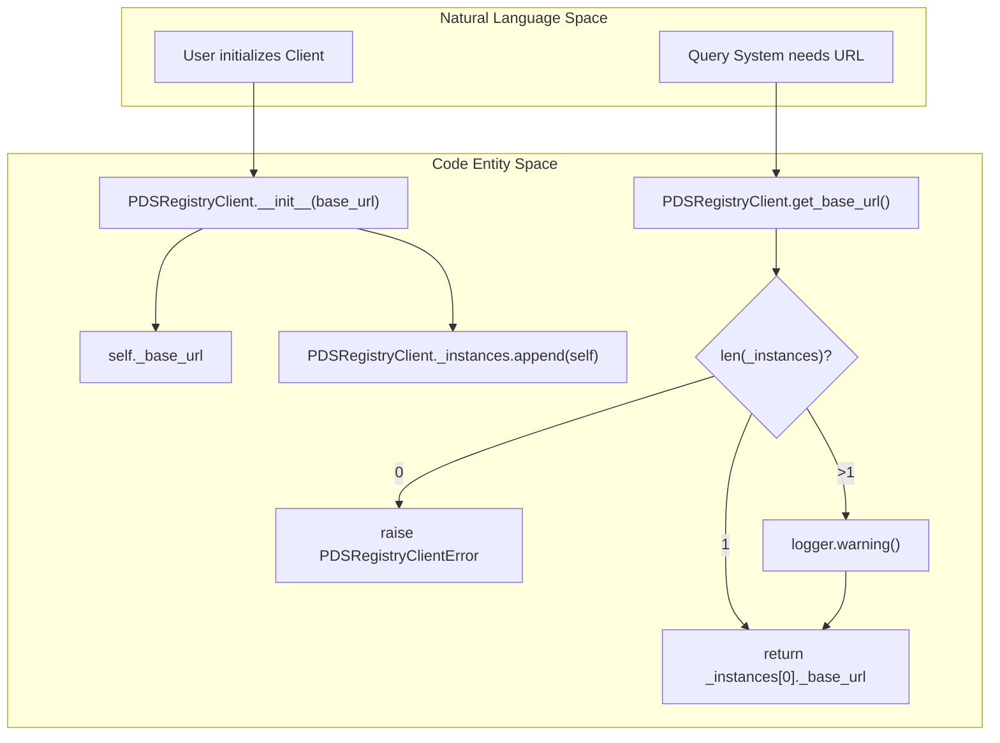
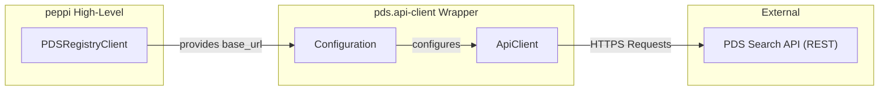

# Page: PDSRegistryClient

# PDSRegistryClient

Relevant source files

The following files were used as context for generating this wiki page:

- [src/pds/peppi/client.py](src/pds/peppi/client.py)

The `PDSRegistryClient` serves as the primary interface for connecting to the PDS Registry API. It wraps the low-level `pds.api_client` to manage configuration, base URL settings, and instance tracking across the `pds.peppi` library.

## Overview and Initialization

The `PDSRegistryClient` class is responsible for establishing the connection parameters used by all search operations within the library. By default, it points to the official PDS production API, but it can be configured to point to development or local instances.

### Base URL Configuration
The default endpoint is defined by the constant `_DEFAULT_API_BASE_URL` [src/pds/peppi/client.py:10-11](). During initialization, the provided `base_url` is stripped of trailing slashes to ensure consistency when building request paths [src/pds/peppi/client.py:41]().

### API Client Integration
The class utilizes the `pds.api_client` package to handle the underlying HTTP communication. It creates a `Configuration` object to set the host and then initializes an `ApiClient` [src/pds/peppi/client.py:43-45]().

### Natural Language to Code Entity Mapping: Initialization

| Natural Language Concept | Code Entity | File Reference |
| :--- | :--- | :--- |
| **Connection Manager** | `PDSRegistryClient` | [src/pds/peppi/client.py:19]() |
| **Default API Endpoint** | `_DEFAULT_API_BASE_URL` | [src/pds/peppi/client.py:10]() |
| **API Configuration** | `pds.api_client.Configuration` | [src/pds/peppi/client.py:43]() |
| **HTTP Engine** | `pds.api_client.ApiClient` | [src/pds/peppi/client.py:45]() |

**Sources:** [src/pds/peppi/client.py:1-46]()

---

## Instance Tracking and State

`PDSRegistryClient` maintains a class-level list of all instantiated clients. This allows other components of the library (such as the `QueryBuilder`) to retrieve the active API configuration without requiring the user to pass client instances manually through every function call.

### The `_instances` List
The class attribute `_instances` stores references to every `PDSRegistryClient` created during the runtime [src/pds/peppi/client.py:29](). Every time `__init__` is called, the new instance appends itself to this list [src/pds/peppi/client.py:42]().

### Global URL Discovery: `get_base_url`
The `get_base_url` class method provides a mechanism to find the API endpoint currently in use [src/pds/peppi/client.py:48-49]().

*   **Single Instance:** Returns the `_base_url` of the only active instance [src/pds/peppi/client.py:50-51]().
*   **Multiple Instances:** Logs a warning and returns the `_base_url` of the first instance created [src/pds/peppi/client.py:52-54]().
*   **Zero Instances:** Raises a `PDSRegistryClientError` [src/pds/peppi/client.py:55-57]().

### Instance Management Flow
The following diagram illustrates how the `PDSRegistryClient` tracks instances and how the system resolves the base URL.

**Diagram: Instance Lifecycle and URL Resolution**

**Sources:** [src/pds/peppi/client.py:29-58]()

---

## Error Handling: PDSRegistryClientError

The library defines a specific exception class, `PDSRegistryClientError`, to handle issues related to client configuration and connectivity [src/pds/peppi/client.py:14-16]().

Currently, this exception is primarily raised when the system attempts to perform a registry operation but no `PDSRegistryClient` has been initialized yet, meaning no base URL can be determined for the API calls [src/pds/peppi/client.py:57]().

### Exception Summary

| Exception Class | Purpose | Trigger Condition |
| :--- | :--- | :--- |
| `PDSRegistryClientError` | General client/connection failure. | Calling `get_base_url()` before instantiating a client. |

**Sources:** [src/pds/peppi/client.py:14-16](), [src/pds/peppi/client.py:55-57]()

---

## Technical Data Flow

The `PDSRegistryClient` acts as the bridge between the high-level `peppi` abstractions and the auto-generated `pds.api_client`.

**Diagram: Data Flow from Peppi to PDS API**

**Sources:** [src/pds/peppi/client.py:31-46]()
