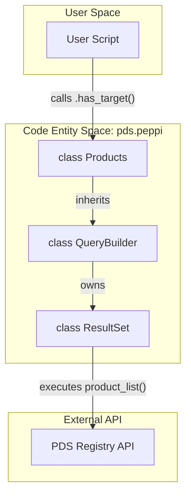
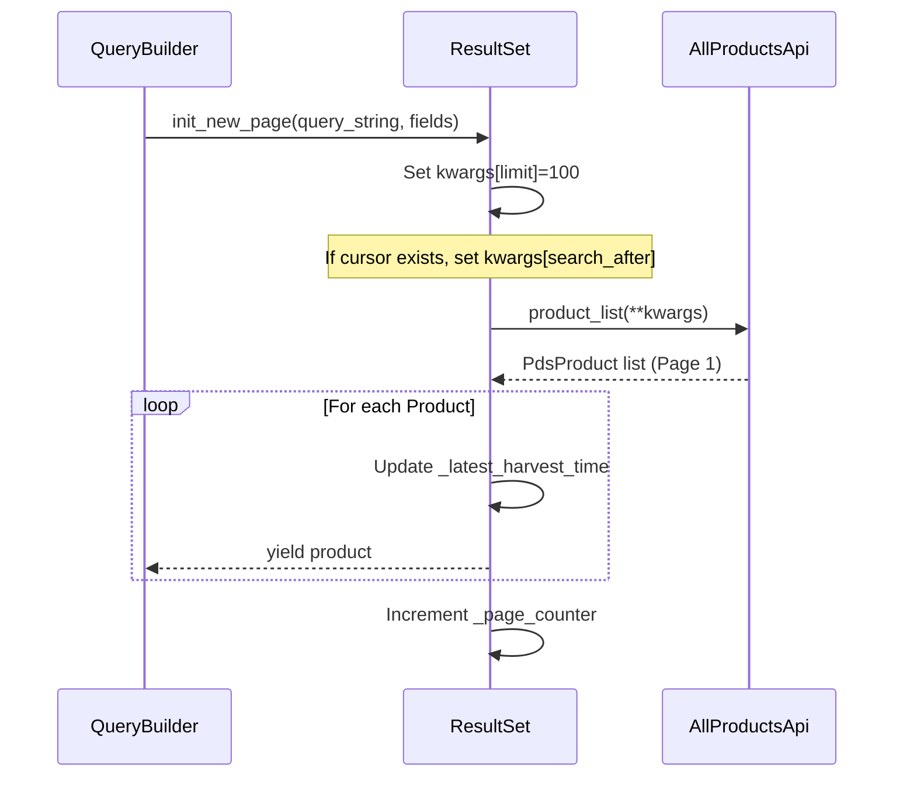

# Page: Products and ResultSet

# Products and ResultSet

Relevant source files

The following files were used as context for generating this wiki page:

- [src/pds/peppi/products.py](src/pds/peppi/products.py)
- [src/pds/peppi/result_set.py](src/pds/peppi/result_set.py)
- [tests/pds/peppi/test_products.py](tests/pds/peppi/test_products.py)

This page documents the `Products` class and the underlying `ResultSet` engine. Together, they provide a high-level interface for querying the PDS Registry and a robust pagination mechanism for handling large volumes of planetary data.

## The Products Class

The `Products` class [src/pds/peppi/products.py:6-12]() is the primary entry point for users of the `pds.peppi` library. It is a thin wrapper that inherits from `QueryBuilder` [src/pds/peppi/products.py:6](), providing the fluent interface used to construct complex queries.

### Initialization and Role
When initialized with a `PDSRegistryClient` [src/pds/peppi/products.py:14-22](), the `Products` instance manages the lifecycle of a query. Because it inherits from `QueryBuilder`, it maintains an internal `ResultSet` instance that handles the actual communication with the PDS API.

### Implementation Diagram: Products and QueryBuilder Relationship
The following diagram illustrates how the `Products` class bridges the user-facing filter methods to the internal result processing.

**Products Entity Relationship**

**Sources:** [src/pds/peppi/products.py:6-23](), [src/pds/peppi/query_builder.py:17-45]()

---

## ResultSet: The Pagination Engine

The `ResultSet` class [src/pds/peppi/result_set.py:12-13]() is responsible for the iterative retrieval of data. It abstracts the complexity of PDS API limits by implementing a transparent pagination strategy.

### Keyset Pagination via `search_after`
To ensure stable results across multiple requests, `ResultSet` uses **keyset pagination** rather than simple offsets. This is critical for large datasets where data might be ingested (harvested) while a user is still paginating through results.

1.  **Sort Property**: Results are ordered by `ops:Harvest_Info.ops:harvest_date_time` [src/pds/peppi/result_set.py:15-16]().
2.  **Cursor Management**: The engine tracks the `_latest_harvest_time` [src/pds/peppi/result_set.py:24]() from the last product of the current page.
3.  **Search After**: Subsequent requests include the `search_after` parameter [src/pds/peppi/result_set.py:63-64](), instructing the API to return results strictly following that specific harvest timestamp.

### Page Size and Lifecycle
*   **Page Size**: Controlled by `_PAGE_SIZE`, currently set to 100 [src/pds/peppi/result_set.py:18-19]().
*   **Initial Fetch**: On the first request, the engine calculates `_expected_pages` by dividing the total `hits` by the page size [src/pds/peppi/result_set.py:83-90]().
*   **Termination**: The iterator raises `StopIteration` once `_page_counter` reaches `_expected_pages` [src/pds/peppi/result_set.py:58-59]().

### Data Flow: Keyset Pagination
This diagram shows the flow of a single page request and how the harvest time cursor is updated.

**Pagination Data Flow**

**Sources:** [src/pds/peppi/result_set.py:29-98]()

---

## The Reset Lifecycle

The `ResultSet` and `Products` instances maintain state that must be managed carefully to ensure query integrity.

### Query Immutability During Pagination
Once iteration has started (i.e., once the first page has been fetched), the `QueryBuilder` prevents any modification to the query clauses [tests/pds/peppi/test_products.py:103-112](). Attempting to add a filter like `.observationals()` while a result set is active will raise a `RuntimeError` [tests/pds/peppi/test_products.py:111-112]().

### Resetting State
To reuse a `Products` instance for a different query or to restart the current query from the beginning, the `.reset()` method must be called.
*   **ResultSet Reset**: Clears `_expected_pages`, `_page_counter`, `_latest_harvest_time`, and `_count` [src/pds/peppi/result_set.py:99-105]().
*   **QueryBuilder Reset**: Clears the accumulated query clauses and resets the internal `ResultSet` [tests/pds/peppi/test_products.py:116-122]().

### Comparison of Count vs. Iteration
Calling `.count()` on a `Products` instance fetches the total number of hits from the API but does not consume the iterator. It internally triggers a reset to ensure that a subsequent `for` loop starts from the first page [tests/pds/peppi/test_products.py:76-101]().

| Feature | Behavior | Source |
| :--- | :--- | :--- |
| **Default Sort** | `ops:Harvest_Info.ops:harvest_date_time` | [src/pds/peppi/result_set.py:15]() |
| **Page Size** | 100 products per request | [src/pds/peppi/result_set.py:18]() |
| **Pagination Type** | Keyset (`search_after`) | [src/pds/peppi/result_set.py:64]() |
| **Immutability** | Clauses locked after iteration starts | [tests/pds/peppi/test_products.py:111]() |
| **Reset** | Clears cursor and counters | [src/pds/peppi/result_set.py:99]() |

**Sources:** [src/pds/peppi/result_set.py:12-105](), [tests/pds/peppi/test_products.py:76-123]()
