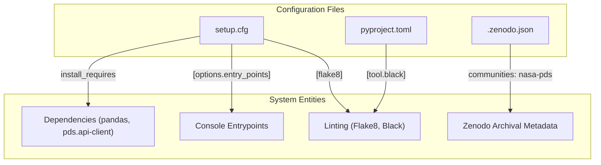
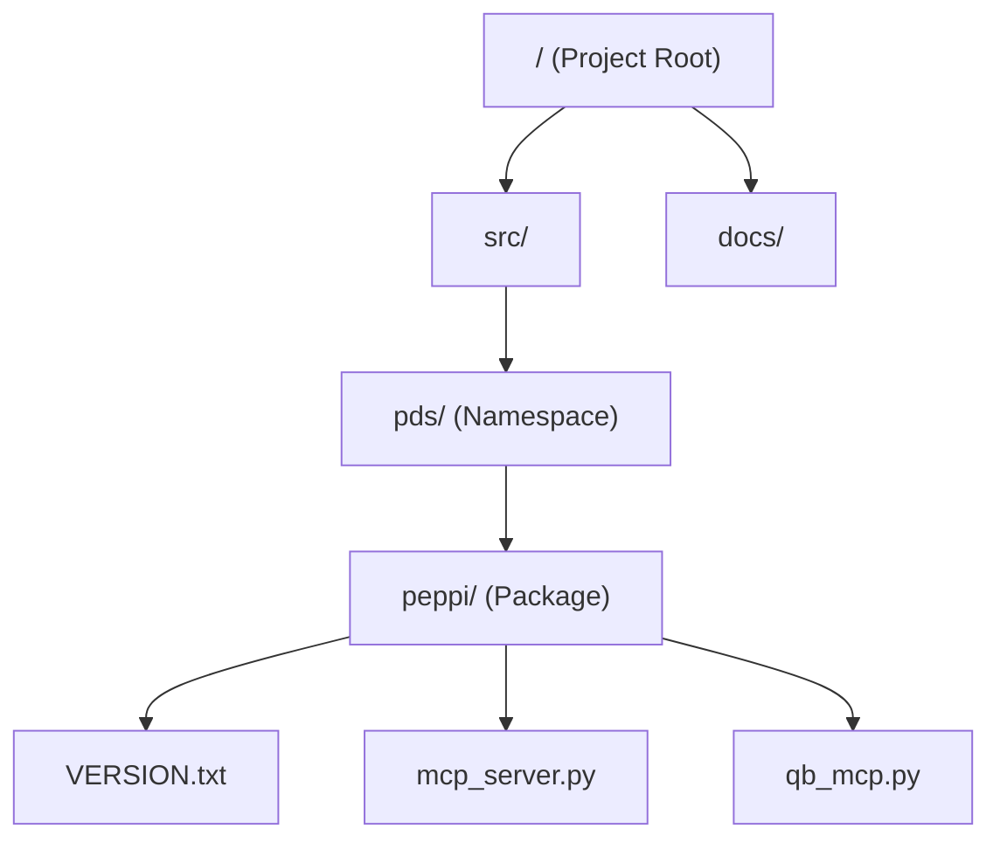

# Page: Project Configuration and Packaging

# Project Configuration and Packaging

Relevant source files

The following files were used as context for generating this wiki page:

- [.zenodo.json](.zenodo.json)
- [LICENSE.md](LICENSE.md)
- [MANIFEST.in](MANIFEST.in)
- [pyproject.toml](pyproject.toml)
- [setup.cfg](setup.cfg)

This section describes the structural configuration of the `pds.peppi` repository, including its packaging metadata, dependency management, namespace architecture, and archival standards. The project uses a modern Python `src/` layout and is distributed under the Apache-2.0 license.

### Packaging and Distribution Strategy

The `pds.peppi` package is configured primarily through `setup.cfg` and `pyproject.toml`. It utilizes `setuptools` as the build backend [pyproject.toml:1-3]() and follows the `find_namespace:` pattern to support the `pds` planetary data ecosystem [setup.cfg:44]().

#### High-Level Metadata
*   **Name**: `pds.peppi` [setup.cfg:8]()
*   **License**: Apache-2.0 [setup.cfg:15](), [LICENSE.md:1-4]()
*   **Python Support**: Requires Python 3.12 or higher [setup.cfg:45]()
*   **Version Management**: Versions are tracked in `src/pds/peppi/VERSION.txt` [setup.cfg:14]() and managed via `versioneer` [setup.cfg:197-203]().
*   **Archival**: Metadata for Zenodo integration is maintained to ensure scientific traceability within the `nasa-pds` community [.zenodo.json:1-4]().

### Configuration Mapping

The following diagram illustrates how configuration files map to specific system behaviors and code entities.

**Configuration to Code Entity Mapping**

Sources: [setup.cfg:30-35](), [setup.cfg:67-71](), [setup.cfg:127-130](), [pyproject.toml:5-7](), [.zenodo.json:1-4]()

### Console Script Entrypoints

The package exposes two primary command-line interfaces (CLIs) that serve as gateways to the Model Context Protocol (MCP) integrations. These are defined in the `[options.entry_points]` section of the configuration [setup.cfg:67-71]().

| Entrypoint | Target Function | Description |
| :--- | :--- | :--- |
| `pds-peppi-mcp-server` | `pds.peppi.mcp_server:main` | FastMCP server for context and target searching. |
| `pds-peppi-qb-mcp` | `pds.peppi.qb_mcp:main` | Advanced QueryBuilder MCP for natural language data discovery. |

Sources: [setup.cfg:69-71]()

### Namespace and Source Layout

The project adheres to the `src/` layout to ensure that tests run against the installed package rather than local modules. It uses a namespace package structure under the `pds` prefix.

**Package Structure Diagram**

Sources: [setup.cfg:42-44](), [setup.cfg:73-75](), [MANIFEST.in:1]()

---

### Sub-Pages

#### [7.1 Package Setup and Dependencies](#)
Details the specific library requirements including `pds.api-client`, `pandas`, `RapidFuzz`, and `fastmcp`. It also covers the `dev` extras used for testing and quality assurance, such as `pytest`, `tox`, and `coverage`.
For details, see [Package Setup and Dependencies](#).

#### [7.2 Documentation Build](#)
Covers the Sphinx configuration, the ReadTheDocs theme integration, and how documentation is generated from RST sources. It explains the `tox` environment used to automate doc builds and the management of version history within the documentation.
For details, see [Documentation Build](#).
