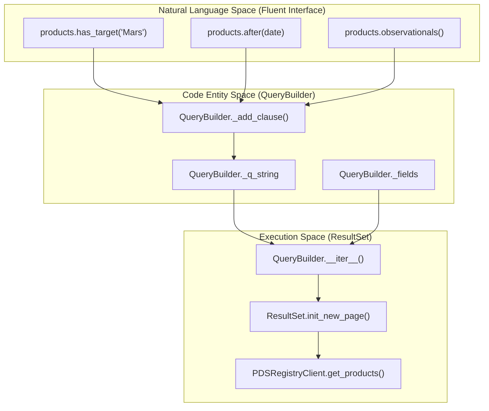
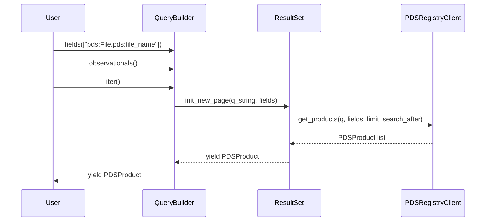

# Page: QueryBuilder and Fluent Interface

# QueryBuilder and Fluent Interface

Relevant source files

The following files were used as context for generating this wiki page:

- [src/pds/peppi/query_builder.py](src/pds/peppi/query_builder.py)
- [tests/pds/peppi/test_products.py](tests/pds/peppi/test_products.py)

The `QueryBuilder` class is the core engine for constructing PDS4 Information Model queries. It provides a fluent interface that allows users to chain method calls to build complex search criteria, which are eventually translated into the domain language expected by the PDS Registry API.

## Overview and State Management

The `QueryBuilder` manages an internal query string and a list of requested metadata fields. It utilizes lazy evaluation, meaning the actual network request to the PDS Registry is only dispatched when the object is iterated over or converted to a data structure (e.g., a DataFrame).

### Immutability and Pagination Constraint
A critical constraint of the `QueryBuilder` is that the query state becomes immutable once pagination has started. If a user attempts to add a filter clause (e.g., `has_target()`) while a `ResultSet` is currently fetching pages, a `RuntimeError` is raised [src/pds/peppi/query_builder.py:112-117](). To modify the query, the user must either exhaust all results or call the `reset()` method [src/pds/peppi/query_builder.py:115-116]().

### Query Construction Flow
The following diagram illustrates how natural language-like method calls are transformed into internal state and finally into a PDS Registry query.

**Query Construction and Execution Flow**

Sources: [src/pds/peppi/query_builder.py:24-64](), [src/pds/peppi/query_builder.py:66-125]()

---

## Filter Methods

The `QueryBuilder` provides specialized methods for common PDS search parameters. Most methods internally call `_add_clause()` to append formatted strings to `_q_string` [src/pds/peppi/query_builder.py:66-100]().

### Metadata and Context Filters
| Method | Description | Implementation Detail |
| :--- | :--- | :--- |
| `has_target(target)` | Filters by target LID or keyword. | Keywords are resolved to LIDs via `contexts()` [src/pds/peppi/query_builder.py:141-171](). |
| `has_investigation(id)` | Filters by investigation/mission identifier. | Appends `ref_lid_investigation eq "{id}"` [src/pds/peppi/query_builder.py:173-188](). |
| `has_instrument(id)` | Filters by instrument identifier. | Appends `ref_lid_instrument eq "{id}"` [src/pds/peppi/query_builder.py:190-205](). |
| `has_instrument_host(id)`| Filters by instrument host (spacecraft/facility).| Appends `ref_lid_instrument_host eq "{id}"` [src/pds/peppi/query_builder.py:207-222](). |
| `has_processing_level(lvl)`| Filters by PDS processing level. | Validates against `PROCESSING_LEVELS` literal [src/pds/peppi/query_builder.py:224-245](). |

### Temporal and Structural Filters
| Method | Description | Implementation Detail |
| :--- | :--- | :--- |
| `before(date)` | Products with start date $\le$ date. | Converts `datetime` to ISO8601 string [src/pds/peppi/query_builder.py:247-266](). |
| `after(date)` | Products with start date $\ge$ date. | Uses `ge` operator on `pds:Time_Coordinates.pds:start_date_time` [src/pds/peppi/query_builder.py:268-287](). |
| `observationals()` | Filters for `Product_Observational`. | Appends `product_class eq "Product_Observational"` [src/pds/peppi/query_builder.py:289-301](). |
| `of_collection(lidvid)` | Products belonging to a LIDVID. | Uses `ref_lid_collection` property [src/pds/peppi/query_builder.py:317-332](). |

### Logical Clause Construction
The `_add_clause` method handles the concatenation of strings using logical operators (defaulting to `and`). It automatically wraps new clauses in parentheses to ensure correct operator precedence [src/pds/peppi/query_builder.py:119-124]().

Sources: [src/pds/peppi/query_builder.py:141-332](), [tests/pds/peppi/test_products.py:125-200]()

---

## Result Handling and Output

The `QueryBuilder` does not just build queries; it also manages the consumption of results through integration with `ResultSet`.

### Pagination and Iteration
The `__iter__` method acts as a bridge between the query state and the `ResultSet` engine. It enters a loop that calls `self._result_set.init_new_page()` using the current `_q_string` and `_fields` [src/pds/peppi/query_builder.py:53-56]().

**Data Flow: From Query to Product Objects**

Sources: [src/pds/peppi/query_builder.py:38-64](), [tests/pds/peppi/test_products.py:31-41]()

### Data Transformation Methods
The class provides two primary ways to consume data beyond simple iteration:

1.  **`count()`**: Performs a specialized request to the Registry API to return the total number of matching products without fetching the full records. It uses the `reset()` method internally to ensure it doesn't interfere with active pagination [src/pds/peppi/query_builder.py:334-351]().
2.  **`as_dataframe(max_rows)`**: Iterates through results and constructs a `pandas.DataFrame`. It maps PDS product properties to DataFrame columns. If no results are found, it returns `None` [src/pds/peppi/query_builder.py:353-388]().

### Field Selection
The `fields(list_of_fields)` method allows users to restrict the metadata returned by the API. This is highly recommended for performance when dealing with large result sets [src/pds/peppi/query_builder.py:303-315]().

Sources: [src/pds/peppi/query_builder.py:303-388](), [tests/pds/peppi/test_products.py:57-75]()
