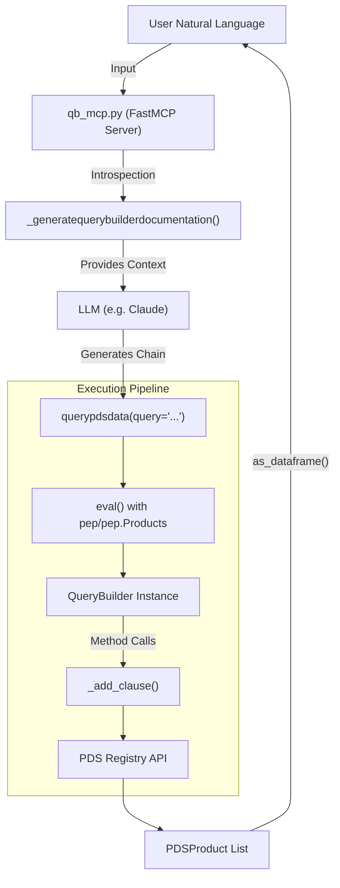
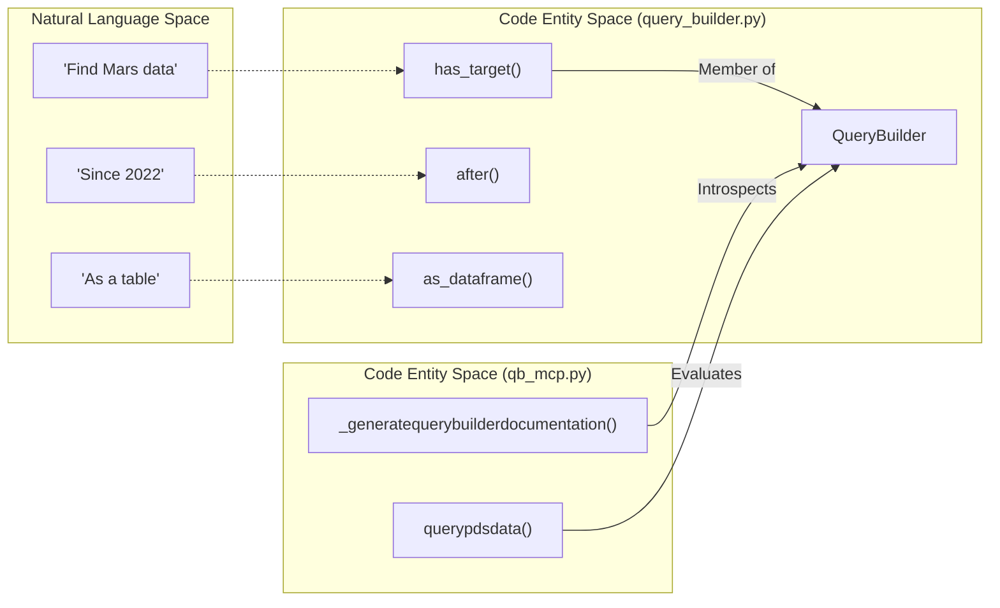

# Page: QueryBuilder MCP Server (qb_mcp.py)

# QueryBuilder MCP Server (qb_mcp.py)

<details>
<summary>Relevant source files</summary>

The following files were used as context for generating this wiki page:

- [README.md](README.md)
- [src/pds/peppi/qb_mcp.py](src/pds/peppi/qb_mcp.py)
- [src/pds/peppi/query_builder.py](src/pds/peppi/query_builder.py)

</details>


The `qb_mcp.py` module implements a sophisticated Model Context Protocol (MCP) server that exposes the `QueryBuilder` fluent interface to Large Language Models (LLMs). Unlike a static tool definition, this server uses Python introspection to dynamically generate its own documentation and tool schemas, allowing an LLM to "write" Peppi query chains in natural language.

## Purpose and Scope

The `pds-peppi-qb-mcp` entrypoint provides a bridge between natural language intent and the structured `QueryBuilder` API. It allows users to interact with the PDS Registry through clients like Claude Desktop or `claude-code` using conversational queries.

Key features include:
*   **Dynamic Documentation**: Automatically generates LLM-friendly documentation for all `QueryBuilder` methods using `inspect`.
*   **Natural Language Translation**: A pipeline that extracts keywords (targets, missions) and maps them to Peppi method calls.
*   **Dual Transport Support**: Supports both `stdio` (for local desktop integration) and `HTTP` (for remote or containerized use) [src/pds/peppi/qb_mcp.py:50-56]().
*   **Context Integration**: Leverages `pds.peppi.Context` for fuzzy matching of planetary bodies and mission identifiers [src/pds/peppi/qb_mcp.py:163-171]().

## System Architecture

The server is built on the `fastmcp` framework. It defines a single primary tool, `querypdsdata`, which accepts a string containing a Peppi query chain.

### Natural Language to Code Pipeline

The following diagram illustrates how a user request is processed by the MCP server and translated into a `QueryBuilder` execution.

**Figure 1: MCP Query Translation Flow**

**Sources:** [src/pds/peppi/qb_mcp.py:100-112](), [src/pds/peppi/qb_mcp.py:236-250](), [src/pds/peppi/query_builder.py:66-100]()

## Implementation Details

### Dynamic Documentation Generation
The function `_generatequerybuilderdocumentation()` uses the `inspect` module to iterate over `QueryBuilder` members. It categorizes methods (e.g., "Target Filtering", "Date Filtering") and formats their signatures into a compact string that the LLM uses as a "manual" for the tool [src/pds/peppi/qb_mcp.py:100-112]().

*   **Signature Formatting**: `_methodsignaturestr` converts Python types into LLM-readable strings [src/pds/peppi/qb_mcp.py:139-162]().
*   **Categorization**: Methods are grouped based on the `_categories` dictionary to provide semantic context [src/pds/peppi/qb_mcp.py:44-97]().

### The `querypdsdata` Tool
The core tool exposed to the MCP client is `querypdsdata`.

| Parameter | Type | Description |
| :--- | :--- | :--- |
| `query` | `str` | A string of chained Peppi methods, e.g., `has_target("Mars").after("2020-01-01").as_dataframe(10)` |

The tool executes the query by evaluating it within a controlled namespace where `pep` refers to the `pds.peppi` package [src/pds/peppi/qb_mcp.py:236-260]().

### Keyword and Target Extraction
To assist the LLM in forming valid queries, the server includes pre-defined lists of common targets and missions.

*   **Targets**: A list of planetary bodies like "mars", "jupiter", and "bennu" [src/pds/peppi/qb_mcp.py:19-22]().
*   **Missions**: A mapping of common names to official mission identifiers (e.g., "orex" to "osiris-rex") [src/pds/peppi/qb_mcp.py:26-37]().

**Sources:** [src/pds/peppi/qb_mcp.py:19-37](), [src/pds/peppi/qb_mcp.py:236-265]()

## Data Flow: Code Entity Mapping

The following diagram maps the logical concepts in the natural language space to the specific classes and functions in the codebase.

**Figure 2: Natural Language to Code Entity Mapping**

**Sources:** [src/pds/peppi/qb_mcp.py:44-80](), [src/pds/peppi/query_builder.py:141-157](), [src/pds/peppi/query_builder.py:240-255]()

## Transport Modes

The server supports two primary execution modes via the `--transport` argument:

1.  **stdio (Default)**: Used for local integration with desktop LLM clients. The LLM launches the Python process and communicates via standard input/output [src/pds/peppi/qb_mcp.py:284-285]().
2.  **HTTP**: Starts a local web server (typically on port 8000) using SSE (Server-Sent Events). This is required for tools like `claude-code` [src/pds/peppi/qb_mcp.py:281-282]().

### Command Line Interface
The entrypoint `pds-peppi-qb-mcp` is configured in `setup.cfg` and handled in `qb_mcp.py` via `argparse`.

```bash
# Start in HTTP mode for remote clients
pds-peppi-qb-mcp --transport http --port 8000

# Default stdio mode for Claude Desktop
pds-peppi-qb-mcp
```

**Sources:** [src/pds/peppi/qb_mcp.py:268-287](), [README.md:22-37](), [README.md:50-60]()
