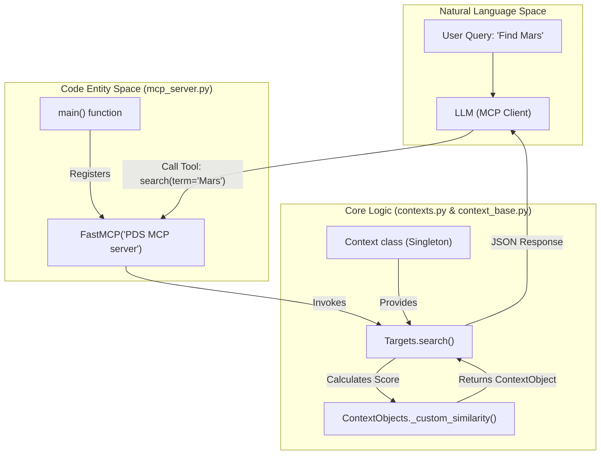
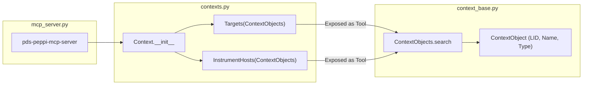

# Page: Simple MCP Server (mcp_server.py)

# Simple MCP Server (mcp_server.py)

Relevant source files

The following files were used as context for generating this wiki page:

- [setup.cfg](setup.cfg)
- [src/pds/peppi/context_base.py](src/pds/peppi/context_base.py)
- [src/pds/peppi/contexts.py](src/pds/peppi/contexts.py)
- [src/pds/peppi/mcp_server.py](src/pds/peppi/mcp_server.py)

The `pds-peppi-mcp-server` is a lightweight entrypoint that exposes the `pds.peppi` context search capabilities to Large Language Models (LLMs) via the Model Context Protocol (MCP). It utilizes the `FastMCP` framework to wrap existing Python methods as executable tools over a standard input/output (stdio) transport layer.

## Overview and Purpose

The primary purpose of this server is to provide LLMs with a mechanism to resolve natural language references to planetary bodies and spacecraft into formal PDS Logical Identifiers (LIDs). It bridges the gap between a user's informal query (e.g., "the curiosity rover") and the precise metadata required to query the PDS Registry.

The server specifically exposes two search tools:
1.  **Instrument Host Search**: For finding spacecraft, orbiters, and rovers.
2.  **Target Search**: For finding planets, satellites, asteroids, and comets.

Sources: `[src/pds/peppi/mcp_server.py:1-16]()`, `[setup.cfg:67-70]()`

## Implementation Details

The implementation is contained within `src/pds/peppi/mcp_server.py`. It initializes a `Context` singleton, which populates its internal registry by querying the PDS Registry API for context products.

### Tool Registration
The server uses the `FastMCP` decorator-like tool registration pattern. Rather than defining new logic, it directly registers the `search` methods of the `Context.TARGETS` and `Context.INSTRUMENT_HOSTS` objects.

| Tool Name | Source Method | Description |
| :--- | :--- | :--- |
| `search` (via InstrumentHosts) | `Context.INSTRUMENT_HOSTS.search` | Fuzzy search for spacecraft/rovers using Levenshtein distance. |
| `search` (via Targets) | `Context.TARGETS.search` | Fuzzy search for planetary bodies using Levenshtein distance. |

### Data Flow: Natural Language to Code Entities
The following diagram illustrates how a natural language request from an MCP client (like Claude Desktop) is routed through the `mcp_server.py` entrypoint into the core `peppi` logic.

**MCP Tool Execution Flow**

Sources: `[src/pds/peppi/mcp_server.py:6-16]()`, `[src/pds/peppi/contexts.py:10-50]()`, `[src/pds/peppi/context_base.py:81-97]()`

## Component Interaction

The server relies on the `Context` class to handle the heavy lifting of data retrieval and fuzzy matching.

1.  **Initialization**: When `main()` is called, `pep.Context()` is instantiated. This triggers a request to the PDS Registry to fetch all context products.
2.  **Mapping**: The `Context` object categorizes these products into `Targets` or `InstrumentHosts` based on their PDS properties (e.g., `pds:Target.pds:name` vs `pds:Instrument_Host.pds:name`).
3.  **Fuzzy Matching**: When the MCP tool is invoked, the `ContextObjects.search` method iterates through the loaded objects and applies `_custom_similarity`, which combines Levenshtein distance with token coverage to handle typos and partial matches.

**Context Search Logic**

Sources: `[src/pds/peppi/mcp_server.py:13-15]()`, `[src/pds/peppi/contexts.py:20-34]()`, `[src/pds/peppi/context_base.py:32-50]()`

## Execution and Transport

The server is configured to run using the `stdio` transport, which is the standard for local MCP integrations where the host application (the MCP client) spawns the Python process and communicates via standard input/output streams.

*   **Entrypoint**: `pds-peppi-mcp-server`
*   **Transport**: `stdio`
*   **Dependencies**: `fastmcp`, `pds.peppi`, `rapidfuzz`

Sources: `[src/pds/peppi/mcp_server.py:16]()`, `[setup.cfg:35-35]()`, `[setup.cfg:70-70]()`
