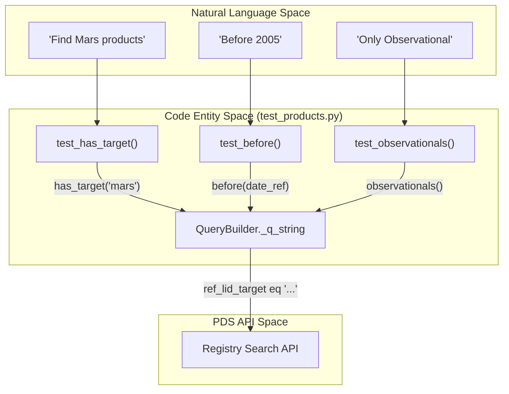
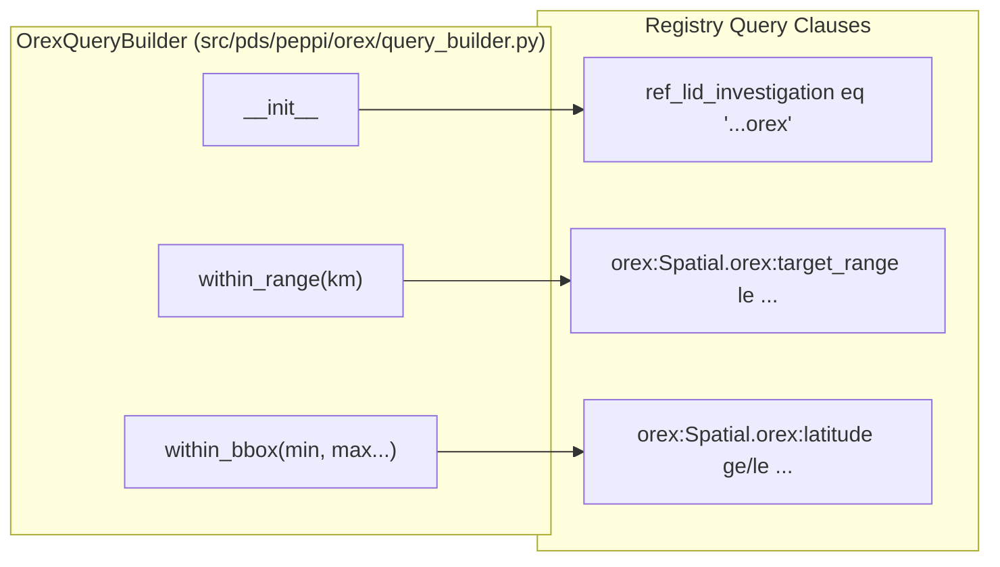

# Page: Test Suite

# Test Suite

Relevant source files

The following files were used as context for generating this wiki page:

- [src/pds/peppi/orex/query_builder.py](src/pds/peppi/orex/query_builder.py)
- [tests/pds/peppi/quickstart.py](tests/pds/peppi/quickstart.py)
- [tests/pds/peppi/test_context_base.py](tests/pds/peppi/test_context_base.py)
- [tests/pds/peppi/test_contexts.py](tests/pds/peppi/test_contexts.py)
- [tests/pds/peppi/test_orex_products.py](tests/pds/peppi/test_orex_products.py)
- [tests/pds/peppi/test_products.py](tests/pds/peppi/test_products.py)

The `pds.peppi` test suite provides comprehensive validation of the library's query building capabilities, context-aware fuzzy searching, and mission-specific extensions. It utilizes `unittest` to perform integration tests against the live PDS Registry API and internal logic checks for data transformation and state management.

### Purpose and Scope
The test suite ensures that:
*   The `QueryBuilder` correctly translates Python methods into PDS API query strings [tests/pds/peppi/test_products.py:125-162]().
*   The `Context` system accurately identifies PDS objects even with user typos [tests/pds/peppi/test_contexts.py:16-23]().
*   Mission-specific extensions like `OrexProducts` correctly enforce spatial constraints and investigation scoping [tests/pds/peppi/test_orex_products.py:14-50]().
*   The Model Context Protocol (MCP) and quickstart scripts remain functional for end-users [tests/pds/peppi/quickstart.py:6-28]().

---

### Core Query Integration Tests
The `ProductsTestCase` in `test_products.py` serves as the primary integration test for the fluent interface. It validates the lifecycle of a query from construction to result iteration.

#### Key Validation Patterns
*   **Result Iteration**: Ensures that iterating over a `Products` instance yields `PdsProduct` objects and respects `MAX_ITERATIONS` to prevent infinite loops during testing [tests/pds/peppi/test_products.py:21-29]().
*   **Field Selection**: Verifies that the `.fields()` method correctly restricts the `properties` dictionary of returned products [tests/pds/peppi/test_products.py:31-42]().
*   **DataFrame Conversion**: Validates that `as_dataframe()` correctly handles both populated and empty result sets, including cases with missing metadata columns [tests/pds/peppi/test_products.py:43-75]().
*   **Immutability Enforcement**: Confirms that a `RuntimeError` is raised if a user attempts to modify a query clause after iteration (pagination) has already begun [tests/pds/peppi/test_products.py:103-124]().

**Query to API Mapping**
The following diagram illustrates how `test_products.py` validates the transition from Natural Language concepts to API-ready query strings.

"Natural Language to Query Builder Mapping"

**Sources:** [tests/pds/peppi/test_products.py:125-159](), [tests/pds/peppi/test_products.py:180-191]()

---

### Context and Fuzzy Search Tests
The `test_contexts.py` and `test_context_base.py` modules validate the `Context` system's ability to map human-readable names to PDS Logical Identifiers (LIDs).

*   **Attribute Access**: Verifies that `Context.TARGETS` and `Context.INSTRUMENT_HOSTS` support dot-notation access for known entities [tests/pds/peppi/test_contexts.py:11-14]().
*   **Levenshtein Scoring**: `test_context_base.py` validates the `_custom_similarity` function, ensuring that exact matches score higher than typos (e.g., "jupiter" vs "jupyter") and that related but distinct terms score lower [tests/pds/peppi/test_context_base.py:7-26]().
*   **Search Integration**: Tests the `search()` method to ensure it returns the correct LIDs even when provided with approximate strings [tests/pds/peppi/test_contexts.py:16-23]().

**Sources:** [tests/pds/peppi/test_contexts.py:6-67](), [tests/pds/peppi/test_context_base.py:1-30]()

---

### Mission-Specific Tests (OSIRIS-REx)
`test_orex_products.py` validates the specialized `OrexProducts` and `OrexQueryBuilder` classes.

*   **Automatic Scoping**: Ensures that every `OrexProducts` instance is initialized with a default filter for the OSIRIS-REx investigation LID [tests/pds/peppi/test_orex_products.py:14-18]().
*   **Override Prevention**: Confirms that `has_investigation()` raises a `NotImplementedError` to prevent users from overriding the mission scope [tests/pds/peppi/test_orex_products.py:20-22]().
*   **Spatial Constraints**:
    *   `within_range()`: Validates that the `orex:Spatial.orex:target_range` property is correctly filtered [tests/pds/peppi/test_orex_products.py:24-35]().
    *   `within_bbox()`: Validates that latitude and longitude boundaries are correctly applied to the query string and reflected in the returned product properties [tests/pds/peppi/test_orex_products.py:36-50]().

"OREX Specialized Filter Logic"

**Sources:** [src/pds/peppi/orex/query_builder.py:6-87](), [tests/pds/peppi/test_orex_products.py:6-50]()

---

### Quickstart and Documentation Validation
The `quickstart.py` script serves as a "smoke test" for the entire library. It demonstrates a common end-to-end workflow:
1.  Initializing the `PDSRegistryClient` [tests/pds/peppi/quickstart.py:6]().
2.  Using `Context` to find an instrument host (Messenger) [tests/pds/peppi/quickstart.py:13-14]().
3.  Combining multiple filters (`has_target`, `has_instrument_host`, `before`, `observationals`) into a single chain [tests/pds/peppi/quickstart.py:17]().
4.  Iterating through results and accessing product metadata like `p.id` and `p.investigations` [tests/pds/peppi/quickstart.py:21-25]().

**Sources:** [tests/pds/peppi/quickstart.py:1-28]()
