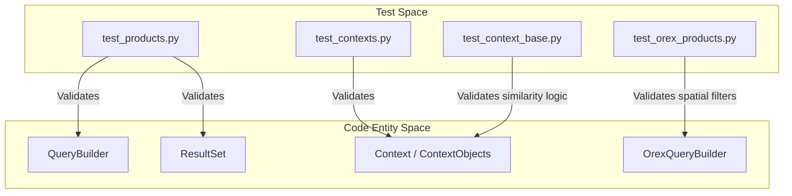
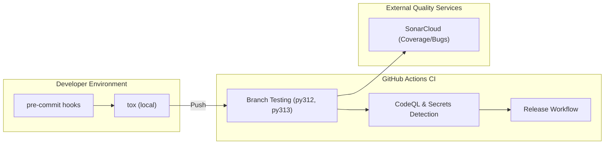

# Page: Testing Infrastructure

# Testing Infrastructure

Relevant source files

The following files were used as context for generating this wiki page:

- [sonar-project.properties](sonar-project.properties)
- [tests/pds/peppi/test_context_base.py](tests/pds/peppi/test_context_base.py)
- [tests/pds/peppi/test_contexts.py](tests/pds/peppi/test_contexts.py)
- [tests/pds/peppi/test_products.py](tests/pds/peppi/test_products.py)
- [tox.ini](tox.ini)

The `pds.peppi` testing infrastructure is designed to ensure the reliability of the fluent query interface, the accuracy of the context-aware fuzzy search, and the stability of mission-specific extensions. The suite combines unit tests for internal logic with integration tests that exercise the live PDS Registry API.

## Test Suite Overview

The test suite is organized into functional modules within the `tests/` directory. It validates the core `QueryBuilder` logic, the `Context` system's metadata resolution, and specialized modules like OSIRIS-REx.

### Core Functional Testing
*   **Query Builder Integration**: `test_products.py` validates the construction of OData filter strings and the execution of paginated queries against the PDS Registry. It includes tests for field selection [tests/pds/peppi/test_products.py:31-42](), DataFrame conversion [tests/pds/peppi/test_products.py:57-66](), and the immutability of query state during active iteration [tests/pds/peppi/test_products.py:103-124]().
*   **Context and Fuzzy Search**: `test_contexts.py` and `test_context_base.py` verify the `Context` system. These tests ensure that `Targets` and `InstrumentHosts` can be accessed via dot-notation [tests/pds/peppi/test_contexts.py:12-14]() and that the `_custom_similarity` scoring correctly handles typos (e.g., "jupyter" vs "jupiter") [tests/pds/peppi/test_context_base.py:7-15]().

### Test Suite Relationships
The following diagram illustrates how the test cases map to the primary code entities they validate.

**Test-to-Entity Mapping**

For detailed breakdowns of individual test modules and specific test cases, see **[Test Suite (#6.1)](#)**.

Sources: [tests/pds/peppi/test_products.py:1-124](), [tests/pds/peppi/test_contexts.py:1-61](), [tests/pds/peppi/test_context_base.py:1-26]()

---

## CI/CD Pipelines and Quality Tools

The project utilizes a modern Python CI/CD stack to maintain code quality and security. This infrastructure automates testing across multiple environments and performs static analysis to detect vulnerabilities.

### Automation and Orchestration
*   **Tox**: The `tox.ini` file defines the standard test execution environment. It manages virtual environments for Python 3.12 and 3.13 [tox.ini:2](), executes `pytest` with coverage reporting [tox.ini:10](), and handles documentation builds via `sphinx-build` [tox.ini:16]().
*   **Linting**: A dedicated `lint` environment runs `pre-commit` hooks to enforce style consistency [tox.ini:18-22]().
*   **Quality Gates**: The project integrates with SonarCloud, using `sonar-project.properties` to track code coverage via `coverage.xml` [sonar-project.properties:1-4]().

### CI/CD Architecture
The following diagram shows the flow of code through the quality assurance pipeline.

**Quality Pipeline Flow**

For details on GitHub Action configurations, secret management, and release triggers, see **[CI/CD Pipelines and Quality Tools (#6.2)](#)**.

Sources: [tox.ini:1-22](), [sonar-project.properties:1-4]()
