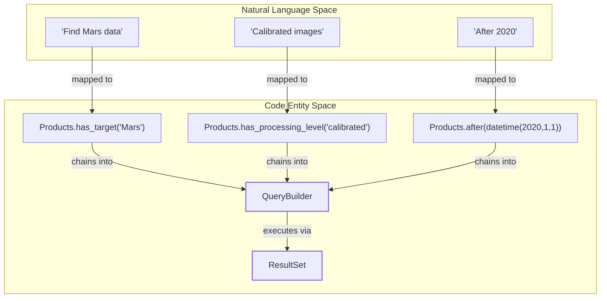

# Page: User Guide and Cookbook

# User Guide and Cookbook

<details>
<summary>Relevant source files</summary>

The following files were used as context for generating this wiki page:

- [docs/source/cookbook.rst](docs/source/cookbook.rst)
- [docs/source/quickstart.rst](docs/source/quickstart.rst)
- [docs/source/user_guide.rst](docs/source/user_guide.rst)
- [tests/pds/peppi/test_cookbook_advanced.py](tests/pds/peppi/test_cookbook_advanced.py)

</details>


This page serves as the high-level entry point for end-user documentation. It provides a conceptual overview of how to interact with the PDS Registry via `peppi`, followed by a categorized set of practical examples.

The documentation is split into two main tracks:
1.  **The User Guide**: Explains the "Why" and "How" of the system (concepts, lazy evaluation, and filter logic).
2.  **The Cookbook**: Provides the "What" (specific code recipes for common science use cases).

### Natural Language to Code Entity Mapping

The following diagram illustrates how natural language search concepts (e.g., "Find Mars images") map to specific classes and methods within the `pds.peppi` codebase.

**Concept Mapping: Search Intent to Code**

**Sources:** [docs/source/user_guide.rst:112-128](), [docs/source/quickstart.rst:52-59]()

---

## User Guide: Key Concepts and Filters (#5.1)

The User Guide covers the fundamental architecture of PDS data and how `peppi` abstracts it.

### PDS Hierarchy and Identifiers
Data in the PDS is organized into a strict hierarchy: **Bundles** contain **Collections**, which contain **Observational Products** [docs/source/user_guide.rst:13-23](). Every entity is identified by a **LID** (Logical Identifier) or **LIDVID** (LID + Version) [docs/source/user_guide.rst:30-43]().

### The Fluent Interface
`peppi` uses a "fluent" or "chained" API. You start with a `Products` instance and chain filter methods. These queries use **Lazy Evaluation**, meaning the API call to the PDS Registry is only triggered when you begin iterating over the results or convert them to a `pandas.DataFrame` [docs/source/user_guide.rst:109-148]().

### Automatic Pagination
The PDS API returns results in pages (usually 100 at a time). The `ResultSet` class (the engine behind `Products`) handles this transparently, fetching new pages as you iterate [docs/source/user_guide.rst:149-162]().

**For detailed conceptual explanations and a full list of filter methods, see [User Guide: Key Concepts and Filters](#5.1).**

**Sources:** [docs/source/user_guide.rst:7-162]()

---

## Cookbook: Recipes and Examples (#5.2)

The Cookbook is a collection of "ready-to-use" snippets for specific scientific workflows.

### Workflow: From Search to Analysis
The diagram below shows the typical data flow from a user's initial search to a local data structure (DataFrame).

**Data Flow: Registry to DataFrame**
```mermaid
graph LR
    subgraph "External API"
        API["PDS Registry API"]
    end

    subgraph "pds.peppi Internals"
        CL["PDSRegistryClient"]
        QB["QueryBuilder"]
        RS["ResultSet"]
    end

    subgraph "User Output"
        DF["pandas.DataFrame"]
    end

    CL -->|requests| API
    QB -->|defines| CL
    RS -->|paginates| CL
    RS -->|as_dataframe()| DF
```
**Sources:** [docs/source/cookbook.rst:160-175](), [docs/source/user_guide.rst:53-85]()

### Recipe Categories
*   **Getting Started**: Basic target searches (e.g., "Mars", "Bennu"), mission-specific searches (e.g., "Curiosity"), and date range filtering [docs/source/cookbook.rst:19-119]().
*   **Intermediate**: Combining multiple filters (Mission + Target + Date), exporting results to CSV via `as_dataframe()`, and retrieving DOIs for citations [docs/source/cookbook.rst:177-243]().
*   **Advanced**: Using specialized classes like `OrexProducts` for OSIRIS-REx spatial queries (bounding boxes and distance ranges) [tests/pds/peppi/test_cookbook_advanced.py:23-28]().

**For the complete library of code examples, see [Cookbook: Recipes and Examples](#5.2).**

**Sources:** [docs/source/cookbook.rst:1-243](), [docs/source/quickstart.rst:1-93](), [tests/pds/peppi/test_cookbook_advanced.py:16-35]()
