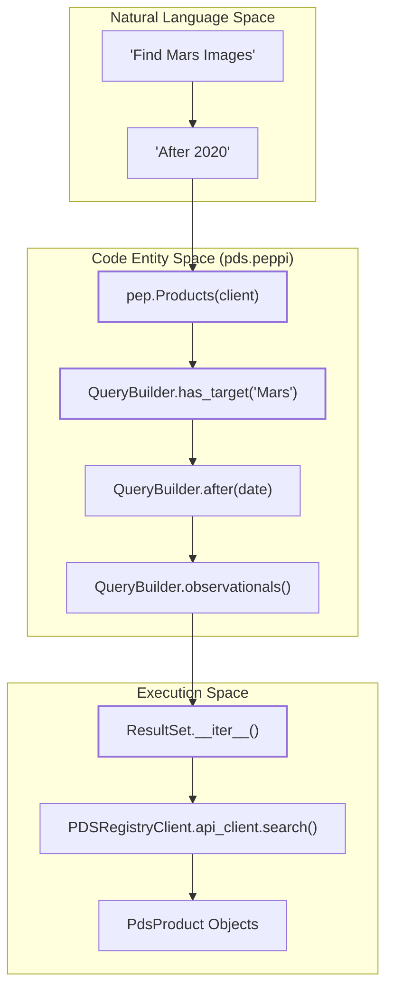
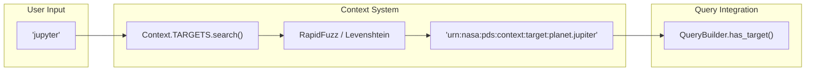

# Page: User Guide: Key Concepts and Filters

# User Guide: Key Concepts and Filters

Relevant source files

The following files were used as context for generating this wiki page:

- [docs/source/user_guide.rst](docs/source/user_guide.rst)
- [tests/pds/peppi/test_getting_started_examples.py](tests/pds/peppi/test_getting_started_examples.py)
- [tests/pds/peppi/test_user_guide_examples.py](tests/pds/peppi/test_user_guide_examples.py)

This guide provides a technical overview of how `pds.peppi` interacts with the Planetary Data System (PDS) product hierarchy and the mechanisms used to build, refine, and execute queries against the PDS Registry.

## PDS Product Hierarchy and Identifiers

The PDS organizes data into a specific hierarchy. `pds.peppi` provides methods to filter specifically for these types [docs/source/user_guide.rst:10-25]().

### Product Types
*   **Observational Products**: The primary science data (images, spectra). These are the leaf nodes of the hierarchy [docs/source/user_guide.rst:15-16]().
*   **Collections**: Logical groupings of related products, such as all images from a specific camera during a mission phase [docs/source/user_guide.rst:18-19]().
*   **Bundles**: High-level groupings containing multiple collections, typically representing an entire mission's data output [docs/source/user_guide.rst:21-22]().
*   **Context Products**: Metadata entities describing the "who, what, where" (Targets, Instruments, Spacecraft) [docs/source/user_guide.rst:24-25]().

### Logical Identifiers (LID/LIDVID)
Every product is uniquely identified by a **LID** (Logical Identifier). If a version is appended, it becomes a **LIDVID** [docs/source/user_guide.rst:30-46]().
*   **LID Format**: `urn:nasa:pds:mission.instrument:collection:product`
*   **LIDVID Format**: `urn:nasa:pds:mission.instrument:collection:product::1.0`

`pds.peppi` abstracts these identifiers by allowing users to search by common names (e.g., "Mars"), which the `Context` system resolves to the appropriate LID [docs/source/user_guide.rst:48-49]().

**Sources:** [docs/source/user_guide.rst:10-49]()

---

## Query Execution Lifecycle

`pds.peppi` employs a **Lazy Evaluation** model. Constructing a query object does not trigger network activity; the API is only called when the result set is actually consumed (e.g., via iteration or conversion to a DataFrame) [docs/source/user_guide.rst:130-148]().

### Automatic Pagination
The PDS API returns results in pages (defaulting to 100). The `ResultSet` class handles this transparently using **keyset pagination** via the `search_after` parameter [docs/source/user_guide.rst:149-162]().

### Natural Language to Code Entity Mapping
The following diagram illustrates how user-level concepts map to the underlying class structures and API interactions.

**Query Pipeline Architecture**

**Sources:** [docs/source/user_guide.rst:109-162](), [tests/pds/peppi/test_user_guide_examples.py:77-116]()

---

## Available Filter Methods

The `Products` class (and its underlying `QueryBuilder`) provides a fluent interface for constructing PDS Search API queries.

| Filter Method | Description | Example |
| :--- | :--- | :--- |
| `has_target(name_or_lid)` | Filters by celestial body. Supports fuzzy name matching. | `.has_target("Mars")` |
| `after(date)` | Filters for data collected after the specified `datetime`. | `.after(datetime(2020,1,1))` |
| `before(date)` | Filters for data collected before the specified `datetime`. | `.before(datetime(2021,1,1))` |
| `has_instrument_host(lid)` | Filters by spacecraft or rover LID. | `.has_instrument_host("urn...")` |
| `has_instrument(lid)` | Filters by specific instrument LID. | `.has_instrument("urn...")` |
| `has_investigation(lid)` | Filters by mission or investigation LID. | `.has_investigation("urn...")` |
| `of_collection(lid)` | Limits search to a specific collection. | `.of_collection("urn...")` |
| `has_processing_level(lvl)` | Filters by PDS processing level (raw, calibrated, etc). | `.has_processing_level("raw")` |
| `observationals()` | Shorthand to filter for `Product_Observational` type. | `.observationals()` |

### Processing Levels
Users can filter data based on its state in the pipeline [docs/source/user_guide.rst:255-262]():
*   `telemetry`: Raw spacecraft transmission.
*   `raw`: Unprocessed instrument data.
*   `partially-processed`: Initial corrections applied.
*   `calibrated`: Converted to physical units.
*   `derived`: High-level products (e.g., mosaics).

**Sources:** [docs/source/user_guide.rst:164-262](), [tests/pds/peppi/test_user_guide_examples.py:118-210]()

---

## Context and Fuzzy Search

The `Context` singleton provides access to the PDS "Context" products, which act as a registry for targets and instrument hosts.

**Fuzzy Search Logic**

`Context.TARGETS` and `Context.INSTRUMENT_HOSTS` allow for typo-tolerant searching. For example, `context.TARGETS.search("jupyter")` will successfully return the LID for Jupiter [docs/source/user_guide.rst:104]().

**Sources:** [docs/source/user_guide.rst:86-105](), [tests/pds/peppi/test_user_guide_examples.py:42-68]()

---

## Best Practices for Building Queries

1.  **Start Broad, Then Refine**: Initialize with `pep.Products(client)` and chain filters. Because of lazy evaluation, there is no performance penalty for adding filters sequentially [docs/source/user_guide.rst:112-119]().
2.  **Use Context for LIDs**: Instead of hardcoding LIDs, use `pep.Context().TARGETS.search()` to retrieve the correct identifier dynamically [docs/source/user_guide.rst:213-217]().
3.  **Combine Time Filters**: Use both `.after()` and `.before()` to define a specific observation window [docs/source/user_guide.rst:200-201]().
4.  **Leverage Processing Levels**: When looking for science-ready data, always include `.has_processing_level("calibrated")` to avoid raw telemetry noise [docs/source/user_guide.rst:253]().

**Sources:** [docs/source/user_guide.rst:109-129](), [tests/pds/peppi/test_user_guide_examples.py:169-182]()
