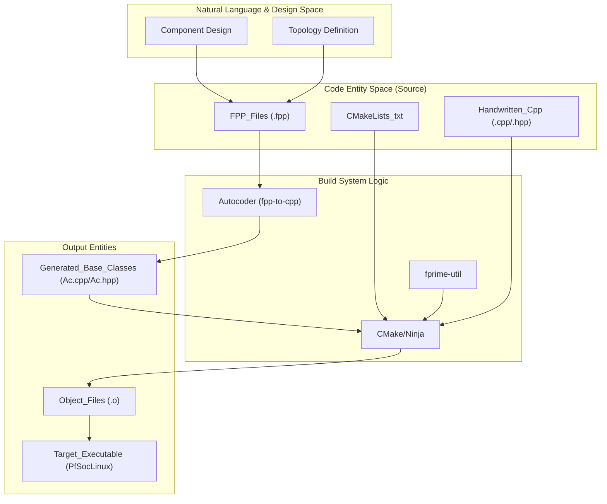
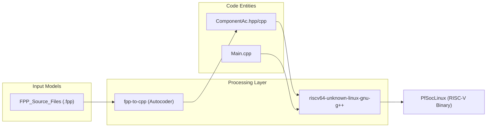

# Build System

Relevant source files

The following files were used as context for generating this wiki page:

- [CMakeLists.txt](CMakeLists.txt)
- [PfSocLinux/CMakeLists.txt](PfSocLinux/CMakeLists.txt)

The `pfsoc-fsw-linux` project utilizes the **F´ (F Prime)** build system, which is built upon **CMake**. This system manages the complex lifecycle of flight software development, including the processing of FPP (F Prime Prime) modeling files, automatic code generation of C++ base classes, and the cross-compilation of the final binary for the RISC-V architecture on the PolarFire SoC.

The build system is designed to abstract the underlying toolchain complexities while providing a standardized interface for developers to add components, ports, and topologies.

### Build System Orchestration

The orchestration of the build process is handled through a hierarchy of `CMakeLists.txt` files. The root `CMakeLists.txt` initializes the framework by including `lib/fprime/cmake/FPrime.cmake` [CMakeLists.txt:11-12]() and the project-wide configuration in `project.cmake` [CMakeLists.txt:14-14]().

Each deployment, such as `PfSocLinux`, maintains its own `CMakeLists.txt` to define compiler flags (e.g., `-Wall`, `-Werror`, `-Wshadow`) [PfSocLinux/CMakeLists.txt:11-22](), add subdirectories like the topology in `Top/` [PfSocLinux/CMakeLists.txt:28-28](), and register the final executable deployment using `register_fprime_deployment` [PfSocLinux/CMakeLists.txt:30-35]().

The diagram below illustrates how the build system bridges the design models to the final executable:

**F´ Build Pipeline: Model to Binary**

**Sources:** [CMakeLists.txt:6-14](), [PfSocLinux/CMakeLists.txt:28-35]()

### Build Configuration and Integration
The integration of F´ into the CMake environment allows for seamless dependency management and modular compilation. The build system identifies components via the `register_fprime_module()` function call within local `CMakeLists.txt` files. In this deployment, the main entry point is defined in `Main.cpp` and linked via the `register_fprime_deployment` macro [PfSocLinux/CMakeLists.txt:30-35]().

For a detailed breakdown of directory structures, CMake macros, and how to invoke the build using `fprime-util`, see **[CMake and F´ Build Integration](#5.1)**.

### Cross-Compilation and Code Generation
Since the target hardware is a RISC-V based PolarFire SoC, the build system must utilize a cross-compiler. A critical step in this process is **Code Generation**, where the FPP toolset parses modeling files to produce the "Ac" (Autocoded) C++ classes. These classes handle the boilerplate logic for port serialization, command dispatching, and telemetry registration.

The relationship between the toolchain and the code generator is visualized below:

**Toolchain and Autocoder Association**

For details on the RISC-V toolchain configuration and the FPP-to-C++ transformation process, see **[Cross-Compilation and FPP Code Generation](#5.2)**.

**Sources:** [CMakeLists.txt:1-14](), [PfSocLinux/CMakeLists.txt:1-35]()
