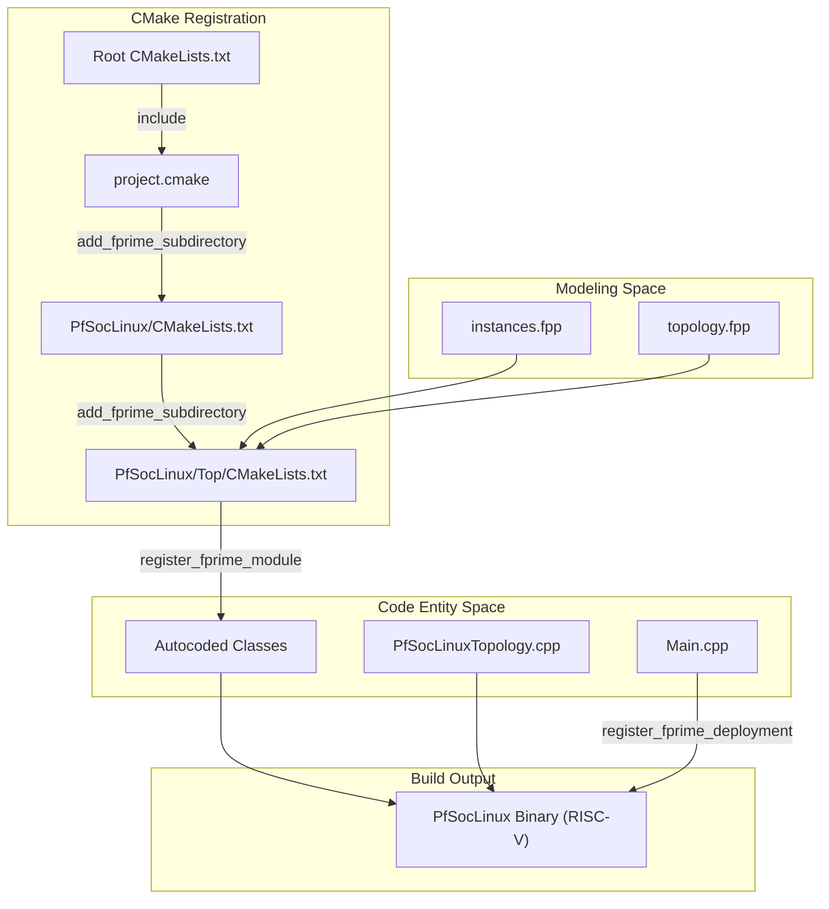
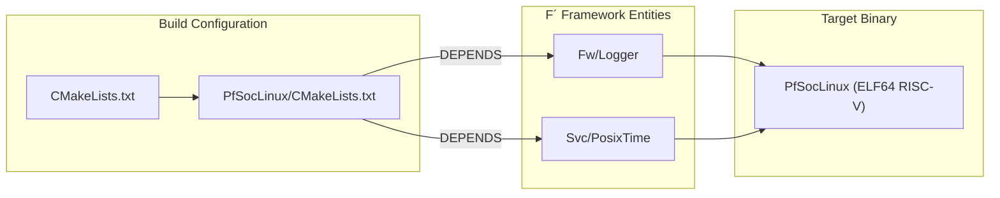

# 5.1 CMake and F´ Build Integration

Relevant source files

The following files were used as context for generating this wiki page:

- [CMakeLists.txt](CMakeLists.txt)
- [PfSocLinux/CMakeLists.txt](PfSocLinux/CMakeLists.txt)
- [PfSocLinux/Top/CMakeLists.txt](PfSocLinux/Top/CMakeLists.txt)
- [project.cmake](project.cmake)

This page describes the configuration and structure of the CMake build system used in the `pfsoc-fsw-linux` deployment. The project leverages the standard F´ (F Prime) build system to manage component dependencies, generate C++ code from FPP (F Prime Prime) models, and facilitate cross-compilation for the RISC-V architecture on the Microchip PolarFire SoC.

## Build System Overview

The build system is responsible for orchestrating three primary tasks:
1.  **FPP Code Generation**: Converting `.fpp` modeling files into C++ Autocoded base classes.
2.  **Component Compilation**: Compiling individual F´ components into static libraries.
3.  **Deployment Linking**: Aggregating components and framework libraries into a single executable binary for the Linux target.

### Directory Layout Conventions

The deployment follows standard F´ directory conventions to ensure the CMake system can discover modules and toolchains.

| Directory | Purpose |
| :--- | :--- |
| `lib/fprime/` | The core F´ framework submodule containing standard components and CMake macros [CMakeLists.txt:11](). |
| `PfSocLinux/` | The deployment directory containing the `Main.cpp` entry point and topology [PfSocLinux/CMakeLists.txt:2-5](). |
| `PfSocLinux/Top/` | Contains the topology definition (`topology.fpp`) and instance definitions (`instances.fpp`) [PfSocLinux/Top/CMakeLists.txt:8-9](). |

**Sources:** [CMakeLists.txt:11](), [PfSocLinux/CMakeLists.txt:1-5](), [PfSocLinux/Top/CMakeLists.txt:7-11]()

## CMake Configuration Flow

The build process is initiated via `fprime-util` or raw `cmake` commands. The flow starts at the project root `CMakeLists.txt`, which imports the F´ build system logic located in the `lib/fprime` directory [CMakeLists.txt:11-12]().

### Data Flow: Model to Binary

The following diagram illustrates how CMake coordinates the transformation of FPP models into a RISC-V executable, specifically showing the registration of the `PfSocLinux` deployment.

**Title: Build System Data Flow**

**Sources:** [CMakeLists.txt:11-14](), [project.cmake:4](), [PfSocLinux/CMakeLists.txt:28-35](), [PfSocLinux/Top/CMakeLists.txt:7-17]()

## CMakeLists.txt Structure

The deployment utilizes a hierarchical `CMakeLists.txt` structure.

### Project-Level Configuration
The root `CMakeLists.txt` defines the project `PfSocFswLinux` [CMakeLists.txt:8](). It includes the F´ framework via `FPrime.cmake` [CMakeLists.txt:11]() and then includes `project.cmake` [CMakeLists.txt:14](). 

The `project.cmake` file acts as a central registry, using `add_fprime_subdirectory` to include the `PfSocLinux` deployment directory [project.cmake:4]().

### Deployment-Level Configuration
The `PfSocLinux/CMakeLists.txt` file configures the specific application targeting the PolarFire SoC [PfSocLinux/CMakeLists.txt:4-5](). It sets strict compiler flags for the deployment, including `-Werror`, `-Wall`, and `-Wextra` [PfSocLinux/CMakeLists.txt:11-22]().

The deployment is finalized using `register_fprime_deployment`, which links the `Main.cpp` entry point with the topology module `PfSocLinux_Top` [PfSocLinux/CMakeLists.txt:30-35]().

### Topology-Level Configuration
The `PfSocLinux/Top/CMakeLists.txt` file defines the source files for the system topology. It includes:
*   `instances.fpp`: Defines component instances [PfSocLinux/Top/CMakeLists.txt:8]().
*   `topology.fpp`: Defines port connections [PfSocLinux/Top/CMakeLists.txt:9]().
*   `PfSocLinuxTopology.cpp`: Contains the manual setup code for the deployment [PfSocLinux/Top/CMakeLists.txt:10]().

It also specifies module dependencies such as `Fw/Logger` and `Svc/PosixTime` [PfSocLinux/Top/CMakeLists.txt:12-15]().

**Sources:** [CMakeLists.txt:6-14](), [project.cmake:1-4](), [PfSocLinux/CMakeLists.txt:8-35](), [PfSocLinux/Top/CMakeLists.txt:7-18]()

## Target Build Invocation

Builds for the RISC-V target are managed through the CMake system, often facilitated by the `fprime-util` wrapper.

### Toolchain and Framework Association
The build system integrates the RISC-V toolchain to ensure that all framework components and user-defined modules are compiled with the correct flags for the PolarFire MSS (Microprocessor Subsystem).

**Title: Toolchain and Framework Association**

**Sources:** [CMakeLists.txt:8](), [PfSocLinux/CMakeLists.txt:8-35](), [PfSocLinux/Top/CMakeLists.txt:12-15]()
