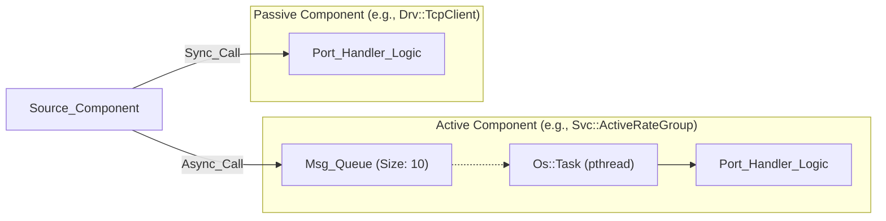
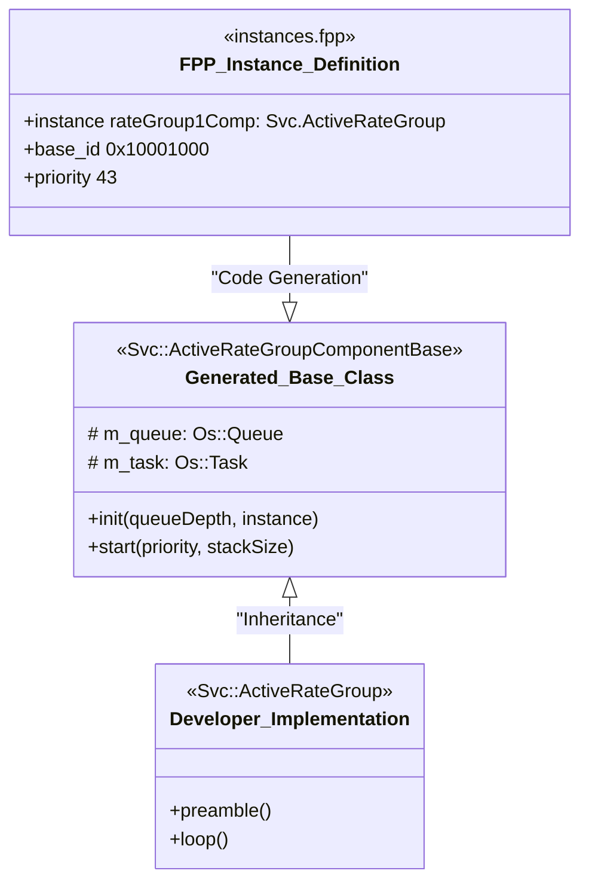

# Components and Ports

Relevant source files

The following files were used as context for generating this wiki page:

- [PfSocLinux/Top/PfSocLinuxTopologyDefs.hpp](PfSocLinux/Top/PfSocLinuxTopologyDefs.hpp)
- [PfSocLinux/Top/instances.fpp](PfSocLinux/Top/instances.fpp)
- [README.md](README.md)

This page details the F´ (F Prime) component model as implemented in the `pfsoc-fsw-linux` deployment. It explains the structural building blocks of the flight software, the distinction between execution contexts, and the port-based communication mechanism defined via the FPP (F Prime Prime) modeling language.

## The F´ Component Model

In F´, a **Component** is a discrete unit of software logic that encapsulates state and behavior. Components do not call each other's functions directly; instead, they interact through well-defined interfaces called **Ports**. This decoupling allows for modular testing and architectural flexibility.

### Component Types

The `pfsoc-fsw-linux` deployment utilizes two primary component types, distinguished by their execution context and threading model:

| Component Type | Execution Context | Implementation Detail |
| :--- | :--- | :--- |
| **Active** | Owns a dedicated execution thread. | Dispatches messages from an internal queue using a `pthread` managed by `Os::Task`. |
| **Passive** | Executes in the caller's thread. | Functions are executed synchronously when a port is invoked by a calling component. |

#### Active Components
Active components contain an internal message queue. When a port is invoked on an Active component, the data is serialized and placed into the queue. The component's internal thread then de-queues the message and executes the associated handler function. This provides asynchronous communication and thread isolation. In this deployment, active components like `rateGroup1Comp` and `cmdSeq` are assigned specific priorities and stack sizes [PfSocLinux/Top/instances.fpp:29-47]().

#### Passive Components
Passive components do not have a thread or a queue. When a port is invoked, the call is synchronous—the code runs immediately within the thread of the component that initiated the port call. These are typically used for low-latency hardware drivers or system utilities. Examples in this deployment include `posixTime` and `comDriver` [PfSocLinux/Top/instances.fpp:53-61]().

**Sources:**
- `PfSocLinux/Top/instances.fpp` [29-61]()
- `README.md` [1-3]()

---

## Ports: Inter-Component Communication

Ports are the "sockets" of a component. They are directional and typed, ensuring that only compatible interfaces can be connected in the system topology.

### Port Types
1.  **Input Ports:** Receive data or commands from other components.
2.  **Output Ports:** Send data or requests to other components.

### Communication Flow
The F´ framework handles the underlying mechanics of port calls. For a connection between two components:
1.  The **Source Component** calls a generated function on its output port.
2.  The **Framework** routes this call to the connected **Target Component**.
3.  If the target is **Passive**, the target's handler function is called immediately.
4.  If the target is **Active**, the framework serializes the arguments and pushes them to the target's queue for later processing.

### Diagram: Component and Port Interaction
The following diagram illustrates the relationship between an Active component (managing a thread) and a Passive component (executing synchronously).

**Active vs Passive Execution Flow**

**Sources:**
- `PfSocLinux/Top/instances.fpp` [21-47]()
- `README.md` [1-3]()

---

## FPP (F Prime Prime) Modeling

Components and Ports are not written manually in C++ from scratch. Instead, they are defined using **FPP**, a modeling language that generates the boilerplate C++ code.

### Instance Definitions
In `pfsoc-fsw-linux`, component instances are declared in `instances.fpp`. This file defines the specific configuration for each component, including:
*   **Base ID:** A unique 8-digit hex identifier (e.g., `0x10001000`) used for telemetry and command routing [PfSocLinux/Top/instances.fpp:7-32]().
*   **Queue Size:** The number of messages an active component can buffer (Default: 10) [PfSocLinux/Top/instances.fpp:21-30]().
*   **Stack Size:** The memory allocated for the component's thread (Default: 64 KB) [PfSocLinux/Top/instances.fpp:22-31]().
*   **Priority:** The scheduling priority for the `Os::Task` (e.g., 43 for `rateGroup1Comp`) [PfSocLinux/Top/instances.fpp:32]().

### Mapping FPP to Code Entities
The following diagram shows how FPP definitions translate into the C++ classes and runtime instances used in the deployment.

**FPP to C++ Translation and Instantiation**

**Sources:**
- `PfSocLinux/Top/instances.fpp` [7-63]()
- `PfSocLinux/Top/PfSocLinuxTopologyDefs.hpp` [10-22]()

---

## Data Flow and Health Monitoring

In the `pfsoc-fsw-linux` environment, ports facilitate the flow of data and system health status.

### Health Ping Mechanism
Components that support the health-ping interface must define `WARN` and `FATAL` thresholds in the `PingEntries` namespace. This defines how many missed pings are allowed before the system triggers an event [PfSocLinux/Top/PfSocLinuxTopologyDefs.hpp:31-44]().
*   **Example:** `PfSocLinux_rateGroup1Comp` is configured with `WARN = 3` and `FATAL = 5` [PfSocLinux/Top/PfSocLinuxTopologyDefs.hpp:48-50]().

### Topology State
The deployment maintains a `TopologyState` structure that carries configuration data across the component graph, including hostnames for TCP communication and subtopology-specific states for `CdhCore`, `ComFprime`, `DataProducts`, and `FileHandling` [PfSocLinux/Top/PfSocLinuxTopologyDefs.hpp:73-80]().

**Sources:**
- `PfSocLinux/Top/PfSocLinuxTopologyDefs.hpp` [47-80]()
- `PfSocLinux/Top/instances.fpp` [61]()
