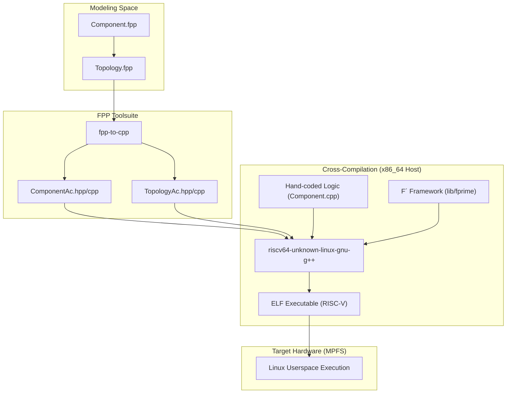
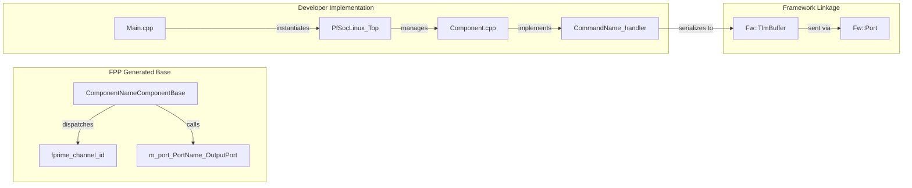

# Cross-Compilation and FPP Code Generation

Relevant source files

The following files were used as context for generating this wiki page:

- [CMakeLists.txt](CMakeLists.txt)
- [PfSocLinux/CMakeLists.txt](PfSocLinux/CMakeLists.txt)
- [settings.ini](settings.ini)

This page details the build-time processes required to transform FPP (F Prime Prime) modeling files into executable machine code for the RISC-V architecture. This involves a two-stage process: first, the translation of domain-specific modeling language into C++ source code, and second, the cross-compilation of that code using a toolchain targeting the Microchip PolarFire SoC (MPFS) Linux environment.

## RISC-V Cross-Compiler Toolchain

The deployment targets the application-class RISC-V cores of the PolarFire SoC. Because the development environment is typically an x86_64 workstation, a cross-compiler is utilized to generate compatible binaries.

### Toolchain Specification
The primary compiler used is `riscv64-unknown-linux-gnu-gcc` (and its C++ counterpart `g++`). The F´ build system is configured to use the `pfsoc-linux` toolchain as the default, as specified in the project configuration [settings.ini:4-4](). This toolchain is responsible for:

*   **Targeting the ISA**: Generating instructions for the 64-bit RISC-V Instruction Set Architecture (RV64GC).
*   **ABI Compliance**: Ensuring the binary adheres to the standard Linux ABI for RISC-V, allowing it to interface with the system's C library (glibc) and the Linux kernel.
*   **Linking**: Combining the object files generated from F´ components with the F´ framework libraries and standard system libraries.

The integration of this toolchain is managed via CMake, where the project is initialized with C and CXX languages [CMakeLists.txt:8-8]().

Sources: [settings.ini:1-6](), [CMakeLists.txt:1-15]()

## FPP Code Generation Flow

FPP is the modeling language used by F´ to define components, ports, and topologies. The build system automates the transformation of these models into C++ boilerplate, ensuring that the structural code (port handling, command dispatching, and telemetry serialization) remains synchronized with the design.

### The Generation Pipeline
1.  **Parsing**: The FPP tools parse `.fpp` files to validate syntax and semantic consistency.
2.  **C++ Translation**: The `fpp-to-cpp` tool generates several files for each component:
    *   `ComponentAc.hpp/cpp`: The "Autocode" base classes containing the logic for port invocation, command registration, and state management.
    *   `PortAc.hpp/cpp`: The classes representing the connection points between components.
3.  **Template Generation**: If a component is new, the tools can generate `Component.hpp/cpp` templates where the developer implements the actual functional logic.

### Data Flow: Modeling to Binary
The following diagram illustrates how FPP models move through the toolchain to become an executable on the PolarFire SoC.

**FPP to RISC-V Binary Transformation**

Sources: [settings.ini:1-5](), [CMakeLists.txt:11-12]()

## Implementation Mapping

The relationship between the FPP definitions and the resulting C++ entities is strictly defined. This allows the developer to interact with generated code through a predictable API. In the `PfSocLinux` deployment, the build system enforces strict compilation flags, including `-Werror`, `-Wall`, and `-Wshadow`, to ensure code quality across both generated and manual source code [PfSocLinux/CMakeLists.txt:11-22]().

### Code Entity Mapping Table

| FPP Entity | Generated C++ Class/Member | Role |
| :--- | :--- | :--- |
| `active component` | `class ComponentName : public ComponentNameComponentBase` | Inherits from `Fw::ActiveComponentBase`; manages its own `Os::Task`. |
| `port` | `ComponentName_PortName_InputPort` | Provides the interface for synchronous or asynchronous invocation. |
| `command` | `void CommandName_cmdHandler(...)` | Pure virtual function in the base class that the developer must implement. |
| `telemetry` | `void tlmWrite_ChannelName(...)` | Protected method used by the component to push data to `Svc::TlmChan`. |
| `event` | `void log_WARNING_HI_EventName(...)` | Protected method used to send events to `Svc::ActiveLogger`. |

### System Data Flow
This diagram bridges the natural language concepts of the build process with the specific code entities involved in the generated framework.

**Code Entity Data Flow**

Sources: [PfSocLinux/CMakeLists.txt:30-35](), [CMakeLists.txt:8-14]()

## Linking and Execution

Once the `riscv64-unknown-linux-gnu-g++` compiler has generated object files for both the generated autocode and the manual implementation (such as `Main.cpp` [PfSocLinux/CMakeLists.txt:32-32]()), the linker combines them with the following:

1.  **F´ Framework**: Located in `./lib/fprime`, providing core base classes like `Fw::ObjBase` [settings.ini:2-2]().
2.  **Platform Libraries**: Support for the PolarFire SoC platform located in `./lib/fprime-pfsoc-linux` [settings.ini:5-5]().
3.  **Deployment Top Level**: The `PfSocLinux_Top` target which encapsulates the system topology [PfSocLinux/CMakeLists.txt:34-34]().
4.  **Standard Libraries**: The RISC-V build of `libstdc++` and `libpthread` required for multi-threaded execution on the PolarFire SoC.

The final output is a RISC-V ELF binary defined by the `register_fprime_deployment` call [PfSocLinux/CMakeLists.txt:30-35]().

Sources: [PfSocLinux/CMakeLists.txt:1-36](), [settings.ini:1-6]()
