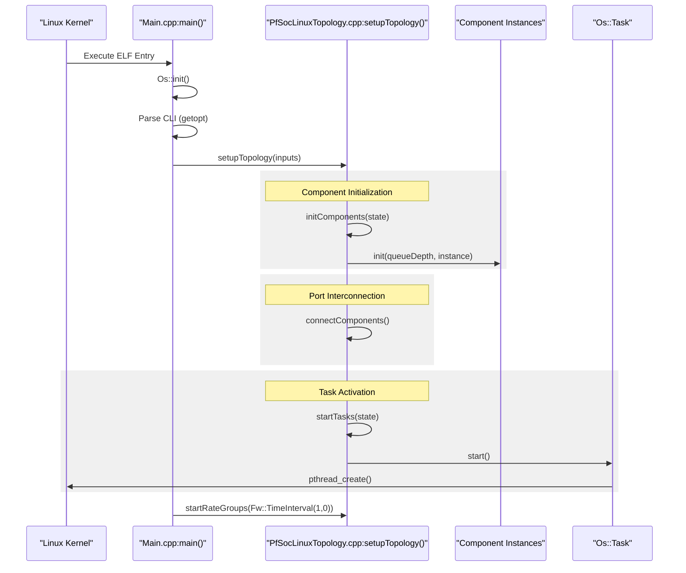
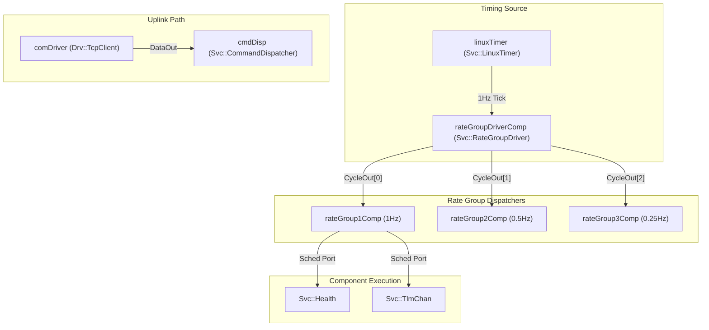

# Execution Flow and Startup Sequence

Relevant source files

The following files were used as context for generating this wiki page:

- [PfSocLinux/Main.cpp](PfSocLinux/Main.cpp)
- [PfSocLinux/Top/PfSocLinuxTopology.cpp](PfSocLinux/Top/PfSocLinuxTopology.cpp)
- [PfSocLinux/Top/PfSocLinuxTopology.hpp](PfSocLinux/Top/PfSocLinuxTopology.hpp)

This page provides a technical walkthrough of the runtime lifecycle of the `pfsoc-fsw-linux` deployment. It covers the transition from the Linux ELF binary entry point to the steady-state execution of the F´ component topology on the PolarFire SoC RISC-V application cores.

## Overview of Runtime Lifecycle

The execution flow follows a deterministic sequence:
1.  **Entry Point**: The Linux kernel loads the ELF binary and executes `main()` [PfSocLinux/Main.cpp:24-24]().
2.  **Initialization**: Global system state and OS abstractions are configured [PfSocLinux/Main.cpp:25-25]().
3.  **Topology Setup**: `setupTopology()` instantiates components, connects ports, and starts active tasks [PfSocLinux/Top/PfSocLinuxTopology.cpp:32-48]().
4.  **Activation**: Active components spawn their underlying `pthreads` via `Os::Task` [PfSocLinux/Top/PfSocLinuxTopology.cpp:43-47]().
5.  **Steady State**: The `Svc::RateGroup` components drive cyclic execution via the `linuxTimer` [PfSocLinux/Top/PfSocLinuxTopology.cpp:50-52]().
6.  **Teardown**: Signal handlers trigger a graceful shutdown of tasks and rate groups [PfSocLinux/Main.cpp:20-22]().

## 1. Main Entry and Initial Configuration

The execution begins in `PfSocLinux/Main.cpp`. The `main()` function serves as the primary orchestrator for the lifecycle of the deployment.

### System Initialization
Before components are created, the system initializes the F´ OS abstraction layer and sets up signal handling.

*   **OS Initialization**: `Os::init()` is called to prepare the platform adaptation layer [PfSocLinux/Main.cpp:25-25]().
*   **Command Line Parsing**: `main()` processes arguments `-a` (hostname) and `-p` (port) for the `comDriver` (TcpClient) [PfSocLinux/Main.cpp:30-44]().
*   **Signal Handling**: `SIGINT` and `SIGTERM` are trapped to call `signalHandler`, which invokes `PfSocLinux::stopRateGroups()` [PfSocLinux/Main.cpp:20-22, 50-51]().

### Startup Sequence Diagram: Initialization to Activation

The following diagram illustrates the transition from the `main()` function through the topology setup.

**Startup Sequence Flow**

**Sources:** [PfSocLinux/Main.cpp:24-55](), [PfSocLinux/Top/PfSocLinuxTopology.cpp:32-48]().

## 2. Component Instantiation and Topology Setup

The deployment's structure is defined by the topology, realized in `PfSocLinux/Top/PfSocLinuxTopology.cpp`.

### `setupTopology()`
This function coordinates the transition from raw memory to a functional software graph:
1.  **`initComponents()`**: Calls the `init` method on all component instances [PfSocLinux/Top/PfSocLinuxTopology.cpp:33-33]().
2.  **`setBaseIds()`**: Assigns unique ID ranges to each component for telemetry/commands [PfSocLinux/Top/PfSocLinuxTopology.cpp:34-34]().
3.  **`connectComponents()`**: Establishes the port-to-port links defined in the FPP model [PfSocLinux/Top/PfSocLinuxTopology.cpp:35-35]().
4.  **`configureTopology()`**: Configures rate group divisors and allocates buffers, such as the 5KB buffer for `cmdSeq` [PfSocLinux/Top/PfSocLinuxTopology.cpp:23-29]().

### Communication Driver Setup
If a hostname and port are provided via CLI, the `comDriver` (a `Drv::TcpClient` instance) is configured and its dedicated `ReceiveTask` is started with priority `COMM_PRIORITY` (34) [PfSocLinux/Top/PfSocLinuxTopology.cpp:38-40, 44-47]().

**Sources:** [PfSocLinux/Top/PfSocLinuxTopology.cpp:19-48]().

## 3. Active Component Thread Startup

F´ distinguishes between **Passive** components and **Active** components. Active components possess their own execution context provided by `Os::Task`.

### Task Activation
During `startTasks(state)`, every Active component (e.g., `cmdDisp`, `eventLogger`, `tlmChan`) spawns a Linux thread.
*   **Thread Creation**: This is implemented via `pthread_create` within the `Os::Task` abstraction.
*   **Stack and Priority**: Components use default stack sizes and priorities defined in the topology constants [PfSocLinux/Top/PfSocLinuxTopology.cpp:46-46]().

**Sources:** [PfSocLinux/Top/PfSocLinuxTopology.cpp:43-47]().

## 4. Steady-State Execution: The Rate Group Loop

Once `setupTopology` returns, `main()` calls `PfSocLinux::startRateGroups(Fw::TimeInterval(1, 0))` [PfSocLinux/Main.cpp:55-55](). This initiates the 1Hz base clock for the system.

### The Rate Group Pattern
The `linuxTimer` component drives the system timing.
1.  **`linuxTimer.startTimer(interval)`**: Starts a periodic timer (1 second interval) [PfSocLinux/Top/PfSocLinuxTopology.cpp:50-52]().
2.  **`rateGroupDriverComp`**: Receives the tick and divides it based on `rateGroupDivisorsSet` [PfSocLinux/Top/PfSocLinuxTopology.cpp:13-13, 24-24]().
3.  **`rateGroup1/2/3Comp`**: These `Svc::ActiveRateGroup` instances receive divided ticks and invoke the `Sched` ports of connected components [PfSocLinux/Top/PfSocLinuxTopology.cpp:25-27]().

**Steady-State Data Flow**

**Sources:** [PfSocLinux/Top/PfSocLinuxTopology.cpp:13-27, 50-52]().

## 5. Teardown Sequence

When a `SIGINT` (Ctrl-C) or `SIGTERM` is received, the `signalHandler` calls `stopRateGroups()`, which stops the `linuxTimer` [PfSocLinux/Main.cpp:20-22](). This causes `main()` to proceed to the teardown phase.

### `teardownTopology()`
The system performs a graceful exit:
1.  **`stopTasks()`**: Signals all Active component threads to terminate [PfSocLinux/Top/PfSocLinuxTopology.cpp:59-59]().
2.  **`comDriver.stop()`**: Closes the TCP connection and joins the `ReceiveTask` thread [PfSocLinux/Top/PfSocLinuxTopology.cpp:61-62]().
3.  **`cmdSeq.deallocateBuffer()`**: Releases the command sequencer memory [PfSocLinux/Top/PfSocLinuxTopology.cpp:63-63]().
4.  **`tearDownComponents()`**: Final cleanup of component resources [PfSocLinux/Top/PfSocLinuxTopology.cpp:64-64]().

**Sources:** [PfSocLinux/Main.cpp:56-58](), [PfSocLinux/Top/PfSocLinuxTopology.cpp:54-65]().
